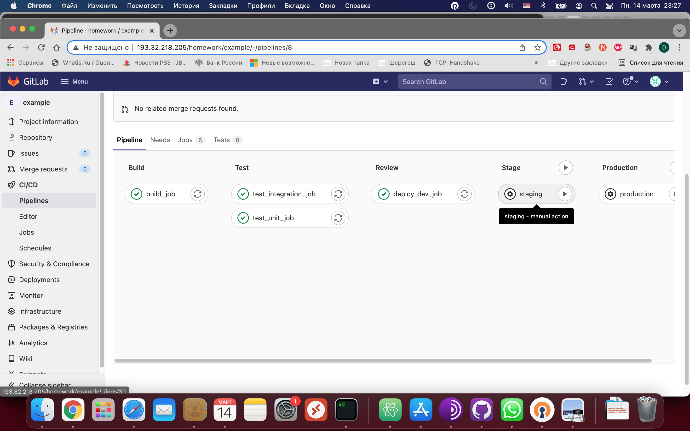
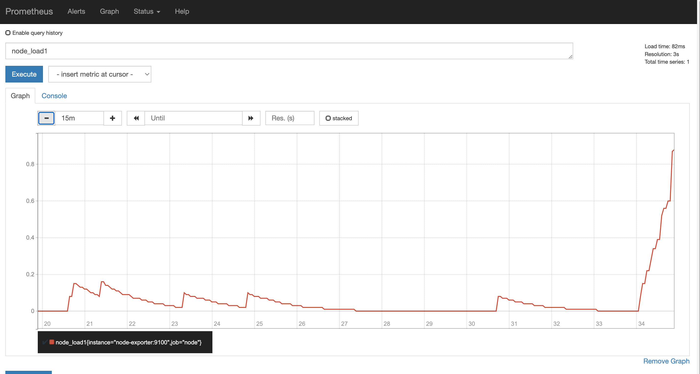
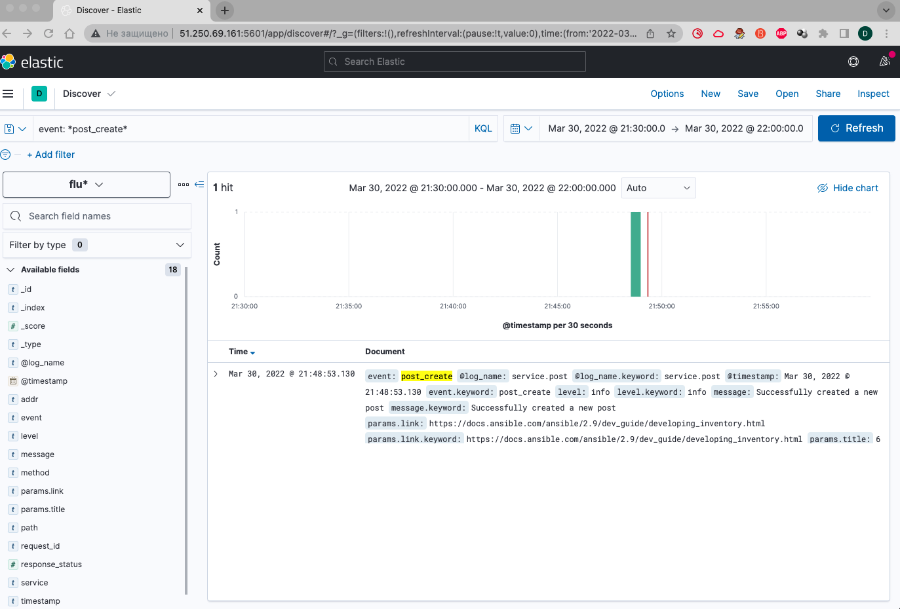
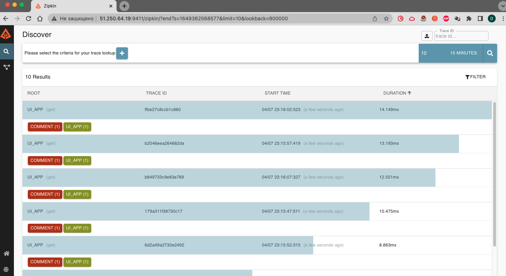
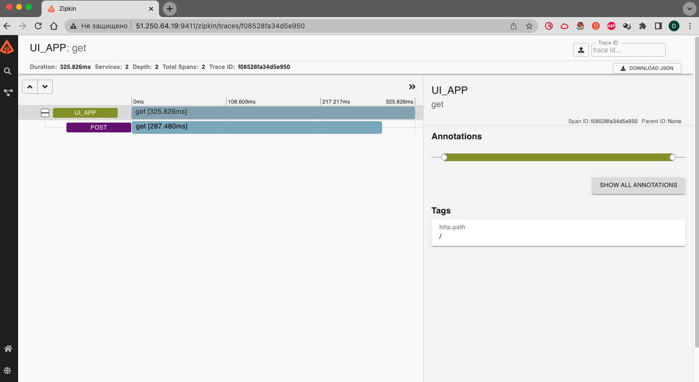

# **Лекция №15: Технология контейнеризации. Введение в Docker**
> _docker-1_
<details>
  <summary>Технология контейнеризации. Введение в Docker</summary>

## **Задание:**
Установка Docker, запуск контейнера на локальной машине, выполнение команд внутри контейнера, создание образа контейнера на основе запущенного.

Цель:
ПРИМЕЧАНИЕ: д/з будет необходимо выполнить после изучения 2-го занятия по docker - «Docker контейнеры. Docker под капотом»

В данном дз студент студент познакомится с контейнеризацией. Поймет ее отличие от виртуализации, узнает что такое Docker и зачем он нужен, создаст образ и запустит контейнер.
В данном задании тренируются навыки: работы с Docker, создания образа, запуск контейнера.

Описание/Пошаговая инструкция выполнения домашнего задания:
Все действия описаны в методическом указании.

Критерии оценки:
0 б. - задание не выполнено
1 б. - задание выполнено
2 б. - выполнены все дополнительные задания

---

## **Выполнено:**

- Интеграция с GitHub
Наберем в своем канале Slack команду-сообщение:
```
/github subscribe Otus-DevOps-2021-11/Deron-D_microservices commits:*
```

1. Устанавливаем Docker:

 [Install Docker Engine on CentOS](https://docs.docker.com/engine/install/centos/)

~~~bash
➜  Deron-D_microservices git:(docker-2) ✗ docker version
Client: Docker Engine - Community
 Version:           20.10.7
 API version:       1.41
 Go version:        go1.13.15
 Git commit:        f0df350
 Built:             Wed Jun  2 11:56:24 2021
 OS/Arch:           linux/amd64
 Context:           default
 Experimental:      true

Server: Docker Engine - Community
 Engine:
  Version:          20.10.7
  API version:      1.41 (minimum version 1.12)
  Go version:       go1.13.15
  Git commit:       b0f5bc3
  Built:            Wed Jun  2 11:54:48 2021
  OS/Arch:          linux/amd64
  Experimental:     false
 containerd:
  Version:          1.4.9
  GitCommit:        e25210fe30a0a703442421b0f60afac609f950a3
 runc:
  Version:          1.0.1
  GitCommit:        v1.0.1-0-g4144b63
 docker-init:
  Version:          0.19.0
  GitCommit:        de40ad0
➜  Deron-D_microservices git:(docker-2) ✗ docker-compose version
docker-compose version 1.29.2, build 5becea4c
docker-py version: 5.0.0
CPython version: 3.7.10
OpenSSL version: OpenSSL 1.1.0l  10 Sep 2019
~~~

2. Docker hello-world

Запустим первый контейнер:
~~~bash
➜  Deron-D_microservices git:(docker-2) ✗ docker run hello-world
Unable to find image 'hello-world:latest' locally
latest: Pulling from library/hello-world
2db29710123e: Pull complete
Digest: sha256:507ecde44b8eb741278274653120c2bf793b174c06ff4eaa672b713b3263477b
Status: Downloaded newer image for hello-world:latest

Hello from Docker!
This message shows that your installation appears to be working correctly.

To generate this message, Docker took the following steps:
 1. The Docker client contacted the Docker daemon.
 2. The Docker daemon pulled the "hello-world" image from the Docker Hub.
    (amd64)
 3. The Docker daemon created a new container from that image which runs the
    executable that produces the output you are currently reading.
 4. The Docker daemon streamed that output to the Docker client, which sent it
    to your terminal.

To try something more ambitious, you can run an Ubuntu container with:
 $ docker run -it ubuntu bash

Share images, automate workflows, and more with a free Docker ID:
 https://hub.docker.com/

For more examples and ideas, visit:
 https://docs.docker.com/get-started/
~~~

3. Docker ps

Список запущенных контейнеров и список всех контейнеров:
~~~bash
➜  Deron-D_microservices git:(docker-2) ✗ docker ps
CONTAINER ID   IMAGE     COMMAND   CREATED   STATUS    PORTS     NAMES
➜  Deron-D_microservices git:(docker-2) ✗  docker ps -a
CONTAINER ID   IMAGE         COMMAND    CREATED         STATUS                     PORTS     NAMES
cf84f4fc13d5   hello-world   "/hello"   2 minutes ago   Exited (0) 2 minutes ago             awesome_hofstadter
~~~

4. Docker images

Список сохраненных образов:
~~~bash
➜  Deron-D_microservices git:(docker-2) ✗ docker images
REPOSITORY                TAG       IMAGE ID       CREATED        SIZE
hello-world               latest    feb5d9fea6a5   4 months ago   13.3kB
ubuntu                    18.04     39a8cfeef173   6 months ago   63.1MB
ubuntu                    bionic    39a8cfeef173   6 months ago   63.1MB
debian                    stretch   2c3ad12c6ecf   6 months ago   101MB
~~~

5. Docker run

Команда run создает и запускает контейнер из image:
~~~bash
➜  Deron-D_microservices git:(docker-2) ✗ docker run -it ubuntu:18.04 /bin/bash
root@610e2e3a4456:/# echo 'Hello world!' > /tmp/file
root@610e2e3a4456:/# cat /tmp/file
Hello world!
root@610e2e3a4456:/# exit
exit
➜  Deron-D_microservices git:(docker-2) ✗ docker run -it ubuntu:18.04 /bin/bash
root@8d6629686521:/# cat /tmp/file
cat: /tmp/file: No such file or directory
root@8d6629686521:/#
root@8d6629686521:/# exit
~~~

Docker run каждый раз запускает новый контейнер
Если не указывать флаг --rm при запуске docker run, то после остановки контейнер вместе с содержимым остается на диске


6. Docker ps

Найдем ранее созданный контейнер в котором мы создали /tmp/file
Это должен быть предпоследний контейнер запущенный из образа ubuntu:18.04
~~~bash
➜  Deron-D_microservices git:(docker-2) ✗ docker ps -a --format "table {{.ID}}\t{{.Image}}\t{{.CreatedAt}}\t{{.Names}}"
CONTAINER ID   IMAGE          CREATED AT                      NAMES
8d6629686521   ubuntu:18.04   2022-02-06 23:26:02 +0300 MSK   objective_faraday
610e2e3a4456   ubuntu:18.04   2022-02-06 23:25:28 +0300 MSK   fervent_lewin
cf84f4fc13d5   hello-world    2022-02-06 23:13:57 +0300 MSK   awesome_hofstadter
~~~

7. Docker start & attach

- start запускает остановленный(уже созданный)
- контейнер attach подсоединяет терминал к созданному контейнеру

~~~bash
➜  Deron-D_microservices git:(docker-2) ✗ docker start fervent_lewin
fervent_lewin
➜  Deron-D_microservices git:(docker-2) ✗ docker attach fervent_lewin
root@610e2e3a4456:/# cat /tmp/file
Hello world!
~~~

`Ctrl+p`, `Ctrl+q`

~~~bash
root@610e2e3a4456:/# read escape sequence
➜  Deron-D_microservices git:(docker-2) ✗ docker ps
CONTAINER ID   IMAGE          COMMAND       CREATED         STATUS         PORTS     NAMES
610e2e3a4456   ubuntu:18.04   "/bin/bash"   7 minutes ago   Up 2 minutes             fervent_lewin
~~~

8. Docker exec

~~~bash
➜  Deron-D_microservices git:(docker-2) ✗ docker ps
CONTAINER ID   IMAGE          COMMAND       CREATED      STATUS      PORTS     NAMES
610e2e3a4456   ubuntu:18.04   "/bin/bash"   2 days ago   Up 2 days             fervent_lewin
➜  Deron-D_microservices git:(docker-2) ✗ docker exec -it 610e2e3a4456 bash
root@610e2e3a4456:/# ps axf
    PID TTY      STAT   TIME COMMAND
     14 pts/1    Ss     0:00 bash
     25 pts/1    R+     0:00  \_ ps axf
      1 pts/0    Ss+    0:00 /bin/bash
root@610e2e3a4456:/# exit
exit
~~~

9. Docker commit

- Создает image из контейнера
- Контейнер при этом остается запущенным

~~~bash
➜  Deron-D_microservices git:(docker-2) ✗ docker commit 610e2e3a4456 deron73/ubuntu-tmp-file
sha256:e909dc08bf43bbd66cce08c5c89c37286f56503fa9b32319ca4c909623b60697
➜  Deron-D_microservices git:(docker-2) ✗ docker images
REPOSITORY                TAG       IMAGE ID       CREATED          SIZE
deron73/ubuntu-tmp-file   latest    e909dc08bf43   14 seconds ago   63.1MB
hello-world               latest    feb5d9fea6a5   4 months ago     13.3kB
docker-compose_postgres   latest    27b9045857c9   6 months ago     265MB
docker-compose_pgsql1c    latest    27b9045857c9   6 months ago     265MB
ubuntu                    18.04     39a8cfeef173   6 months ago     63.1MB
ubuntu                    bionic    39a8cfeef173   6 months ago     63.1MB
debian                    stretch   2c3ad12c6ecf   6 months ago     101MB
➜  Deron-D_microservices git:(docker-2) ✗ docker images > dockermonolith/docker-1.log
~~~

### Задание со ⭐

~~~bash
➜  Deron-D_microservices git:(docker-2) ✗ docker inspect 610e2e3a4456
[
    {
        "Id": "610e2e3a4456ca905af8b292da1f4cb276a551c4b79b1dd441183088aa460c6f",
        "Created": "2022-02-06T20:25:28.563953735Z",
        "Path": "/bin/bash",
        "Args": [],
        "State": {
            "Status": "running",
            "Running": true,
            "Paused": false,
            "Restarting": false,
            "OOMKilled": false,
            "Dead": false,
            "Pid": 1671358,
            "ExitCode": 0,
            "Error": "",
            "StartedAt": "2022-02-06T20:30:50.19225462Z",
            "FinishedAt": "2022-02-06T20:25:59.575342297Z"
        },
        "Image": "sha256:39a8cfeef17302cb7ce93cefe12368560fe62ef9d517808855f7bda79a1eb697",
        "ResolvConfPath": "/var/lib/docker/containers/610e2e3a4456ca905af8b292da1f4cb276a551c4b79b1dd441183088aa460c6f/resolv.conf",
        "HostnamePath": "/var/lib/docker/containers/610e2e3a4456ca905af8b292da1f4cb276a551c4b79b1dd441183088aa460c6f/hostname",
        "HostsPath": "/var/lib/docker/containers/610e2e3a4456ca905af8b292da1f4cb276a551c4b79b1dd441183088aa460c6f/hosts",
        "LogPath": "/var/lib/docker/containers/610e2e3a4456ca905af8b292da1f4cb276a551c4b79b1dd441183088aa460c6f/610e2e3a4456ca905af8b292da1f4cb276a551c4b79b1dd441183088aa460c6f-json.log",
        "Name": "/fervent_lewin",
        "RestartCount": 0,
        "Driver": "overlay2",
        "Platform": "linux",
        "MountLabel": "",
        "ProcessLabel": "",
        "AppArmorProfile": "",
        "ExecIDs": null,
        "HostConfig": {
            "Binds": null,
            "ContainerIDFile": "",
            "LogConfig": {
                "Type": "json-file",
                "Config": {}
            },
            "NetworkMode": "default",
            "PortBindings": {},
            "RestartPolicy": {
                "Name": "no",
                "MaximumRetryCount": 0
            },
            "AutoRemove": false,
            "VolumeDriver": "",
            "VolumesFrom": null,
            "CapAdd": null,
            "CapDrop": null,
            "CgroupnsMode": "host",
            "Dns": [],
            "DnsOptions": [],
            "DnsSearch": [],
            "ExtraHosts": null,
            "GroupAdd": null,
            "IpcMode": "private",
            "Cgroup": "",
            "Links": null,
            "OomScoreAdj": 0,
            "PidMode": "",
            "Privileged": false,
            "PublishAllPorts": false,
            "ReadonlyRootfs": false,
            "SecurityOpt": null,
            "UTSMode": "",
            "UsernsMode": "",
            "ShmSize": 67108864,
            "Runtime": "runc",
            "ConsoleSize": [
                0,
                0
            ],
            "Isolation": "",
            "CpuShares": 0,
            "Memory": 0,
            "NanoCpus": 0,
            "CgroupParent": "",
            "BlkioWeight": 0,
            "BlkioWeightDevice": [],
            "BlkioDeviceReadBps": null,
            "BlkioDeviceWriteBps": null,
            "BlkioDeviceReadIOps": null,
            "BlkioDeviceWriteIOps": null,
            "CpuPeriod": 0,
            "CpuQuota": 0,
            "CpuRealtimePeriod": 0,
            "CpuRealtimeRuntime": 0,
            "CpusetCpus": "",
            "CpusetMems": "",
            "Devices": [],
            "DeviceCgroupRules": null,
            "DeviceRequests": null,
            "KernelMemory": 0,
            "KernelMemoryTCP": 0,
            "MemoryReservation": 0,
            "MemorySwap": 0,
            "MemorySwappiness": null,
            "OomKillDisable": false,
            "PidsLimit": null,
            "Ulimits": null,
            "CpuCount": 0,
            "CpuPercent": 0,
            "IOMaximumIOps": 0,
            "IOMaximumBandwidth": 0,
            "MaskedPaths": [
                "/proc/asound",
                "/proc/acpi",
                "/proc/kcore",
                "/proc/keys",
                "/proc/latency_stats",
                "/proc/timer_list",
                "/proc/timer_stats",
                "/proc/sched_debug",
                "/proc/scsi",
                "/sys/firmware"
            ],
            "ReadonlyPaths": [
                "/proc/bus",
                "/proc/fs",
                "/proc/irq",
                "/proc/sys",
                "/proc/sysrq-trigger"
            ]
        },
        "GraphDriver": {
            "Data": {
                "LowerDir": "/var/lib/docker/overlay2/4925f794763b8f803d6b76401e34dcdb1bdb7e5f70e6ffe7acb357750c14e8d3-init/diff:/var/lib/docker/overlay2/04e1c7aa28e7582ffe86ca772c26544f5a952c052d5be37e67e5aef63bf5a80f/diff",
                "MergedDir": "/var/lib/docker/overlay2/4925f794763b8f803d6b76401e34dcdb1bdb7e5f70e6ffe7acb357750c14e8d3/merged",
                "UpperDir": "/var/lib/docker/overlay2/4925f794763b8f803d6b76401e34dcdb1bdb7e5f70e6ffe7acb357750c14e8d3/diff",
                "WorkDir": "/var/lib/docker/overlay2/4925f794763b8f803d6b76401e34dcdb1bdb7e5f70e6ffe7acb357750c14e8d3/work"
            },
            "Name": "overlay2"
        },
        "Mounts": [],
        "Config": {
            "Hostname": "610e2e3a4456",
            "Domainname": "",
            "User": "",
            "AttachStdin": true,
            "AttachStdout": true,
            "AttachStderr": true,
            "Tty": true,
            "OpenStdin": true,
            "StdinOnce": true,
            "Env": [
                "PATH=/usr/local/sbin:/usr/local/bin:/usr/sbin:/usr/bin:/sbin:/bin"
            ],
            "Cmd": [
                "/bin/bash"
            ],
            "Image": "ubuntu:18.04",
            "Volumes": null,
            "WorkingDir": "",
            "Entrypoint": null,
            "OnBuild": null,
            "Labels": {}
        },
        "NetworkSettings": {
            "Bridge": "",
            "SandboxID": "3cb67ef189998d29761a502dad22b7c0d8a720f9a87ed3742ad11cc01d4b7490",
            "HairpinMode": false,
            "LinkLocalIPv6Address": "",
            "LinkLocalIPv6PrefixLen": 0,
            "Ports": {},
            "SandboxKey": "/var/run/docker/netns/3cb67ef18999",
            "SecondaryIPAddresses": null,
            "SecondaryIPv6Addresses": null,
            "EndpointID": "850ed7f45b94a55314b0b839485b79601c61c4fecb51a38ce2dbf10ebfa5d85d",
            "Gateway": "172.17.0.1",
            "GlobalIPv6Address": "",
            "GlobalIPv6PrefixLen": 0,
            "IPAddress": "172.17.0.2",
            "IPPrefixLen": 16,
            "IPv6Gateway": "",
            "MacAddress": "02:42:ac:11:00:02",
            "Networks": {
                "bridge": {
                    "IPAMConfig": null,
                    "Links": null,
                    "Aliases": null,
                    "NetworkID": "6d2e447479c6b6e4e141a8281be413a46af2b28c9e182c69230e3ed653f2abcb",
                    "EndpointID": "850ed7f45b94a55314b0b839485b79601c61c4fecb51a38ce2dbf10ebfa5d85d",
                    "Gateway": "172.17.0.1",
                    "IPAddress": "172.17.0.2",
                    "IPPrefixLen": 16,
                    "IPv6Gateway": "",
                    "GlobalIPv6Address": "",
                    "GlobalIPv6PrefixLen": 0,
                    "MacAddress": "02:42:ac:11:00:02",
                    "DriverOpts": null
                }
            }
        }
    }
]
➜  Deron-D_microservices git:(docker-2) ✗ docker inspect 39a8cfeef173
[
    {
        "Id": "sha256:39a8cfeef17302cb7ce93cefe12368560fe62ef9d517808855f7bda79a1eb697",
        "RepoTags": [
            "ubuntu:18.04",
            "ubuntu:bionic"
        ],
        "RepoDigests": [
            "ubuntu@sha256:7bd7a9ca99f868bf69c4b6212f64f2af8e243f97ba13abb3e641e03a7ceb59e8"
        ],
        "Parent": "",
        "Comment": "",
        "Created": "2021-07-26T21:21:31.071665434Z",
        "Container": "c92bfb9ad23f9f790e1b9aceecd94e4da4fd21892314d88c8baf1e767d826306",
        "ContainerConfig": {
            "Hostname": "c92bfb9ad23f",
            "Domainname": "",
            "User": "",
            "AttachStdin": false,
            "AttachStdout": false,
            "AttachStderr": false,
            "Tty": false,
            "OpenStdin": false,
            "StdinOnce": false,
            "Env": [
                "PATH=/usr/local/sbin:/usr/local/bin:/usr/sbin:/usr/bin:/sbin:/bin"
            ],
            "Cmd": [
                "/bin/sh",
                "-c",
                "#(nop) ",
                "CMD [\"bash\"]"
            ],
            "Image": "sha256:b8a5122daf391c9b0675a7d9b74c22896be683c3ee0935858ca8166d51756164",
            "Volumes": null,
            "WorkingDir": "",
            "Entrypoint": null,
            "OnBuild": null,
            "Labels": {}
        },
        "DockerVersion": "20.10.7",
        "Author": "",
        "Config": {
            "Hostname": "",
            "Domainname": "",
            "User": "",
            "AttachStdin": false,
            "AttachStdout": false,
            "AttachStderr": false,
            "Tty": false,
            "OpenStdin": false,
            "StdinOnce": false,
            "Env": [
                "PATH=/usr/local/sbin:/usr/local/bin:/usr/sbin:/usr/bin:/sbin:/bin"
            ],
            "Cmd": [
                "bash"
            ],
            "Image": "sha256:b8a5122daf391c9b0675a7d9b74c22896be683c3ee0935858ca8166d51756164",
            "Volumes": null,
            "WorkingDir": "",
            "Entrypoint": null,
            "OnBuild": null,
            "Labels": null
        },
        "Architecture": "amd64",
        "Os": "linux",
        "Size": 63137486,
        "VirtualSize": 63137486,
        "GraphDriver": {
            "Data": {
                "MergedDir": "/var/lib/docker/overlay2/04e1c7aa28e7582ffe86ca772c26544f5a952c052d5be37e67e5aef63bf5a80f/merged",
                "UpperDir": "/var/lib/docker/overlay2/04e1c7aa28e7582ffe86ca772c26544f5a952c052d5be37e67e5aef63bf5a80f/diff",
                "WorkDir": "/var/lib/docker/overlay2/04e1c7aa28e7582ffe86ca772c26544f5a952c052d5be37e67e5aef63bf5a80f/work"
            },
            "Name": "overlay2"
        },
        "RootFS": {
            "Type": "layers",
            "Layers": [
                "sha256:21639b09744fc39b4e1fe31c79cdf54470afe4d7239a517c4060bd181f8e3039"
            ]
        },
        "Metadata": {
            "LastTagTime": "0001-01-01T00:00:00Z"
        }
    }
]
~~~
### **Выводы про разницу между контейнером и образом:**
Образ докера являются основой контейнеров.
Образ - это упорядоченная коллекция изменений корневой файловой системы и соответствующих параметров
выполнения для использования в среде выполнения контейнера.
Образ обычно содержит объединение многоуровневых файловых систем, расположенных друг на друге.
Образ не имеет состояния и никогда не изменяется.

**Контейнер - это исполняемый (остановленный) экземпляр образа docker.**

Контейнер Docker состоит из:
- Docker образа
- Среды выполнения
- Стандартного набора инструкций
Концепция заимствована из морских контейнеров, которые определяют стандарт для доставки товаров по всему миру.
Docker определяет стандарт для отправки программного обеспечения.

(*) Взято из [Docker Glossary](https://docs.docker.com/glossary/)

Хотелось бы еще добавить, что из одного образа можно запустить множество контейнеров.


## **Полезное:**

</details>

# **Лекция №16: Docker контейнеры. Docker под капотом**
> _docker-2_
<details>
  <summary>Docker контейнеры. Docker под капотом</summary>

## **Задание:**
Запуск VM с установленным Docker Engine при помощи Docker Machine. Написание Dockerfile и сборка образа с тестовым приложением. Сохранение образа на DockerHub.

Цель:
В данном дз студент продолжит работать с Docker, создаст образы приложения и загрузит из в DockerHub.
В данном задании тренируются навыки: работы с Docker, DockerHub.

Описание/Пошаговая инструкция выполнения домашнего задания:
Все действия описаны в методическом указании.

Критерии оценки:
0 б. - задание не выполнено
1 б. - задание выполнено
2 б. - выполнены все дополнительные задания

---

## **Выполнено:**

1. Docker machine


Ставим Docker machine [https://github.com/docker/machine/releases](https://github.com/docker/machine/releases)
~~~bash
curl -L https://github.com/docker/machine/releases/download/v0.16.2/docker-machine-`uname -s`-`uname -m` >/tmp/docker-machine &&
~~~

Создадим Docker хост в Yandex Cloud и настроим локальное окружение на работу с ним
~~~bash
➜  Deron-D_infra git:(main) yc compute instance create \
  --name docker-host \
  --zone ru-central1-a \
  --network-interface subnet-name=reddit-app-net-ru-central1-a,nat-ip-version=ipv4 \
  --create-boot-disk image-folder-id=standard-images,image-family=ubuntu-1804-lts,size=15 \
  --ssh-key ~/.ssh/appuser.pub
done (19s)
id: fhm7srocib0tiak4n3og
folder_id: b1glujc915djb9lako8f
created_at: "2022-02-14T18:30:28Z"
name: docker-host
zone_id: ru-central1-a
platform_id: standard-v2
resources:
  memory: "2147483648"
  cores: "2"
  core_fraction: "100"
status: RUNNING
boot_disk:
  mode: READ_WRITE
  device_name: fhm0r8po6uisnmtgbepe
  auto_delete: true
  disk_id: fhm0r8po6uisnmtgbepe
network_interfaces:
- index: "0"
  mac_address: d0:0d:7e:6f:0c:92
  subnet_id: e9bcqv136grugc8pqv6k
  primary_v4_address:
    address: 10.128.0.10
    one_to_one_nat:
      address: 51.250.15.142
      ip_version: IPV4
fqdn: fhm7srocib0tiak4n3og.auto.internal
scheduling_policy: {}
network_settings:
  type: STANDARD
placement_policy: {}
~~~

После чего можно инициализировать окружение Docker.
~~~bash
➜  Deron-D_infra git:(main) docker-machine create \
  --driver generic \
  --generic-ip-address=51.250.15.142 \
  --generic-ssh-user yc-user \
  --generic-ssh-key ~/.ssh/appuser \
docker-host
Running pre-create checks...
~~~

Проверяем, что наш Docker-хост успешно создан
~~~bash
➜  Deron-D_infra git:(main) docker-machine ls
NAME          ACTIVE   DRIVER    STATE     URL                        SWARM   DOCKER      ERRORS
docker-host   -        generic   Running   tcp://51.250.15.142:2376           v20.10.12
~~~

И начинаем с ним работу
~~~bash
$ eval $(docker-machine env docker-host)
~~~
> переключиться обратно на локальный хост `eval $(docker-machine env --unset)`


2. Сборка образа

~~~bash
➜  docker-monolith git:(docker-2) ✗ docker build -t reddit:latest .
Sending build context to Docker daemon  8.192kB
Step 1/11 : FROM ubuntu:18.04
 ---> dcf4d4bef137
Step 2/11 : RUN apt-get update
 ---> Using cache
 ---> cb0cee1bbe0d
Step 3/11 : RUN apt-get install -y mongodb-server ruby-full ruby-dev build-essential git
 ---> Using cache
 ---> c99964f40c4f
Step 4/11 : RUN gem install bundler
 ---> Using cache
 ---> df14a7870f89
Step 5/11 : RUN git clone -b monolith https://github.com/express42/reddit.git
 ---> Using cache
 ---> efd55a5d1952
Step 6/11 : COPY mongod.conf /etc/mongod.conf
 ---> Using cache
 ---> 3829a455e7a6
Step 7/11 : COPY db_config /reddit/db_config
 ---> Using cache
 ---> a36862cab24c
Step 8/11 : COPY start.sh /start.sh
 ---> Using cache
 ---> bec898124297
Step 9/11 : RUN cd /reddit && rm Gemfile.lock && bundle install
 ---> Using cache
 ---> 865adfa813d2
Step 10/11 : RUN chmod 0777 /start.sh
 ---> Using cache
 ---> 5a162930ae1f
Step 11/11 : CMD ["/start.sh"]
 ---> Using cache
 ---> 924d4cfbfd6e
Successfully built 924d4cfbfd6e
Successfully tagged reddit:latest
~~~

Посмотрим на все образы (в том числе промежуточные):
~~~bash
➜  docker-monolith git:(docker-2) ✗ docker images -a
REPOSITORY   TAG       IMAGE ID       CREATED              SIZE
reddit       latest    924d4cfbfd6e   24 seconds ago       647MB
<none>       <none>    5a162930ae1f   About a minute ago   647MB
<none>       <none>    865adfa813d2   About a minute ago   647MB
<none>       <none>    bec898124297   2 minutes ago        616MB
<none>       <none>    a36862cab24c   2 minutes ago        616MB
<none>       <none>    3829a455e7a6   2 minutes ago        616MB
<none>       <none>    efd55a5d1952   2 minutes ago        616MB
<none>       <none>    df14a7870f89   3 minutes ago        616MB
<none>       <none>    c99964f40c4f   3 minutes ago        614MB
<none>       <none>    cb0cee1bbe0d   6 minutes ago        102MB
ubuntu       18.04     dcf4d4bef137   11 days ago          63.2MB
~~~


3. Запуск контейнера

~~~bash
➜  docker-monolith git:(docker-2) ✗ docker run --name reddit -d --network=host reddit:latest
fc1e14519ad2e1b50d80ea866c9f6f11028dab5039093f7402292af2c6db4994
~~~

Проверим результат:
~~~bash
➜  docker-monolith git:(docker-2) ✗ docker-machine ls
NAME          ACTIVE   DRIVER    STATE     URL                        SWARM   DOCKER      ERRORS
docker-host   *        generic   Running   tcp://51.250.15.142:2376           v20.10.12

➜  docker-monolith git:(docker-2) ✗ curl 51.250.15.142:9292
<!DOCTYPE html>
<html lang='en'>
<head>
<meta charset='utf-8'>
<meta content='IE=Edge,chrome=1' http-equiv='X-UA-Compatible'>
<meta content='width=device-width, initial-scale=1.0' name='viewport'>
<title>Monolith Reddit :: All posts</title>q
....
~~~

4. Оптимизация.

Попробуем уменьшить размер образа и количество слоев. Создадим файл `Dockerfile.optimized` со следующим содержимым:
~~~Dockerfile
FROM ubuntu:18.04

RUN apt-get update && \
    apt-get install -y mongodb-server ruby-full ruby-bundler ruby-dev build-essential git && \
    git clone -b monolith https://github.com/express42/reddit.git && \
    apt-get autoremove -y &&  \
    apt-get autoclean && \
    apt-get clean && \
    rm -rf /var/lib/apt/lists/* && \
    rm -rf /tmp/* /var/tmp/*

COPY mongod.conf /etc/mongod.conf
COPY db_config /reddit/db_config
COPY start.sh /start.sh

RUN cd /reddit && rm Gemfile.lock && bundle install
RUN chmod 0777 /start.sh

CMD ["/start.sh"]
~~~

~~~bash
docker-monolith git:(docker-2) ✗ docker build -t reddit:1.1 . -f Dockerfile.optimized
~~~

~~~bash
➜  docker-monolith git:(docker-2) ✗ docker images -a
REPOSITORY   TAG       IMAGE ID       CREATED          SIZE
reddit       1.1       ce470d456105   29 minutes ago   616MB
...
reddit       latest    675ad42ddbea   51 minutes ago   655MB
...
ubuntu       18.04     dcf4d4bef137   12 days ago      63.2MB
~~~

5. Docker hub

~~~bash
➜  docker-monolith git:(docker-2) ✗ docker login
Login with your Docker ID to push and pull images from Docker Hub. If you don't have a Docker ID, head over to https://hub.docker.com to create one.
Username: deron73
Password:
WARNING! Your password will be stored unencrypted in /home/dpp/.docker/config.json.
Configure a credential helper to remove this warning. See
https://docs.docker.com/engine/reference/commandline/login/#credentials-store
Login Succeeded
➜  docker-monolith git:(docker-2) ✗ docker tag reddit:1.1 deron73/otus-reddit:1.0
➜  docker-monolith git:(docker-2) ✗ docker push deron73/otus-reddit:1.0
The push refers to repository [docker.io/deron73/otus-reddit]
5ba9b12c850a: Pushed
0bf01b51819b: Pushed
325283f40c08: Pushed
a844f1d825e6: Pushed
36b33cb1d4ff: Pushed
8f9e73e9156d: Pushed
1dc52a6b4de8: Mounted from library/ubuntu
1.0: digest: sha256:688012a2de6158c20ee3dda784352baa403f59440aae8e394c49e1ace80b25ae size: 1782
~~~

Проверяем:

~~~bash
➜  docker-monolith git:(docker-2) ✗ eval $(docker-machine env --unset)
➜  docker-monolith git:(docker-2) ✗ docker images
REPOSITORY                TAG       IMAGE ID       CREATED        SIZE
deron73/ubuntu-tmp-file   latest    e909dc08bf43   5 days ago     63.1MB
hello-world               latest    feb5d9fea6a5   4 months ago   13.3kB
docker-compose_pgsql1c    latest    27b9045857c9   6 months ago   265MB
docker-compose_postgres   latest    27b9045857c9   6 months ago   265MB
ubuntu                    18.04     39a8cfeef173   6 months ago   63.1MB
ubuntu                    bionic    39a8cfeef173   6 months ago   63.1MB
debian                    stretch   2c3ad12c6ecf   6 months ago   101MB
➜  docker-monolith git:(docker-2) ✗ docker run --name reddit -d -p 9292:9292 deron73/otus-reddit:1.0
Unable to find image 'deron73/otus-reddit:1.0' locally
1.0: Pulling from deron73/otus-reddit
68e7bb398b9f: Pull complete
5ae5dc3e4ca1: Pull complete
5ce2afa0215b: Pull complete
a9820bbe8aa3: Pull complete
5a338a82d69c: Pull complete
7e2f2e908650: Pull complete
ee04fcf40e7a: Pull complete
Digest: sha256:688012a2de6158c20ee3dda784352baa403f59440aae8e394c49e1ace80b25ae
Status: Downloaded newer image for deron73/otus-reddit:1.0
445b15da1a649ea59c8bf217a2cf697ed2f23f50518a1038dd272c4ef751d2bd

➜  docker-monolith git:(docker-2) ✗ docker ps
CONTAINER ID   IMAGE                     COMMAND       CREATED         STATUS         PORTS                                       NAMES
445b15da1a64   deron73/otus-reddit:1.0   "/start.sh"   4 minutes ago   Up 4 minutes   0.0.0.0:9292->9292/tcp, :::9292->9292/tcp   reddit
➜  docker-monolith git:(docker-2) ✗ curl localhost:9292
<!DOCTYPE html>
<html lang='en'>
<head>
<meta charset='utf-8'>
<meta content='IE=Edge,chrome=1' http-equiv='X-UA-Compatible'>
<meta content='width=device-width, initial-scale=1.0' name='viewport'>
<title>Monolith Reddit :: All posts</title>
...
~~~

6. Еще проверяем:

~~~bash
➜  docker-monolith git:(docker-2) ✗ docker logs reddit -f
about to fork child process, waiting until server is ready for connections.
forked process: 9
child process started successfully, parent exiting
Puma starting in single mode...
* Puma version: 5.6.2 (ruby 2.5.1-p57) ("Birdie's Version")
*  Min threads: 0
*  Max threads: 5
*  Environment: development
*          PID: 32
/reddit/helpers.rb:4: warning: redefining `object_id' may cause serious problems
* Listening on http://0.0.0.0:9292
Use Ctrl-C to stop
172.17.0.1 - - [14/Feb/2022:19:47:43 +0000] "GET / HTTP/1.1" 200 1861 0.0190

➜  docker-monolith git:(docker-2) ✗ docker exec -it reddit bash
root@445b15da1a64:/# ps aux
USER         PID %CPU %MEM    VSZ   RSS TTY      STAT START   TIME COMMAND
root           1  0.0  0.0  18384  3108 ?        Ss   19:42   0:00 /bin/bash /start.sh
root           9  0.1  0.4 1020780 66740 ?       Sl   19:42   0:00 /usr/bin/mongod --fork --logpath /var/log/mongod.log --config /etc/mongodb.conf
root          32  0.0  0.2 662180 37692 ?        Sl   19:43   0:00 puma 5.6.2 (tcp://0.0.0.0:9292) [reddit]
root          45  0.2  0.0  18512  3448 pts/0    Ss   19:52   0:00 bash
root          61  0.0  0.0  34412  2904 pts/0    R+   19:52   0:00 ps aux
root@445b15da1a64:/# killall5 1
root@445b15da1a64:/# %

➜  docker-monolith git:(docker-2) ✗ docker ps
CONTAINER ID   IMAGE     COMMAND   CREATED   STATUS    PORTS     NAMES

➜  docker-monolith git:(docker-2) ✗ docker stop reddit && docker rm reddit
reddit
reddit

➜  docker-monolith git:(docker-2) ✗ docker run --name reddit --rm -it deron73/otus-reddit:1.0 bash
root@348139cf6af3:/# ps aux
USER         PID %CPU %MEM    VSZ   RSS TTY      STAT START   TIME COMMAND
root           1  0.0  0.0  18512  3316 pts/0    Ss   19:54   0:00 bash
root          16  0.0  0.0  34412  2804 pts/0    R+   19:54   0:00 ps aux
root@348139cf6af3:/# exit
exit
~~~


~~~bash
➜  docker-monolith git:(docker-2) ✗ docker inspect deron73/otus-reddit:1.0
[
    {
        "Id": "sha256:ce470d456105f7339ff61104c70a0c5eccd43e33b271cd88f393e52cd24ff527",
        "RepoTags": [
            "deron73/otus-reddit:1.0"
        ],
        "RepoDigests": [
            "deron73/otus-reddit@sha256:688012a2de6158c20ee3dda784352baa403f59440aae8e394c49e1ace80b25ae"
        ],
        "Parent": "",
        "Comment": "",
        "Created": "2022-02-14T19:03:24.148992844Z",
        "Container": "ca59dcfeacd9b9d9b0894b01d36837643f732777c66dd7c26d46092b744b5119",
        "ContainerConfig": {
            "Hostname": "ca59dcfeacd9",
            "Domainname": "",
            "User": "",
            "AttachStdin": false,
            "AttachStdout": false,
            "AttachStderr": false,
            "Tty": false,
            "OpenStdin": false,
            "StdinOnce": false,
            "Env": [
                "PATH=/usr/local/sbin:/usr/local/bin:/usr/sbin:/usr/bin:/sbin:/bin"
            ],
            "Cmd": [
                "/bin/sh",
                "-c",
                "#(nop) ",
                "CMD [\"/start.sh\"]"
            ],
            "Image": "sha256:9cdb1e2dfef3577af22d96bfbbd44c4bafb1fe0cd78065faeae5131bff2fa93e",
            "Volumes": null,
            "WorkingDir": "",
            "Entrypoint": null,
            "OnBuild": null,
            "Labels": {}
        },
        "DockerVersion": "20.10.12",
        "Author": "",
        "Config": {
            "Hostname": "",
            "Domainname": "",
            "User": "",
            "AttachStdin": false,
            "AttachStdout": false,
            "AttachStderr": false,
            "Tty": false,
            "OpenStdin": false,
            "StdinOnce": false,
            "Env": [
                "PATH=/usr/local/sbin:/usr/local/bin:/usr/sbin:/usr/bin:/sbin:/bin"
            ],
            "Cmd": [
                "/start.sh"
            ],
            "Image": "sha256:9cdb1e2dfef3577af22d96bfbbd44c4bafb1fe0cd78065faeae5131bff2fa93e",
            "Volumes": null,
            "WorkingDir": "",
            "Entrypoint": null,
            "OnBuild": null,
            "Labels": null
        },
        "Architecture": "amd64",
        "Os": "linux",
        "Size": 615930791,
        "VirtualSize": 615930791,
        "GraphDriver": {
            "Data": {
                "LowerDir": "/var/lib/docker/overlay2/4b2a50183a0ef47f7007028a644651f3b98a32ff7e28c7a66b06ea33ceb2b7a4/diff:/var/lib/docker/overlay2/de269dbb24d65aac8b0c6becc07ed0f3f263673fe15bfb13d0c53deb4bcd675e/diff:/var/lib/docker/overlay2/d38c83d66e09b521e78d9ff1648e87339e3243939efb185e1bf1b158a46f35f4/diff:/var/lib/docker/overlay2/4b066fe029bca4727ee7fe6d6666db9a470b80b8f552879e331ce65242fe70d7/diff:/var/lib/docker/overlay2/1fc92dcf6859745850284d5b64917e9569726f1d8cd884a7f510cb799d91965e/diff:/var/lib/docker/overlay2/e2679a7f1ab3a6420c58db16ff044cb2a1930c2047840c353b7739a15c10b28a/diff",
                "MergedDir": "/var/lib/docker/overlay2/f15dfb4fc82a549ecba2e2a404436c45585e37f28d31dd009d9876db8b2fa124/merged",
                "UpperDir": "/var/lib/docker/overlay2/f15dfb4fc82a549ecba2e2a404436c45585e37f28d31dd009d9876db8b2fa124/diff",
                "WorkDir": "/var/lib/docker/overlay2/f15dfb4fc82a549ecba2e2a404436c45585e37f28d31dd009d9876db8b2fa124/work"
            },
            "Name": "overlay2"
        },
        "RootFS": {
            "Type": "layers",
            "Layers": [
                "sha256:1dc52a6b4de8561423dd3ec5a1f7f77f5309fd8cb340f80b8bc3d87fa112003e",
                "sha256:8f9e73e9156d454cf191074f3d2cf2e5e549998554675260663bdb84bb83ba96",
                "sha256:36b33cb1d4ff2170784ed4d69175eb2615c5b18205b1bada6e021872a5124de0",
                "sha256:a844f1d825e607f83ec3f00f3df4b3b7b54d34cac8bb3973a202d6872453a767",
                "sha256:325283f40c08a4ec45f039b0436e33e60deaf2d89aeccc0291bb2a04c0e943d6",
                "sha256:0bf01b51819b4ba1a0ab3013cd7b69bdf60efdec790c9dbd36cb699c5328c847",
                "sha256:5ba9b12c850a6e7d1aed0ce3aeb982d0313035588dee9ddc2b19826ecb3495e1"
            ]
        },
        "Metadata": {
            "LastTagTime": "0001-01-01T00:00:00Z"
        }
    }
]
~~~

~~~bash
➜  docker-monolith git:(docker-2) ✗ docker inspect deron73/otus-reddit:1.0 -f '{{.ContainerConfig.Cmd}}'
[/bin/sh -c #(nop)  CMD ["/start.sh"]]
➜  docker-monolith git:(docker-2) ✗ docker run --name reddit -d -p 9292:9292 deron73/otus-reddit:1.0
f028497bab3abfded0a2f41f888324411eb4bfe69e59fedd716796e219519acc
~~~


7. Освобождение ресурсов:

~~~bash
➜  docker-monolith git:(docker-2) ✗ docker-machine rm docker-host
About to remove docker-host
WARNING: This action will delete both local reference and remote instance.
Are you sure? (y/n): y
Successfully removed docker-host
~~~

~~~bash
➜  docker-monolith git:(docker-2) ✗ yc compute instances list
+----------------------+-------------+---------------+---------+--------------+-------------+
|          ID          |    NAME     |    ZONE ID    | STATUS  | EXTERNAL IP  | INTERNAL IP |
+----------------------+-------------+---------------+---------+--------------+-------------+
| fhmd1na8srgn4q5top8l | docker-host | ru-central1-a | RUNNING | 51.250.5.184 | 10.128.0.34 |
+----------------------+-------------+---------------+---------+--------------+-------------+

➜  docker-monolith git:(docker-2) ✗ yc compute instance delete docker-host
done (21s)
~~~

Задание со ⭐

1.  Создаем прототип в директории /docker-monolith/infra/ для автоматизации поднятия нескольких инстансов в Yandex Cloud, установки на них докера и запуска там образа deron73/otus-reddit:1.0

~~~bash
➜  docker-monolith git:(docker-2) ✗ tree infra
infra
├── ansible
│   ├── ansible.cfg
│   └── docker_install.yml
├── packer
│   ├── docker.json
│   ├── key.json
│   ├── variables.json
│   └── variables.json.example
└── terraform
    ├── inventory.tpl
    ├── main.tf
    ├── terraform.tfstate
    ├── terraform.tfvars
    ├── terraform.tfvars.example
    └── variables.tf
~~~

2. Жарим образ:

~~~bash
➜  docker-monolith git:(docker-2) ✗ cd infra/packer
➜  packer git:(docker-2) ✗ packer validate -var-file=./variables.json ./docker.json
The configuration is valid.

➜  packer git:(docker-2) ✗ packer build -var-file=./variables.json ./docker.json
yandex: output will be in this color.

...
--> yandex: A disk image was created: docker-base (id: fd8ekbe042d70fehmd54) with family name docker-base
~~~

3. Поднимаем инфрастурктуру, задав количество инстансов `count_of_instance` в `terraform.tfvars`:

~~~bash
➜  packer git:(docker-2) ✗ cd ../terraform
➜  terraform git:(docker-2) ✗ terraform init

Initializing the backend...

Initializing provider plugins...
- Checking for available provider plugins...
- Downloading plugin for provider "local" (hashicorp/local) 2.1.0...
- Downloading plugin for provider "yandex" (terraform-providers/yandex) 0.35.0...

➜  terraform git:(docker-2) ✗ terraform apply
Plan: 3 to add, 0 to change, 0 to destroy.

Do you want to perform these actions?
  Terraform will perform the actions described above.
  Only 'yes' will be accepted to approve.

  Enter a value: yes
...
~~~

4. Запускаем контейнеры в инстансах:
~~~bash
➜  terraform git:(docker-2) ✗ cd ../ansible
➜  ansible git:(docker-2) ✗ ansible-playbook run_otus_reddit.yml

PLAY [Pull & run docker container] *****
...
PLAY RECAP **************************************************************************************************************************************************
62.84.119.234              : ok=1    changed=1    unreachable=0    failed=0    skipped=0    rescued=0    ignored=0
62.84.124.98               : ok=1    changed=1    unreachable=0    failed=0    skipped=0    rescued=0    ignored=0
~~~

5. Проверяем:

~~~bash
➜  ansible git:(docker-2) ✗ curl 62.84.119.234 | head -7
  % Total    % Received % Xferd  Average Speed   Time    Time     Time  Current
                                 Dload  Upload   Total   Spent    Left  Speed
100  1861  100  1861    0     0  50297      0 --:--:-- --:--:-- --:--:-- 50297
<!DOCTYPE html>
<html lang='en'>
<head>
<meta charset='utf-8'>
<meta content='IE=Edge,chrome=1' http-equiv='X-UA-Compatible'>
<meta content='width=device-width, initial-scale=1.0' name='viewport'>
<title>Monolith Reddit :: All posts</title>
➜  ansible git:(docker-2) ✗ curl 62.84.124.98 | head -7
  % Total    % Received % Xferd  Average Speed   Time    Time     Time  Current
                                 Dload  Upload   Total   Spent    Left  Speed
100  1861  100  1861    0     0  56393      0 --:--:-- --:--:-- --:--:-- 56393
<!DOCTYPE html>
<html lang='en'>
<head>
<meta charset='utf-8'>
<meta content='IE=Edge,chrome=1' http-equiv='X-UA-Compatible'>
<meta content='width=device-width, initial-scale=1.0' name='viewport'>
<title>Monolith Reddit :: All posts</title>
~~~

## **Полезное:**

</details>


# **Лекция №17: Docker образы. Микросервисы**
> _docker-3_
<details>
  <summary>Docker образы. Микросервисы</summary>

## **Задание:**
Разбиение приложения на несколько микросервисов. Выбор базового образа. Подключение volume к контейнеру.

Цель:
В данном дз студент продолжит работы с Docker, разобьет приложение на отдельные микросервисы, соберет для каждого приложения отдельный образ, выберет базовый образ.
В данном задании тренируются навыки: создания образов Docker, написания Dockerfile.

Описание/Пошаговая инструкция выполнения домашнего задания:
Все действия описаны в методическом указании.

Критерии оценки:
0 б. - задание не выполнено
1 б. - задание выполнено
2 б. - выполнены все дополнительные задания


## **План**
- **Разбить наше приложение на несколько компонентов**
- **Запустить наше микросервисное приложение**

---

## **Выполнено:**

1. Поднимаем Docker хост в Yandex Cloud, аналогично предыдущему ДЗ:

~~~bash
➜  Deron-D_microservices git:(docker-3) ✗ yc compute instance create \
  --name docker-host \
  --zone ru-central1-a \
  --network-interface subnet-name=docker-net-ru-central1-a,nat-ip-version=ipv4 \
  --create-boot-disk image-folder-id=standard-images,image-family=ubuntu-1804-lts,size=15 \
  --ssh-key ~/.ssh/appuser.pub
...
      address: 51.250.5.113
...

~~~

~~~bash
docker-machine create \
  --driver generic \
  --generic-ip-address=51.250.5.113 \
  --generic-ssh-user yc-user \
  --generic-ssh-key ~/.ssh/appuser \
docker-host
~~~

~~~bash
➜  Deron-D_microservices git:(docker-3) ✗  eval $(docker-machine env docker-host)
➜  Deron-D_microservices git:(docker-3) ✗  docker-machine ls
NAME          ACTIVE   DRIVER    STATE     URL                       SWARM   DOCKER      ERRORS
docker-host   *        generic   Running   tcp://51.250.5.113:2376           v20.10.12
~~~

2. Скачиваем и распаковываем архив:

~~~bash
➜  Deron-D_microservices git:(docker-3) ✗ wget -q https://github.com/express42/reddit/archive/microservices.zip
➜  Deron-D_microservices git:(docker-3) ✗ unzip microservices.zip
Archive:  microservices.zip
...
➜  Deron-D_microservices git:(docker-3) ✗ rm microservices.zip
➜  Deron-D_microservices git:(docker-3) ✗ mv reddit-microservices src
➜  Deron-D_microservices git:(docker-3) ✗ tree src
src
├── comment
│   ├── comment_app.rb
│   ├── config.ru
│   ├── docker_build.sh
│   ├── Gemfile
│   ├── Gemfile.lock
│   ├── helpers.rb
│   └── VERSION
├── post-py
│   ├── docker_build.sh
│   ├── helpers.py
│   ├── post_app.py
│   ├── requirements.txt
│   └── VERSION
├── README.md
└── ui
    ├── config.ru
    ├── docker_build.sh
    ├── Gemfile
    ├── Gemfile.lock
    ├── helpers.rb
    ├── middleware.rb
    ├── ui_app.rb
    ├── VERSION
    └── views
        ├── create.haml
        ├── index.haml
        ├── layout.haml
        └── show.haml

~~~


3. Создаем соответствующие Docker в нашей структуре:

- [Сервис post-py](./src/post-py/Dockerfile)
- [Сервис comment](./src/comment/Dockerfile)
- [Сервис ui](./src/comment/ui)


4. Скачаем последний образ MongoDB:

Скачаем последний образ MongoDB:

~~~bash
docker pull mongo:latest
~~~

5. Соберем образы с нашими сервисами:

~~~bash
cd src
docker build -t deron73/post:1.0 ./post-py
docker build -t deron73/comment:1.0 ./comment
docker build -t deron73/ui:1.0 ./ui
~~~


6. Проверяем создание обрвзов. Создаем специальную сеть для приложения.
~~~bash
➜  src git:(docker-3) ✗ docker images
REPOSITORY        TAG            IMAGE ID       CREATED              SIZE
deron73/ui        1.0            667a7b4ca6c7   15 seconds ago       772MB
deron73/comment   1.0            02f4337e4dda   About a minute ago   770MB
deron73/post      1.0            eff55993fbb9   3 minutes ago        111MB
mongo             latest         5285cb69ea55   3 weeks ago          698MB
ruby              2.2            6c8e6f9667b2   3 years ago          715MB
python            3.6.0-alpine   cb178ebbf0f2   4 years ago          88.6MB

➜  src git:(docker-3) ✗ docker network create reddit
74ae6ce357a50def43bf424eddcce15e15ffee1b4d4efae1d817266b5d582055
➜  src git:(docker-3) ✗ docker network ls
NETWORK ID     NAME      DRIVER    SCOPE
5607fd2beb5f   bridge    bridge    local
ce687ca5c751   host      host      local
1de7e8f59dd4   none      null      local
74ae6ce357a5   reddit    bridge    local
~~~


7. Создадим bridge-сеть для контейнеров, так как сетевые алиасы не работают в сети по умолчанию.
Запустим наши контейнеры в этой сети.
Добавим сетевые алиасы контейнерам.

~~~bash
docker run -d --network=reddit --network-alias=post_db --network-alias=comment_db mongo:latest
docker run -d --network=reddit --network-alias=post deron73/post:1.0
docker run -d --network=reddit --network-alias=comment deron73/comment:1.0
docker run -d --network=reddit -p 9292:9292 deron73/ui:1.0

➜  src git:(docker-3) ✗ docker ps
CONTAINER ID   IMAGE                 COMMAND                  CREATED              STATUS              PORTS                                       NAMES
51640271f386   deron73/ui:1.0        "puma"                   6 seconds ago        Up 5 seconds        0.0.0.0:9292->9292/tcp, :::9292->9292/tcp   friendly_cori
f27c93323484   deron73/comment:1.0   "puma"                   25 seconds ago       Up 24 seconds                                                   vigorous_mclaren
34ead3eb6bc4   mongo:latest          "docker-entrypoint.s…"   About a minute ago   Up About a minute   27017/tcp                                   optimistic_roentgen
~~~

Проверяем

~~~bash
➜  src git:(docker-3) ✗ curl 51.250.5.113:9292 | head -9
  % Total    % Received % Xferd  Average Speed   Time    Time     Time  Current
                                 Dload  Upload   Total   Spent    Left  Speed
100  1834  100  1834    0     0  63241      0 --:--:-- --:--:-- --:--:-- 63241
<!DOCTYPE html>
<html lang='en'>
<head>
<meta charset='utf-8'>
<meta content='IE=Edge,chrome=1' http-equiv='X-UA-Compatible'>
<meta content='width=device-width, initial-scale=1.0' name='viewport'>
<title>Microservices Reddit :: All posts</title>
<link crossorigin='anonymous' href='https://maxcdn.bootstrapcdn.com/bootstrap/3.3.6/css/bootstrap.min.css' integrity='sha384-1q8mTJOASx8j1Au+a5WDVnPi2lkFfwwEAa8hDDdjZlpLegxhjVME1fgjWPGmkzs7' rel='stylesheet' type='text/css'>
<link crossorigin='anonymous' href='https://maxcdn.bootstrapcdn.com/bootstrap/3.3.6/css/bootstrap-theme.min.css' integrity='sha384-fLW2N01lMqjakBkx3l/M9EahuwpSfeNvV63J5ezn3uZzapT0u7EYsXMjQV+0En5r' rel='stylesheet' type='text/css'>
~~~

Задание со ⭐

Остановим контейнеры:

~~~bash
docker kill $(docker ps -q)
~~~

Запустим контейнеры с другими сетевыми алиасами. Адреса для взаимодействия контейнеров зададим через ENV -
переменные внутри Dockerfile 'овю. При запуске контейнеров ( docker run ) зададим им переменные окружения соответствующие новым сетевым алиасам, не пересоздавая образ:

~~~bash
docker run -d --network=reddit --network-alias=dpp_post_db --network-alias=dpp_comment_db mongo:latest
docker run -d --network=reddit --network-alias=dpp_post --env POST_DATABASE_HOST=dpp_post_db deron73/post:1.0
docker run -d --network=reddit --network-alias=dpp_comment --env COMMENT_DATABASE_HOST=dpp_comment_db  deron73/comment:1.0
docker run -d --network=reddit -p 9292:9292 --env POST_SERVICE_HOST=dpp_post --env COMMENT_SERVICE_HOST=dpp_comment deron73/ui:1.0
~~~

Проверяем:
~~~bash
➜  Deron-D_microservices git:(docker-3) ✗ curl 51.250.5.113:9292 | head -9
  % Total    % Received % Xferd  Average Speed   Time    Time     Time  Current
                                 Dload  Upload   Total   Spent    Left  Speed
100  1673  100  1673    0     0  36369      0 --:--:-- --:--:-- --:--:-- 36369
<!DOCTYPE html>
<html lang='en'>
<head>
<meta charset='utf-8'>
<meta content='IE=Edge,chrome=1' http-equiv='X-UA-Compatible'>
<meta content='width=device-width, initial-scale=1.0' name='viewport'>
<title>Microservices Reddit :: All posts</title>
<link crossorigin='anonymous' href='https://maxcdn.bootstrapcdn.com/bootstrap/3.3.6/css/bootstrap.min.css' integrity='sha384-1q8mTJOASx8j1Au+a5WDVnPi2lkFfwwEAa8hDDdjZlpLegxhjVME1fgjWPGmkzs7' rel='stylesheet' type='text/css'>
<link crossorigin='anonymous' href='https://maxcdn.bootstrapcdn.com/bootstrap/3.3.6/css/bootstrap-theme.min.css' integrity='sha384-fLW2N01lMqjakBkx3l/M9EahuwpSfeNvV63J5ezn3uZzapT0u7EYsXMjQV+0En5r' rel='stylesheet' type='text/css'>
~~~

8. Сервис ui - улучшаем образ
~~~bash
➜  Deron-D_microservices git:(docker-3) docker images
REPOSITORY        TAG            IMAGE ID       CREATED        SIZE
deron73/post      1.0            740c208a0d53   23 hours ago   121MB
deron73/ui        1.0            667a7b4ca6c7   24 hours ago   772MB
deron73/comment   1.0            02f4337e4dda   24 hours ago   770MB
~~~

Поменяем содержимое `./ui/Dockerfile`
~~~Dockerfile
FROM ubuntu:16.04
RUN apt-get update \
    && apt-get install -y ruby-full ruby-dev build-essential \
    && gem install bundler --no-ri --no-rdoc

ENV APP_HOME /app
RUN mkdir $APP_HOME

WORKDIR $APP_HOME
ADD Gemfile* $APP_HOME/
RUN bundle install
ADD . $APP_HOME

ENV POST_SERVICE_HOST post
ENV POST_SERVICE_PORT 5000
ENV COMMENT_SERVICE_HOST comment
ENV COMMENT_SERVICE_PORT 9292

CMD ["puma"]
~~~

Пересоберем `ui`
~~~bash
➜  src git:(docker-3) ✗ docker build -t deron73/ui:2.0 ./ui
Sending build context to Docker daemon  30.72kB
Step 1/13 : FROM ubuntu:16.04
....

➜  src git:(docker-3) ✗ docker images
REPOSITORY        TAG            IMAGE ID       CREATED          SIZE
deron73/ui        2.0            ddb37a276d36   29 seconds ago   463MB
deron73/post      1.0            740c208a0d53   23 hours ago     121MB
deron73/ui        1.0            667a7b4ca6c7   24 hours ago     772MB
deron73/comment   1.0            02f4337e4dda   24 hours ago     770MB
~~~

Запустим еще раз:
~~~bash
docker kill $(docker ps -q)
docker run -d --network=reddit --network-alias=post_db --network-alias=comment_db mongo:latest
docker run -d --network=reddit --network-alias=post deron73/post:1.0
docker run -d --network=reddit --network-alias=comment deron73/comment:1.0
docker run -d --network=reddit -p 9292:9292 deron73/ui:2.0

➜  Deron-D_microservices git:(docker-3) ✗ curl 51.250.5.113:9292 | head -9
~~~

Задание со ⭐

Соберем образ сервиса `UI` на основе Alpine Linux. [Dockerfile](./src//ui/Dockerfile.1)

~~~bash
docker build -t deron73/ui:3.0 ./ui --file ui/Dockerfile.1

➜  src git:(docker-3) ✗ docker images
REPOSITORY        TAG            IMAGE ID       CREATED         SIZE
deron73/ui        3.0            98406fd81821   2 minutes ago   261MB
deron73/ui        2.0            ddb37a276d36   2 days ago      463MB
deron73/post      1.0            740c208a0d53   2 days ago      121MB
deron73/ui        1.0            667a7b4ca6c7   3 days ago      772MB
deron73/comment   1.0            02f4337e4dda   3 days ago      770MB
~~~

Проверяем:
~~~bash
docker kill $(docker ps -q)
docker run -d --network=reddit --network-alias=post_db --network-alias=comment_db mongo:latest
docker run -d --network=reddit --network-alias=post deron73/post:1.0
docker run -d --network=reddit --network-alias=comment deron73/comment:1.0
docker run -d --network=reddit -p 9292:9292 deron73/ui:3.0

➜  src git:(docker-3) ✗ curl 51.250.5.113:9292 | head -9
  % Total    % Received % Xferd  Average Speed   Time    Time     Time  Current
                                 Dload  Upload   Total   Spent    Left  Speed
100  1673  100  1673    0     0  26555      0 --:--:-- --:--:-- --:--:-- 26140
<!DOCTYPE html>
<html lang='en'>
<head>
<meta charset='utf-8'>
<meta content='IE=Edge,chrome=1' http-equiv='X-UA-Compatible'>
<meta content='width=device-width, initial-scale=1.0' name='viewport'>
<title>Microservices Reddit :: All posts</title>
<link crossorigin='anonymous' href='https://maxcdn.bootstrapcdn.com/bootstrap/3.3.6/css/bootstrap.min.css' integrity='sha384-1q8mTJOASx8j1Au+a5WDVnPi2lkFfwwEAa8hDDdjZlpLegxhjVME1fgjWPGmkzs7' rel='stylesheet' type='text/css'>
<link crossorigin='anonymous' href='https://maxcdn.bootstrapcdn.com/bootstrap/3.3.6/css/bootstrap-theme.min.css' integrity='sha384-fLW2N01lMqjakBkx3l/M9EahuwpSfeNvV63J5ezn3uZzapT0u7EYsXMjQV+0En5r' rel='stylesheet' type='text/css'>
~~~

9. Запуск приложения с volume

Создадим Docker volume:

~~~bash
docker volume create reddit_db
~~~

Подключим его к контейнеру с MongoDB:
~~~bash
docker kill $(docker ps -q)
docker run -d --network=reddit --network-alias=post_db --network-alias=comment_db -v reddit_db:/data/db mongo:latest
~~~

Перезапуск приложения с volume
~~~bash
docker run -d --network=reddit --network-alias=post deron73/post:1.0
docker run -d --network=reddit --network-alias=comment deron73/comment:1.0
docker run -d --network=reddit -p 9292:9292 deron73/ui:3.0
~~~

- Зайдем на [http://51.250.5.113:9292/](http://51.250.5.113:9292/)
- Напишем пост
- Перезапустим контейнеры
~~~bash
docker kill $(docker ps -q)
docker run -d --network=reddit --network-alias=post_db --network-alias=comment_db -v reddit_db:/data/db mongo:latest
docker run -d --network=reddit --network-alias=post deron73/post:1.0
docker run -d --network=reddit --network-alias=comment deron73/comment:1.0
docker run -d --network=reddit -p 9292:9292 deron73/ui:3.0
~~~

- Проверим, что пост остался на месте

10. Освободим ресурсы `завтра-завтра, не сегодня...`
~~~bash
docker-machine rm docker-host
yc compute instance delete docker-host
~~~


## **Полезное:**

[Linter для работы с Docker-образами](https://github.com/hadolint/hadolint)

</details>


# **Лекция №18: Сетевое взаимодействие Docker контейнеров. Docker Compose. Тестирование образов**
> _docker-4_
<details>
  <summary>Docker Compose. Сетевое взаимодействие</summary>

## **Задание:**
Практика работы с основными типами Docker сетей. Декларативное описание Docker инфраструктуры при помощи Docker Compose.

Цель:
В данном дз студент продолжит работать с Docker. Узнает типы сетей используемые Docker. Научится создавать и управлять сетями.
В данном задании тренируются навыки: создания и управления сетями Docker.

Описание/Пошаговая инструкция выполнения домашнего задания:
Все действия описаны в методическом указании.

Критерии оценки:
0 б. - задание не выполнено
1 б. - задание выполнено
2 б. - выполнены все дополнительные задания


## **План**
- **Работа с сетями в Docker**
- **Использование docker-compose**

---

## **Выполнено:**

1. Поднимаем Docker хост в Yandex Cloud, аналогично предыдущим ДЗ:

~~~bash
yc compute instance create \
  --name docker-host \
  --zone ru-central1-a \
  --network-interface subnet-name=docker-net-ru-central1-a,nat-ip-version=ipv4 \
  --create-boot-disk image-folder-id=standard-images,image-family=ubuntu-1804-lts,size=15 \
  --ssh-key ~/.ssh/appuser.pub
...
      address: 51.250.8.36
...

~~~

~~~bash
docker-machine create \
  --driver generic \
  --generic-ip-address=51.250.8.36 \
  --generic-ssh-user yc-user \
  --generic-ssh-key ~/.ssh/appuser \
docker-host
~~~

~~~bash
docker-machine ls
NAME          ACTIVE   DRIVER    STATE     URL                       SWARM   DOCKER      ERRORS
docker-host   *        generic   Running   tcp://51.250.8.36:2376           v20.10.12
eval $(docker-machine env docker-host)
~~~

2. Работа с сетью в Docker

- none: внутри контейнера из сетевых интерфейсов существует только loopback.
- host: контейнер доступна только сеть хоста
- bridge: контейнеры могу взаимодействовать и выходить наружу через сеть хоста

~~~bash
docker run -ti --rm --network none joffotron/docker-net-tools -c ifconfig
lo        Link encap:Local Loopback
          inet addr:127.0.0.1  Mask:255.0.0.0
          UP LOOPBACK RUNNING  MTU:65536  Metric:1
          RX packets:0 errors:0 dropped:0 overruns:0 frame:0
          TX packets:0 errors:0 dropped:0 overruns:0 carrier:0
          collisions:0 txqueuelen:1000
          RX bytes:0 (0.0 B)  TX bytes:0 (0.0 B)

docker run -ti --rm --network none joffotron/docker-net-tools -c 'ping -4 -c 4 127.0.0.1'
          PING 127.0.0.1 (127.0.0.1): 56 data bytes
          64 bytes from 127.0.0.1: seq=0 ttl=64 time=0.060 ms
          64 bytes from 127.0.0.1: seq=1 ttl=64 time=0.053 ms
          64 bytes from 127.0.0.1: seq=2 ttl=64 time=0.074 ms
          64 bytes from 127.0.0.1: seq=3 ttl=64 time=0.056 ms

          --- 127.0.0.1 ping statistics ---
          4 packets transmitted, 4 packets received, 0% packet loss
          round-trip min/avg/max = 0.053/0.060/0.074 ms

docker run -ti --rm --network none joffotron/docker-net-tools -c 'ping -4 -c 4 8.8.8.8'
          PING 8.8.8.8 (8.8.8.8): 56 data bytes
          ping: sendto: Network unreachable
~~~

~~~bash
docker run -ti --rm --network host joffotron/docker-net-tools -c ifconfig
docker0   Link encap:Ethernet  HWaddr 02:42:68:25:99:12
          inet addr:172.17.0.1  Bcast:172.17.255.255  Mask:255.255.0.0
          UP BROADCAST MULTICAST  MTU:1500  Metric:1
          RX packets:0 errors:0 dropped:0 overruns:0 frame:0
          TX packets:0 errors:0 dropped:0 overruns:0 carrier:0
          collisions:0 txqueuelen:0
          RX bytes:0 (0.0 B)  TX bytes:0 (0.0 B)

eth0      Link encap:Ethernet  HWaddr D0:0D:BC:50:E6:F0
          inet addr:10.128.0.31  Bcast:10.128.0.255  Mask:255.255.255.0
          inet6 addr: fe80::d20d:bcff:fe50:e6f0%32603/64 Scope:Link
          UP BROADCAST RUNNING MULTICAST  MTU:1500  Metric:1
          RX packets:11992 errors:0 dropped:0 overruns:0 frame:0
          TX packets:8870 errors:0 dropped:0 overruns:0 carrier:0
          collisions:0 txqueuelen:1000
          RX bytes:117617495 (112.1 MiB)  TX bytes:969180 (946.4 KiB)

lo        Link encap:Local Loopback
          inet addr:127.0.0.1  Mask:255.0.0.0
          inet6 addr: ::1%32603/128 Scope:Host
          UP LOOPBACK RUNNING  MTU:65536  Metric:1
          RX packets:276 errors:0 dropped:0 overruns:0 frame:0
          TX packets:276 errors:0 dropped:0 overruns:0 carrier:0
          collisions:0 txqueuelen:1000
          RX bytes:25816 (25.2 KiB)  TX bytes:25816 (25.2 KiB)

➜  Deron-D_microservices git:(docker-4) ✗ docker-machine ssh docker-host ifconfig
bash: ifconfig: command not found
exit status 127

docker-machine ssh docker-host ip a
1: lo: <LOOPBACK,UP,LOWER_UP> mtu 65536 qdisc noqueue state UNKNOWN group default qlen 1000
    link/loopback 00:00:00:00:00:00 brd 00:00:00:00:00:00
    inet 127.0.0.1/8 scope host lo
       valid_lft forever preferred_lft forever
    inet6 ::1/128 scope host
       valid_lft forever preferred_lft forever
2: eth0: <BROADCAST,MULTICAST,UP,LOWER_UP> mtu 1500 qdisc mq state UP group default qlen 1000
    link/ether d0:0d:bc:50:e6:f0 brd ff:ff:ff:ff:ff:ff
    inet 10.128.0.31/24 brd 10.128.0.255 scope global eth0
       valid_lft forever preferred_lft forever
    inet6 fe80::d20d:bcff:fe50:e6f0/64 scope link
       valid_lft forever preferred_lft forever
4: docker0: <NO-CARRIER,BROADCAST,MULTICAST,UP> mtu 1500 qdisc noqueue state DOWN group default
    link/ether 02:42:68:25:99:12 brd ff:ff:ff:ff:ff:ff
    inet 172.17.0.1/16 brd 172.17.255.255 scope global docker0
       valid_lft forever preferred_lft forever
~~~

~~~bash
docker run --network host -d nginx
9ef47f29c9e204dc05bb59c4563148f2644ec830d629c855cb0e0020be6c8534

docker run --network host -d nginx
de7829b001ee62889ad1b20d4d8dd621c625770af06179a523ec567d729790bd

docker run --network host -d nginx
2872ece865f1800e885885064df4acda237839bd5ec57efbeb022cf1ca345d51

docker ps
CONTAINER ID   IMAGE     COMMAND                  CREATED          STATUS          PORTS     NAMES
f92ff3fdbcb0   nginx     "/docker-entrypoint.…"   12 seconds ago   Up 10 seconds             keen_wu

docker ps -a
CONTAINER ID   IMAGE     COMMAND                  CREATED         STATUS                          PORTS     NAMES
2872ece865f1   nginx     "/docker-entrypoint.…"   2 minutes ago   Exited (1) About a minute ago             laughing_pasteur
de7829b001ee   nginx     "/docker-entrypoint.…"   2 minutes ago   Exited (1) About a minute ago             objective_hertz
9ef47f29c9e2   nginx     "/docker-entrypoint.…"   2 minutes ago   Exited (1) 2 minutes ago                  epic_zhukovsky
f92ff3fdbcb0   nginx     "/docker-entrypoint.…"   2 minutes ago   Up 2 minutes                              keen_wu

docker kill $(docker ps -q)
f92ff3fdbcb0
~~~

Как видим, работает только один контейнер. Это связано с Host Driver:

- Контейнер использует network namespace хоста;
- Сеть не управляется самим Docker;
- Два сервиса в разных контейнерах не могут слушать один и тот же порт.

Подготовим docker-host машину для просмотра net-namespaces:
~~~bash
docker-machine ssh docker-host
sudo ln -s /var/run/docker/netns /var/run/netns
~~~

Теперь можно просматривать cуществующие в данный момент net-namespaces:
~~~bash
sudo ip netns
default
~~~

~~~bash
docker run --network none -d nginx
14a57539782af72c5005dfaa31a6ec72de4bdd2b014b757e767257d6aa502938

docker-machine ssh docker-host

sudo ip netns
3dbe01a083d7
default

sudo ip netns exec 3dbe01a083d7 ip a
1: lo: <LOOPBACK,UP,LOWER_UP> mtu 65536 qdisc noqueue state UNKNOWN group default qlen 1000
   link/loopback 00:00:00:00:00:00 brd 00:00:00:00:00:00
   inet 127.0.0.1/8 scope host lo
      valid_lft forever preferred_lft forever

sudo ip netns exec default ip a
      1: lo: <LOOPBACK,UP,LOWER_UP> mtu 65536 qdisc noqueue state UNKNOWN group default qlen 1000
          link/loopback 00:00:00:00:00:00 brd 00:00:00:00:00:00
          inet 127.0.0.1/8 scope host lo
             valid_lft forever preferred_lft forever
          inet6 ::1/128 scope host
             valid_lft forever preferred_lft forever
      2: eth0: <BROADCAST,MULTICAST,UP,LOWER_UP> mtu 1500 qdisc mq state UP group default qlen 1000
          link/ether d0:0d:bc:50:e6:f0 brd ff:ff:ff:ff:ff:ff
          inet 10.128.0.31/24 brd 10.128.0.255 scope global eth0
             valid_lft forever preferred_lft forever
          inet6 fe80::d20d:bcff:fe50:e6f0/64 scope link
             valid_lft forever preferred_lft forever
      4: docker0: <NO-CARRIER,BROADCAST,MULTICAST,UP> mtu 1500 qdisc noqueue state DOWN group default
          link/ether 02:42:68:25:99:12 brd ff:ff:ff:ff:ff:ff
          inet 172.17.0.1/16 brd 172.17.255.255 scope global docker0
             valid_lft forever preferred_lft forever

sudo ip a
      1: lo: <LOOPBACK,UP,LOWER_UP> mtu 65536 qdisc noqueue state UNKNOWN group default qlen 1000
          link/loopback 00:00:00:00:00:00 brd 00:00:00:00:00:00
          inet 127.0.0.1/8 scope host lo
             valid_lft forever preferred_lft forever
          inet6 ::1/128 scope host
             valid_lft forever preferred_lft forever
      2: eth0: <BROADCAST,MULTICAST,UP,LOWER_UP> mtu 1500 qdisc mq state UP group default qlen 1000
          link/ether d0:0d:bc:50:e6:f0 brd ff:ff:ff:ff:ff:ff
          inet 10.128.0.31/24 brd 10.128.0.255 scope global eth0
             valid_lft forever preferred_lft forever
          inet6 fe80::d20d:bcff:fe50:e6f0/64 scope link
             valid_lft forever preferred_lft forever
      4: docker0: <NO-CARRIER,BROADCAST,MULTICAST,UP> mtu 1500 qdisc noqueue state DOWN group default
          link/ether 02:42:68:25:99:12 brd ff:ff:ff:ff:ff:ff
          inet 172.17.0.1/16 brd 172.17.255.255 scope global docker0
             valid_lft forever preferred_lft forever


exit
logout

docker kill $(docker ps -q)
14a57539782a
~~~

~~~bash
docker run --network host -d nginx
8ff3e085c690f38d54fabe24ef5325a2ebc03048bc91c679100eace01e1c0822

docker-machine ssh docker-host

yc-user@docker-host:~$ sudo ip netns
default

yc-user@docker-host:~$ sudo ip netns exec default ip a
1: lo: <LOOPBACK,UP,LOWER_UP> mtu 65536 qdisc noqueue state UNKNOWN group default qlen 1000
    link/loopback 00:00:00:00:00:00 brd 00:00:00:00:00:00
    inet 127.0.0.1/8 scope host lo
       valid_lft forever preferred_lft forever
    inet6 ::1/128 scope host
       valid_lft forever preferred_lft forever
2: eth0: <BROADCAST,MULTICAST,UP,LOWER_UP> mtu 1500 qdisc mq state UP group default qlen 1000
    link/ether d0:0d:bc:50:e6:f0 brd ff:ff:ff:ff:ff:ff
    inet 10.128.0.31/24 brd 10.128.0.255 scope global eth0
       valid_lft forever preferred_lft forever
    inet6 fe80::d20d:bcff:fe50:e6f0/64 scope link
       valid_lft forever preferred_lft forever
4: docker0: <NO-CARRIER,BROADCAST,MULTICAST,UP> mtu 1500 qdisc noqueue state DOWN group default
    link/ether 02:42:68:25:99:12 brd ff:ff:ff:ff:ff:ff
    inet 172.17.0.1/16 brd 172.17.255.255 scope global docker0
       valid_lft forever preferred_lft forever

yc-user@docker-host:~$ sudo ip a
1: lo: <LOOPBACK,UP,LOWER_UP> mtu 65536 qdisc noqueue state UNKNOWN group default qlen 1000
    link/loopback 00:00:00:00:00:00 brd 00:00:00:00:00:00
    inet 127.0.0.1/8 scope host lo
       valid_lft forever preferred_lft forever
    inet6 ::1/128 scope host
       valid_lft forever preferred_lft forever
2: eth0: <BROADCAST,MULTICAST,UP,LOWER_UP> mtu 1500 qdisc mq state UP group default qlen 1000
    link/ether d0:0d:bc:50:e6:f0 brd ff:ff:ff:ff:ff:ff
    inet 10.128.0.31/24 brd 10.128.0.255 scope global eth0
       valid_lft forever preferred_lft forever
    inet6 fe80::d20d:bcff:fe50:e6f0/64 scope link
       valid_lft forever preferred_lft forever
4: docker0: <NO-CARRIER,BROADCAST,MULTICAST,UP> mtu 1500 qdisc noqueue state DOWN group default
    link/ether 02:42:68:25:99:12 brd ff:ff:ff:ff:ff:ff
    inet 172.17.0.1/16 brd 172.17.255.255 scope global docker0
       valid_lft forever preferred_lft forever
yc-user@docker-host:~$ exit
logout

docker kill $(docker ps -q)
8ff3e085c690
~~~

### Bridge network driver

Создадим bridge-сеть в docker (флаг --driver указывать не обязательно, т.к. по-умолчанию используется bridge

~~~bash
docker network create reddit --driver bridge
2fff92d8d7327d86b16fb83dd71618fdd9d40e9c241f04b2f7640948aadaeeec
~~~

Запустим наш проект reddit с использованием bridge-сети
~~~bash
cd src
docker build -t deron73/post:1.0 ./post-py
docker build -t deron73/comment:1.0 ./comment
docker build -t deron73/ui:1.0 ./ui


docker run -d --network=reddit mongo:latest
docker run -d --network=reddit deron73/post:1.0
docker run -d --network=reddit deron73/comment:1.0
docker run -d --network=reddit -p 9292:9292 deron73/ui:1.0
~~~

При проверке работы сервиса наблюдаем ошибку:
~~~
Can't show blog posts, some problems with the post service. Refresh?
~~~

т.к. наши сервисы ссылаются друг на друга по dns- именам, прописанным в ENV-переменных (см Dockerfile). В текущей инсталляции встроенный DNS docker не знает ничего об этих именах.
Решением проблемы будет присвоение контейнерам имен или сетевых алиасов при старте:

~~~bash
docker kill $(docker ps -q)
docker run -d --network=reddit --network-alias=post_db --network-alias=comment_db mongo:latest
docker run -d --network=reddit --network-alias=post deron73/post:1.0
docker run -d --network=reddit --network-alias=comment deron73/comment:1.0
docker run -d --network=reddit -p 9292:9292 deron73/ui:1.0
~~~


Давайте запустим наш проект в 2-х bridge сетях. Так , чтобы сервис ui не имел

доступа к базе данных.

Остановим старые копии контейнеров
~~~
docker kill $(docker ps -q)
~~~

Создадим docker-сети
~~~bash
docker network create back_net --subnet=10.0.2.0/24
docker network create front_net --subnet=10.0.1.0/24

docker network ls
NETWORK ID     NAME        DRIVER    SCOPE
972824e56bdd   back_net    bridge    local
5db7b1642cb2   front_net   bridge    local
...
~~~

Запустим контейнеры
~~~bash
docker run -d --network=front_net -p 9292:9292 --name ui deron73/ui:1.0
docker run -d --network=back_net  --name comment deron73/comment:1.0
docker run -d --network=back_net  --name post deron73/post:1.0
docker run -d --network=back_net --name mongo_db --network-alias=post_db --network-alias=comment_db mongo:latest
~~~


Зайдем на адрес http://51.250.8.36:9292/
~~~
Can't show blog posts, some problems with the post service. Refresh?
~~~

Docker при инициализации контейнера может подключить к нему только 1 сеть.
При этом контейнеры из соседних сетей не будут доступны как в DNS, так и для взаимодействия по сети.

Поэтому нужно поместить контейнеры post и comment в обе сети.

Дополнительные сети подключаются командой:
`docker network connect <network> <container>`

Подключим контейнеры ко второй сети

~~~bash
docker network connect front_net post
docker network connect front_net comment
~~~

Зайдем на адрес http://51.250.8.36:9292/
Все работает.

### Исследование сетевого стека контейнеров

Зайдем по ssh на docker-host и установим пакет bridge-utils
:
~~~bash
docker-machine ssh docker-host

sudo apt-get update && sudo apt-get install bridge-utils
~~~

Выполним:
~~~bash
sudo docker network ls
NETWORK ID     NAME        DRIVER    SCOPE
972824e56bdd   back_net    bridge    local
5424dc67c23c   bridge      bridge    local
5db7b1642cb2   front_net   bridge    local
2717ef651f7f   host        host      local
8caf88c9e435   none        null      local
2fff92d8d732   reddit      bridge    local
~~~

Найдем bridge-интерфейсы для каждой из сетей. Просмотрим информацию о каждом.
~~~bash
ip link | grep br
    link/loopback 00:00:00:00:00:00 brd 00:00:00:00:00:00
    link/ether d0:0d:bc:50:e6:f0 brd ff:ff:ff:ff:ff:ff
    link/ether 02:42:68:25:99:12 brd ff:ff:ff:ff:ff:ff
5: br-2fff92d8d732: <NO-CARRIER,BROADCAST,MULTICAST,UP> mtu 1500 qdisc noqueue state DOWN mode DEFAULT group default
    link/ether 02:42:ed:4f:6a:be brd ff:ff:ff:ff:ff:ff
44: br-972824e56bdd: <BROADCAST,MULTICAST,UP,LOWER_UP> mtu 1500 qdisc noqueue state UP mode DEFAULT group default
    link/ether 02:42:9b:1a:c6:5b brd ff:ff:ff:ff:ff:ff
45: br-5db7b1642cb2: <BROADCAST,MULTICAST,UP,LOWER_UP> mtu 1500 qdisc noqueue state UP mode DEFAULT group default
    link/ether 02:42:92:4a:f7:32 brd ff:ff:ff:ff:ff:ff
47: vethd5e71db@if46: <BROADCAST,MULTICAST,UP,LOWER_UP> mtu 1500 qdisc noqueue master br-5db7b1642cb2 state UP mode DEFAULT group default
    link/ether 96:8e:0a:81:df:5a brd ff:ff:ff:ff:ff:ff link-netnsid 0
49: veth49a3f28@if48: <BROADCAST,MULTICAST,UP,LOWER_UP> mtu 1500 qdisc noqueue master br-972824e56bdd state UP mode DEFAULT group default
    link/ether 5e:0f:14:52:31:30 brd ff:ff:ff:ff:ff:ff link-netnsid 1
51: veth8262647@if50: <BROADCAST,MULTICAST,UP,LOWER_UP> mtu 1500 qdisc noqueue master br-972824e56bdd state UP mode DEFAULT group default
    link/ether c2:75:ab:84:f8:b6 brd ff:ff:ff:ff:ff:ff link-netnsid 2
53: veth7642c1b@if52: <BROADCAST,MULTICAST,UP,LOWER_UP> mtu 1500 qdisc noqueue master br-972824e56bdd state UP mode DEFAULT group default
    link/ether b6:b2:65:b7:c4:9e brd ff:ff:ff:ff:ff:ff link-netnsid 3
55: vethc916e10@if54: <BROADCAST,MULTICAST,UP,LOWER_UP> mtu 1500 qdisc noqueue master br-5db7b1642cb2 state UP mode DEFAULT group default
    link/ether 42:5d:8d:97:0b:3d brd ff:ff:ff:ff:ff:ff link-netnsid 2
57: vethb9bfa16@if56: <BROADCAST,MULTICAST,UP,LOWER_UP> mtu 1500 qdisc noqueue master br-5db7b1642cb2 state UP mode DEFAULT group default
    link/ether 1a:f8:fe:1f:fb:c4 brd ff:ff:ff:ff:ff:ff link-netnsid 1
~~~

Посмотрим какие интерфейсы есть в бридже
~~~bash
brctl show br-972824e56bdd
bridge name	bridge id		STP enabled	interfaces
br-972824e56bdd		8000.02429b1ac65b	no		veth49a3f28
							veth7642c1b
							veth8262647
~~~

Отображаемые veth-интерфейсы - это те части виртуальных пар интерфейсов (2 на схеме), которые лежат в сетевом пространстве хоста и также отображаются в ifconfig. Вторые их части лежат внутри контейнеров


Давайте посмотрим как выглядит iptables.
~~~bash
sudo iptables -nL -t nat -v
...
Chain POSTROUTING (policy ACCEPT 3723 packets, 230K bytes)
 pkts bytes target     prot opt in     out     source               destination
    0     0 MASQUERADE  all  --  *      !br-5db7b1642cb2  10.0.1.0/24          0.0.0.0/0
    0     0 MASQUERADE  all  --  *      !br-972824e56bdd  10.0.2.0/24          0.0.0.0/0
    0     0 MASQUERADE  all  --  *      !br-2fff92d8d732  172.18.0.0/16        0.0.0.0/0
  191 11532 MASQUERADE  all  --  *      !docker0  172.17.0.0/16        0.0.0.0/0
    0     0 MASQUERADE  tcp  --  *      *       10.0.1.2             10.0.1.2             tcp dpt:9292
...
    4   256 DNAT       tcp  --  !br-5db7b1642cb2 *       0.0.0.0/0            0.0.0.0/0            tcp dpt:9292 to:10.0.1.2:9292
~~~

Запустим
~~~bash
ps ax | grep docker-proxy
16625 ?        Sl     0:00 /usr/bin/docker-proxy -proto tcp -host-ip 0.0.0.0 -host-port 9292 -container-ip 10.0.1.2 -container-port 9292
16631 ?        Sl     0:00 /usr/bin/docker-proxy -proto tcp -host-ip :: -host-port 9292 -container-ip 10.0.1.2 -container-port 9292
~~~
Видим, что хотя бы 1 запущенный процесс docker-proxy.
 Этот процесс в данный момент слушает сетевой tcp-порт 9292


### Docker-compose

Docker-compose - это инструментальное средство взаимодействия контейнеров, docker сетей, хранилищ (volume). Удобен когда:

- Одно приложение состоит из множества контейнеров / сервисов
- Один контейнер зависит от другого
- Порядок запуска имеет значение
- docker build/run/create
- & etc ...

Проверим, что docker-compose установлен:
~~~bash
src git:(docker-4) ✗ docker-compose -v
docker-compose version 1.29.2, build 5becea4c
~~~

Остановим контейнеры, запущенные на предыдущих шагах
~~~bash
docker kill $(docker ps -q)
~~~

Выполните:
~~~bash
export USERNAME=deron73
docker-compose up -d
docker-compose ps

docker-compose ps
    Name                  Command             State                    Ports
----------------------------------------------------------------------------------------------
src_comment_1   puma                          Up
src_post_1      python3 post_app.py           Up
src_post_db_1   docker-entrypoint.sh mongod   Up      27017/tcp
src_ui_1        puma                          Up      0.0.0.0:9292->9292/tcp,:::9292->9292/tcp
~~~


Изменим [docker-compose](./src/docker-compose.yml) под кейс с множеством сетей, сетевых алиасов с помощью
[.env](./src/.env.example).

Проверяем, дополнительно задав базовое имя проекта через ключ `-p`
~~~
docker-compose -p HW18 up -d
Creating network "hw18_back_net" with the default driver
Creating network "hw18_front_net" with the default driver
Creating volume "hw18_post_db" with default driver
Creating hw18_post_db_1 ... done
Creating hw18_post_1    ... done
Creating hw18_comment_1 ... done
Creating hw18_ui_1      ... done
~~~

Также базовое имя проект возможно параметризовать через переменную COMPOSE_PROJECT_NAME в файле `.env`

### Задание со ⭐

Создать docker-compose.override.yml для reddit проекта, который позволит

- Изменять код каждого из приложений, не выполняя сборку образа
- Запускать puma для руби приложений в дебаг режиме с двумя воркерами (флаги --debug и -w 2)

Создадим `docker-compose.override.yml` файл со следующим содержанием:
~~~yaml
version: '3.3'
services:
  ui:
    volumes:
      - /home/yc-user/reddit-microservices/ui:/app
    command: puma --debug -w 2

  post:
    volumes:
      - /home/yc-user/reddit-microservices/post-py:/app

  comment:
    volumes:
      - /home/yc-user/reddit-microservices/comment:/app
    command: puma --debug -w 2
~~~

Зайдем по ssh на docker-host и скачаем исходный src архив
:
~~~bash
docker-machine ssh docker-host

wget -q https://github.com/express42/reddit/archive/microservices.zip
sudo apt install unzip
unzip microservices.zip
exit
~~~

Проверяем:
~~~bash
# Переключаемся на удаленную docker машину
eval $(docker-machine env docker-host)

# Остановим ранее запущенные сервисы
docker-compose down
docker kill $(docker ps -q)

# Запустим все сервисы
docker-compose up -d

# Проверяем успешный запуск контейнеров с нужными ключами
ddocker-compose ps

    Name                  Command             State                    Ports
----------------------------------------------------------------------------------------------
src_comment_1   puma --debug -w 2             Up
src_post_1      python3 post_app.py           Up
src_post_db_1   docker-entrypoint.sh mongod   Up      27017/tcp
src_ui_1        puma --debug -w 2             Up      0.0.0.0:9292->9292/tcp,:::9292->9292/tcp


docker ps

CONTAINER ID   IMAGE                 COMMAND                  CREATED          STATUS          PORTS                                       NAMES
2da5c52de18c   deron73/ui:1.0        "puma --debug -w 2"      37 minutes ago   Up 12 minutes   0.0.0.0:9292->9292/tcp, :::9292->9292/tcp   src_ui_1
c103f766c082   deron73/post:1.0      "python3 post_app.py"    39 minutes ago   Up 12 minutes                                               src_post_1
1bc6c2c6b969   deron73/comment:1.0   "puma --debug -w 2"      39 minutes ago   Up 12 minutes                                               src_comment_1
f981a940b1fa   mongo:3.2             "docker-entrypoint.s…"   44 minutes ago   Up 12 minutes   27017/tcp                                   src_post_db_1
~~~

Пробуем изменить/создать файл проекта, не выполняя сборку образа:
~~~bash
docker-machine ssh docker-host

touch ~/reddit-microservices/ui/newfile
exit
logout
➜  src git:(docker-4) ✗ docker-compose exec ui ls -l ../app
total 40
-rw-rw-r-- 1 1000 1002  237 Apr  1  2020 Gemfile
-rw-rw-r-- 1 1000 1002 1843 Apr  1  2020 Gemfile.lock
-rw-rw-r-- 1 1000 1002    6 Apr  1  2020 VERSION
-rw-rw-r-- 1 1000 1002  396 Apr  1  2020 config.ru
-rw-rw-r-- 1 1000 1002  165 Apr  1  2020 docker_build.sh
-rw-rw-r-- 1 1000 1002 2160 Apr  1  2020 helpers.rb
-rw-rw-r-- 1 1000 1002 1041 Apr  1  2020 middleware.rb
-rw-rw-r-- 1 1000 1002    0 Mar  7 17:47 newfile
-rw-rw-r-- 1 1000 1002 7159 Apr  1  2020 ui_app.rb
drwxrwxr-x 2 1000 1002 4096 Apr  1  2020 views
~~~

Наш файл присутствует.
Таким образом, гипотетически мы можем менять код проекта, не выполняя сборку образа.

#### Освободим ресурсы `завтра-завтра, не сегодня...`
~~~bash
docker-compose down
docker-machine rm docker-host
yc compute instance delete docker-host
~~~

## **Полезное:**

[Share Compose configurations between files and projects](https://docs.docker.com/compose/extends/)

</details>


# **Лекция №20: Устройство Gitlab CI. Построение процесса непрерывной интеграции**
> _gitlab-ci-1_
<details>
  <summary>Gitlab CI. Построение процесса непрерывной интеграции</summary>

## **Задание:**
Цель:
В данном дз студент установит и произведет первичную настройку Gitlab CI. Напишет и настроит первый pipeline.
В данном задании тренируются навыки: установки и настройки Gitlab CI, написания пайплайнов.

Описание/Пошаговая инструкция выполнения домашнего задания:
Все действия описаны в методическом указании.

Критерии оценки:
0 б. - задание не выполнено
1 б. - задание выполнено
2 б. - выполнены все дополнительные задания


## **План**
- **Подготовить инсталляцию Gitlab CI**
- **Подготовить репозиторий с кодом приложения**
- **Описать для приложения этапы пайплайна**
- **Определить окружения**


---
## **Выполнено:**

1. Создаем виртуальный сервер для CI
~~~bash
yc compute instance create \
  --name gitlab-ci-vm \
  --platform standard-v2 \
  --memory 8GB \
  --cores 2 \
  --core-fraction 100 \
  --preemptible \
  --zone ru-central1-a \
  --network-interface subnet-name=docker-net-ru-central1-a,nat-ip-version=ipv4 \
  --create-boot-disk image-folder-id=standard-images,image-family=ubuntu-1804-lts,size=30 \
  --ssh-key ~/.ssh/appuser.pub
~~~

2. Разворачиваем GitLab помощью ansible ролей

### Задание со ⭐

~~~bash
cd gitlab-ci/ansible
ansible-playbook playbook.yml
~~~

3. Проверяем доступность (подождав около 3-5 минут после завершения плейбука по развертыванию) по адресу [http://178.154.205.15](http://178.154.205.15):

~~~bash
yc compute instance list
+----------------------+--------------+---------------+---------+----------------+-------------+
|          ID          |     NAME     |    ZONE ID    | STATUS  |  EXTERNAL IP   | INTERNAL IP |
+----------------------+--------------+---------------+---------+----------------+-------------+
| fhmfm0qsa1m8687f4n7t | gitlab-ci-vm | ru-central1-a | RUNNING | 178.154.205.15 | 10.128.0.9  |
+----------------------+--------------+---------------+---------+----------------+-------------+

➜  ansible git:(gitlab-ci-1) ✗ ssh yc-user@178.154.205.15 -i ~/.ssh/appuser
Welcome to Ubuntu 18.04.6 LTS (GNU/Linux 4.15.0-112-generic x86_64)

 * Documentation:  https://help.ubuntu.com
 * Management:     https://landscape.canonical.com
 * Support:        https://ubuntu.com/advantage
New release '20.04.4 LTS' available.
Run 'do-release-upgrade' to upgrade to it.

Last login: Sun Mar 13 17:08:13 2022 from 82.194.224.170
yc-user@fhmfm0qsa1m8687f4n7t:~$ sudo -s
root@fhmfm0qsa1m8687f4n7t:~# cat /srv/gitlab/config/initial_root_password
# WARNING: This value is valid only in the following conditions
#          1. If provided manually (either via `GITLAB_ROOT_PASSWORD` environment variable or via `gitlab_rails['initial_root_password']` setting in `gitlab.rb`, it was provided before database was seeded for the first time (usually, the first reconfigure run).
#          2. Password hasn't been changed manually, either via UI or via command line.
#
#          If the password shown here doesn't work, you must reset the admin password following https://docs.gitlab.com/ee/security/reset_user_password.html#reset-your-root-password.

Password: cjUhm09YLLbyo3lT9EZoxVJSMxNR4AegQ6fKWgip7f4=

# NOTE: This file will be automatically deleted in the first reconfigure run after 24 hours.
~~~


4. Выполняем настройку GitLab CI

- Отключение регистрации новых пользователей через `Settings -> General -> Sign-up restrictions`
~~~
[] Sign-up enabled
~~~

-  Создание группы
Перейдем в соответствующую панель и создадим группу:
~~~
Name - homework
Description - Projects for my homework
Visibility - private
~~~

- Создадим проект с именем 'example'

5. Добавление remote

Чтобы использовать репозиторий проекта GitLab, добавим ещё один remote к своему локальному репозиторию
~~~bash
➜  ansible git:(gitlab-ci-1) ✗ git remote add gitlab http://178.154.205.15/homework/example.git
➜  ansible git:(gitlab-ci-1) ✗ git push gitlab gitlab-ci-1
Username for 'http://178.154.205.15': root
Password for 'http://root@178.154.205.15':
Перечисление объектов: 150, готово.
Подсчет объектов: 100% (150/150), готово.
При сжатии изменений используется до 12 потоков
Сжатие объектов: 100% (143/143), готово.
Запись объектов: 100% (150/150), 52.55 KiB | 8.76 MiB/s, готово.
Total 150 (delta 55), reused 4 (delta 0), pack-reused 0
remote: Resolving deltas: 100% (55/55), done.
remote:
remote: To create a merge request for gitlab-ci-1, visit:
remote:   http://178.154.205.15/homework/example/-/merge_requests/new?merge_request%5Bsource_branch%5D=gitlab-ci-1
remote:
To http://178.154.205.15/homework/example.git
 * [new branch]      gitlab-ci-1 -> gitlab-ci-1
~~~

6. Определение CI/CD Pipeline

- Пайплайн для GitLab определяется в файле .gitlab-ci.yml. Создадим его в корне репозитория:

~~~yaml
stages:
  - build
  - test
  - deploy

build_job:
  stage: build
  script:
    - echo 'Building'

test_unit_job:
  stage: test
  script:
    - echo 'Testing 1'

test_integration_job:
  stage: test
  script:
    - echo 'Testing 2'

deploy_job:
  stage: deploy
  script:
    - echo 'Deploy'
~~~

-  Запушим изменения
~~~bash
git add .gitlab-ci.yml
git commit -m 'add pipeline definition'
git push gitlab gitlab-ci-1
~~~

7. Создание и регистрация раннера.

- Для регистрации нужен токен. Увидеть его можно в настройках проекта:`Settings -> CI/CD -> Pipelines -> Runners` и посмотреть на секцию `Set up a specific Runner manual`

- Добавление раннера
~~~bash
ssh yc-user@178.154.205.15 -i ~/.ssh/appuser
sudo docker run -d --name gitlab-runner --restart \
always -v /srv/gitlab-runner/config:/etc/gitlab-runner -v \
/var/run/docker.sock:/var/run/docker.sock gitlab/gitlab-runner:latest
~~~

- Регистрация раннера

После запуска раннер нужно зарегистрировать. На сервере, где работает Gitlab CI, выполните команду, подставив свои IP и токен:
~~~bash
sudo docker exec -it gitlab-runner gitlab-runner register \
    --url http://193.32.218.205/ \
    --non-interactive \
    --locked=false \
    --name DockerRunner \
    --executor docker \
    --docker-image alpine:latest \
    --registration-token GR1348941wb5nuchvVjY1yYb3LEyF \
    --tag-list "linux,xenial,ubuntu,docker" \
    --run-untagged

    Runtime platform                                    arch=amd64 os=linux pid=28 revision=c6e7e194 version=14.8.2
    Running in system-mode.

    Registering runner... succeeded                     runner=GR134894
    Runner registered successfully. Feel free to start it, but if it's running already the config should be automatically reloaded!
~~~

Опции и их значения для регистрации раннера можно подсмотреть так:
~~~bash
sudo docker exec -it gitlab-runner gitlab-runner register --help
~~~

- Проверка раннера и паплайна


8. Добавим Reddit в проект

~~~bash
git clone https://github.com/express42/reddit.git && rm -rf ./reddit/.git
git add reddit/
git commit -m "Add reddit app"
git push gitlab gitlab-ci-1
~~~

9. Тесты в пайплайне

- Изменим описание пайплайна в .gitlab-ci.yml:

~~~yaml
image: ruby:2.4.2
stages:
...
variables:
  DATABASE_URL: 'mongodb://mongo/user_posts'
before_script:
 - cd reddit
 - bundle install
...
test_unit_job:
  stage: test
  services:
    - mongo:latest
  script:
    - ruby simpletest.rb
...
~~~

- Создадим файл тестов `reddit/simpletest.rb`:

~~~ruby
require_relative './app'
require 'test/unit'
require 'rack/test'

set :environment, :test

class MyAppTest < Test::Unit::TestCase
  include Rack::Test::Methods

  def app
    Sinatra::Application
  end

  def test_get_request
    get '/'
    assert last_response.ok?
  end
end
~~~

- Последним шагом нам нужно добавить библиотеку rack-test для тестирования в файл `reddit/Gemfile`:

~~~ruby
...
gem 'sinatra', '~> 2.0.1'
gem 'haml'
gem 'bson_ext'
gem 'bcrypt'
gem 'puma'
gem 'mongo'
gem 'json'
gem 'rack-test'
...
~~~


Запушим код в GitLab и убедимся, что `test_unit_job` гоняет тесты:


9. Окружения

- Изменим пайплайн таким образом, чтобы `deploy_job` стал определением окружения dev, на которое условно будет выкатываться каждое изменение в коде проекта.

~~~yaml
image: ruby:2.4.2

stages:
  - build
  - test
  - review

variables:
  DATABASE_URL: 'mongodb://mongo/user_posts'

before_script:
  - cd reddit
  - bundle install

build_job:
  stage: build
  script:
    - echo 'Building'

test_unit_job:
  stage: test
  services:
    - mongo:latest
  script:
    - ruby simpletest.rb

test_integration_job:
  stage: test
  script:
    - echo 'Testing 2'

deploy_dev_job:
  stage: review
  script:
    - echo 'Deploy'
  environment:
    name: dev
    url: http://dev.example.com
~~~

- Проверка созданного при выкатке окружения dev


10. Добавление новых окружений Staging и Production

Если на dev мы можем выкатывать последнюю версию кода, то к окружению production это может быть неприменимо, если, конечно, вы не стремитесь к continiuos deployment.
Давайте определим два новых этапа: stage и production. Первый будет содержать задачу, имитирующую выкатку на окружение staging, второй - на production.
Определим эти задачи таким образом, чтобы они запускались вручную, с помощью аргумента `when: manual`.

- Добавим в `.gitlab-ci.yml` новые окружения и условия запусков для раннеров:

~~~yaml
image: ruby:2.4.2

stages:
  - build
  - test
  - review
  - stage
  - production

variables:
  DATABASE_URL: 'mongodb://mongo/user_posts'

before_script:
  - cd reddit
  - bundle install

build_job:
  stage: build
  script:
    - echo 'Building'

test_unit_job:
  stage: test
  services:
    - mongo:latest
  script:
    - ruby simpletest.rb

test_integration_job:
  stage: test
  script:
    - echo 'Testing 2'

deploy_dev_job:
  stage: review
  script:
    - echo 'Deploy'
  environment:
    name: dev
    url: http://dev.example.com

staging:
  stage: stage
  when: manual
  only:
    - /^\d+\.\d+\.\d+/
  script:
    - echo 'Deploy'
  environment:
    name: stage
    url: http://beta.example.com

production:
  stage: production
  when: manual
  only:
    - /^\d+\.\d+\.\d+/
  script:
    - echo 'Deploy'
  environment:
    name: production
    url: http://example.com
~~~

- Пуш с тэгами
Изменения без указания тэга запустят пайплайн без задач staging и production.
Изменение, помеченное тэгом в git, запустит полный пайплайн.

~~~bash
git add .gitlab-ci.yml
git commit -m '#4 add logout button to profile page'
git tag 2.4.10
git push gitlab gitlab-ci-1 --tags
~~~



11. Динамические окружения

Gitlab CI позволяет определить динамические окружения. Эта мощная функциональность позволяет вам иметь выделенный стенд для, например, каждой feature-ветки в git.
Определяются динамические окружения с помощь переменных, доступных в `.gitlab-ci.yml`.
Добавим ещё одну задачу. Эта задача определяет динамическое окружение для каждой ветки в репозитории, кроме ветки master.

~~~yaml
image: ruby:2.4.2

stages:
  - build
  - test
  - review
  - stage
  - production

variables:
  DATABASE_URL: 'mongodb://mongo/user_posts'

before_script:
  - cd reddit
  - bundle install

build_job:
  stage: build
  script:
    - echo 'Building'

test_unit_job:
  stage: test
  services:
    - mongo:latest
  script:
    - ruby simpletest.rb

test_integration_job:
  stage: test
  script:
    - echo 'Testing 2'

deploy_dev_job:
  stage: review
  script:
    - echo 'Deploy'
  environment:
    name: dev
    url: http://dev.example.com

branch review:
  stage: review
  script: echo "Deploy to $CI_ENVIRONMENT_SLUG"
  environment:
    name: branch/$CI_COMMIT_REF_NAME
    url: http://$CI_ENVIRONMENT_SLUG.example.com
  only:
    - branches
  except:
    - master

staging:
  stage: stage
  when: manual
  only:
    - /^\d+\.\d+\.\d+/
  script:
    - echo 'Deploy'
  environment:
    name: stage
    url: http://beta.example.com

production:
  stage: production
  when: manual
  only:
    - /^\d+\.\d+\.\d+/
  script:
    - echo 'Deploy'
  environment:
    name: production
    url: http://example.com
~~~


~~~bash
git add .gitlab-ci.yml
git commit -m '#5 add changes for version 2.4.12'
git tag 2.4.12
git push gitlab gitlab-ci-1 --tags
~~~

- Проверка создания динамических окружений

Теперь на каждую ветку в git, отличную от master, Gitlab CI будет определять новое окружение.


### Задание со ⭐

12. Автоматизация развёртывания GitLab Runner

~~~bash
cd gitlab-ci/ansible
ansible-playbook playbook-runners.yml
[WARNING]: Invalid characters were found in group names but not replaced, use -vvvv to see details
[WARNING]: Found both group and host with same name: gitlab-ci-vm

PLAY [Deploy & Configure GitLab-CI runners] *****************************************************************************************************************

TASK [Gathering Facts] **************************************************************************************************************************************
ok: [gitlab-ci-vm]

TASK [gitlab-runners-deploy : Start container gitlab-runner] ************************************************************************************************
ok: [gitlab-ci-vm]

TASK [gitlab-runners-configure : Configure gitlab-runner] ***************************************************************************************************
changed: [gitlab-ci-vm]

PLAY RECAP **************************************************************************************************************************************************
gitlab-ci-vm               : ok=3    changed=1    unreachable=0    failed=0    skipped=0    rescued=0    ignored=0
~~~

13. Настройка оповещений в Slack (по желанию)

Настроим интеграцию вашего пайплайна с тестовым Slack-чатом, который мы использовали ранее.
Для этого перейдем в `Settings -> Integrations -> Slack notification`.
Нужно включить эту интеграцию, выбрать события и заполнить поля с URL вашего Slack webhook.
Добавим ссылку на канал в слаке, в котором можно проверить работу оповещений, в файл README.md.

[Channel ID:C037903MQUC](https://devops-team-otus.slack.com/archives/C037903MQUC)

## **Полезное:**
- [GitLab Docker images](https://docs.gitlab.com/ee/install/docker.html)

</details>

# **Лекция №22: Введение в мониторинг. Модели и принципы работы систем мониторинга**
> _monitoring-1_
<details>
  <summary>Создание и запуск системы мониторинга Prometheus.</summary>

## **Задание:**
Цель:
В данном дз студент познакомится с инструментов мониторинга Prometheus. Произведет его настройку и настройку exporters.
В данном задании тренируются навыки: создания системы мониторинга на базе Prometheus.

Описание/Пошаговая инструкция выполнения домашнего задания:
Мониторинг состояния микросервисов, сбор метрик при помощи prometheus exporters.
Все действия описаны в методическом указании.

Критерии оценки:
0 б. - задание не выполнено
1 б. - задание выполнено
2 б. - выполнены все дополнительные задания

## **План**
- **Prometheus: запуск, конфигурация, знакомство с Web UI**
- **Мониторинг состояния микросервисов**
- **Сбор метрик хоста с использованием экспортера**
- **Задание со ⭐**

---
## **Выполнено:**

1. Создадим Docker хост в Yandex Cloud и настроим локальное окружение на работу с ним

~~~bash
yc compute instance create \
  --name docker-host \
  --zone ru-central1-a \
  --network-interface subnet-name=docker-net-ru-central1-a,nat-ip-version=ipv4 \
  --create-boot-disk image-folder-id=standard-images,image-family=ubuntu-1804-lts,size=15 \
  --ssh-key ~/.ssh/id_rsa.pub
...
      address: 178.154.200.254
...

docker-machine create \
  --driver generic \
  --generic-ip-address=178.154.200.254 \
  --generic-ssh-user yc-user \
  --generic-ssh-key ~/.ssh/id_rsa \
docker-host

eval $(docker-machine env docker-host)
~~~

2. Запуск Prometheus

~~~bash
➜  Deron-D_microservices git:(monitoring-1) ✗ docker run --rm -p 9090:9090 -d --name prometheus  prom/prometheus
129f6f1333143d743211b3577cb1e76a3d15431919c1f12dd9cd48f77922b37e
➜  Deron-D_microservices git:(monitoring-1) ✗ docker ps
CONTAINER ID   IMAGE             COMMAND                  CREATED         STATUS         PORTS                                       NAMES
129f6f133314   prom/prometheus   "/bin/prometheus --c…"   7 seconds ago   Up 4 seconds   0.0.0.0:9090->9090/tcp, :::9090->9090/tcp   prometheus
~~~

Откроем веб интерфейс [http://178.154.200.254:9090/](http://178.154.200.254:9090/)

> IP адрес созданной VM можно узнать используя команду: `docker-machine ip docker-host`


Выполним запрос:


Поясним результат вывода:
~~~json
prometheus_build_info{branch="HEAD", goversion="go1.17.8", instance="localhost:9090", job="prometheus", revision="881111fec4332c33094a6fb2680c71fffc427275", version="2.34.0"}
1
~~~

**prometheus_build_info** - название метрики. Идентификатор собранной информации.
**branch, goversion, instance, job, revision, version** - лейблы. Добавляют метаданные метрике, уточняя её. Использование лейблов дает нам возможность не ограничиваться лишь одним названием метрик для идентификации получаемой информации. Лейблы содержатся в {} скобках и представлены наборами "ключ=значение".
**1** - значение метрики. Численное значение метрики, либо NaN, если значение недоступно.

3. Targets
Targets (цели) - представляют собой системы или процессы, за которыми следит Prometheus. Prometheus является pull системой, поэтому он постоянно делает HTTP запросы на имеющиеся у него адреса (endpoints). Посмотрим текущий список целей


В веб интерфейсе мы можем видеть состояние каждого endpoint-a (up); лейбл (instance="someURL"), который Prometheus автоматически добавляет к каждой метрике, прошедшее с момента последней операции сбора информации с endpoint-a.
Также здесь отображаются ошибки при их наличии и можно отфильтровать только неживые таргеты.


Остановим контейнер
~~~bash
docker stop prometheus
~~~

4. Создание Docker образа

- Создадим `monitoring/prometheus/Dockerfile`

~~~Dockerfile
FROM prom/prometheus:v2.1.0
ADD prometheus.yml /etc/prometheus/
~~~

- Создадим фвйл конфигурации `monitoring/prometheus/Dockerfile`

~~~yaml
---
global:
  scrape_interval: '5s'

scrape_configs:
  - job_name: 'prometheus'
    static_configs:
      - targets:
        - 'localhost:9090'

  - job_name: 'ui'
    static_configs:
      - targets:
        - 'ui:9292'

  - job_name: 'comment'
    static_configs:
      - targets:
        - 'comment:9292'
~~~

- Соберем образ

~~~bash
export USER_NAME=deron73
$ docker build -t $USERNAME/prometheus .

➜  prometheus git:(monitoring-1) ✗ docker images
REPOSITORY           TAG       IMAGE ID       CREATED          SIZE
deron73/prometheus   latest    22a395b9d326   12 seconds ago   112MB
prom/prometheus      latest    e3cf894a63f5   4 days ago       205MB
prom/prometheus      v2.1.0    c8ecf7c719c1   4 years ago      112MB
~~~

5. Соберем images из корня репозитория

~~~bash
for i in ui post-py comment; do cd src/$i; bash docker_build.sh; cd -; done
~~~

6. Поднимем Prometheus совместно с микросервисами. Для этого определим в `docker/docker-compose.yml` файле новый сервис.

~~~yaml
prometheus:
  image: ${USER_NAME}/prometheus
  ports:
    - '9090:9090'
  volumes:
    - prometheus_data:/prometheus
  command: # Передаем доп параметры в командной строке
    - '--config.file=/etc/prometheus/prometheus.yml'
    - '--storage.tsdb.path=/prometheus'
    - '--storage.tsdb.retention=1d' # Задаем время хранения метрик в 1 день
  networks:
    - front_net
    - back_net
...
volumes:
  prometheus_data:
~~~

7. Мониторинг состояния микросервисов

- Список endpoint-ов


- Состояние сервиса UI


- Остановим post сервис и проверим, как изменится статус ui сервиса, который зависим от post.

~~~bash
docker-compose stop post
Stopping docker_post_1 ... done
~~~

- Обновим наш график


- Поиск проблемы


- Чиним

~~~bash
docker-compose start post
Starting post ... done
~~~


8. Сбор метрик хоста

- Node exporter
Воспользуемся Node экспортер для сбора информации о работе Docker хоста и представлению этой информации в Prometheus.

Определим ещё один сервиc в `docker/docker-compose.yml` файле

~~~yaml
services:

  node-exporter:
    image: prom/node-exporter:v0.15.2
    user: root
    volumes:
      - /proc:/host/proc:ro
      - /sys:/host/sys:ro
      - /:/rootfs:ro
    command:
      - '--path.procfs=/host/proc'
      - '--path.sysfs=/host/sys'
      - '--collector.filesystem.ignored-mount-points="^/(sys|proc|dev|host|etc)($$|/)"'
    networks:
      - front_net
      - back_net
...
~~~

- Добавим еще один job в `prometheus.yml`:

~~~yaml
scrape_configsL
  ...
  - job_name: 'node'
    static_configs:
      - targets:
        - 'node-exporter:9100'
~~~

- Пересоберем образ

~~~bash
monitoring/prometheus $ docker build -t $USER_NAME/prometheus:1.1 .
~~~

- Пересоздадим наши сервисы

~~~bash
docker-compose down
docker-compose up -d
~~~

- Получим информацию об использовании CPU


**Проверим мониторинг**

- Зайдем на хост: `docker-machine ssh docker-host`
- Добавим нагрузки: `yes > /dev/null`




9. Запушим собранные образы на DockerHub:

~~~bash
docker tag $USER_NAME/comment $USER_NAME/comment:1.0
docker tag $USER_NAME/ui $USER_NAME/ui:1.0
docker tag $USER_NAME/post $USER_NAME/post:1.0
docker tag $USER_NAME/prometheus $USER_NAME/prometheus:1.0
docker login
docker push $USER_NAME/comment:1.0
docker push $USER_NAME/ui:1.0
docker push $USER_NAME/post:1.0
docker push $USER_NAME/prometheus:1.0
docker-compose -f docker-compose.yml up -d
~~~

> Cсылка на докер хаб с нашими образами [https://hub.docker.com/u/deron73](https://hub.docker.com/u/deron73)

### Задание со ⭐

#### Добавление в Prometheus мониторинга MongoDB

> Используем стабильный образ из официального репо percona [MongoDB exporter](https://github.com/percona/mongodb_exporter)

- Добавим запуск экспортера в `docker/docker-compose.yml`

~~~yaml
mongodb-exporter:
  image: percona/mongodb_exporter:0.20
  environment:
    MONGODB_URI: mongodb://post_db:27017
  networks:
    - back_net
~~~

- и в `monitoring/prometheus/prometheus.yml`

~~~yaml
- job_name: 'mongodb'
  static_configs:
    - targets:
      - 'mongodb-exporter:9216'
~~~

- пересоберем образ `monitoring/prometheus` и перезапустим сервисы, не забыв актуализировать версию сервиса `prometheus`
в `.env`

~~~bash
cd monitoring/prometheus
docker build -t $USER_NAME/prometheus:1.2 .
docker push $USER_NAME/prometheus:1.2

cd ../../docker/
docker-compose down
docker-compose -f docker-compose.yml up -d
~~~


#### Blackbox Exporter

**Blackbox exporter** позволяет реализовать для Prometheus мониторинг по принципу черного ящика. Т. е. например мы можем проверить отвечает ли сервис по http, или принимает ли соединения порт.

- Задав в качестве базового образа [https://github.com/prometheus/blackbox_exporter](https://github.com/prometheus/blackbox_exporter) создадим `monitoring\blackbox-exporter\Dockerfile` со следующим содержимым:

~~~Dockerfile
FROM prom/blackbox-exporter:0.20.0
COPY blackbox.yml /etc/blackboxexporter/config.yml
~~~

- Подготовим конфигурационный файл `blackbox.yml`:

~~~yml
modules:
  http_2xx:
    http:
      no_follow_redirects: false
      preferred_ip_protocol: ip4
      valid_http_versions:
      - HTTP/1.1
      - HTTP/2
      valid_status_codes: []
    prober: http
    timeout: 5s
~~~

- Соберем и запушим образ:

~~~bash
cd monitoring/blackbox-exporter
docker build -t $USER_NAME/blackbox-exporter:1.1 .
docker push $USER_NAME/blackbox-exporter:1.1
~~~

- Добавим запуск экспортера в `docker/docker-compose.yml`

~~~yaml
services:

  blackbox-exporter:
    image: ${USER_NAME}/blackbox-exporter:${BLACKBOX_VERSION}
    command:
      - '--config.file=/etc/blackboxexporter/config.yml'
    networks:
      - back_net
      - front_net
...
~~~

- Добавим job в `monitoring/prometheus/prometheus.yml`:

~~~yaml
- job_name: 'blackbox'
  scrape_interval: 5s
  metrics_path: /probe
  params:
    module: [ http_2xx ]
  static_configs:
    - targets:
      - http://ui:9292
      - http://comment:9292/healthcheck
      - http://post:5000/healthcheck
  relabel_configs:
    - source_labels: [ __address__ ]
      target_label: __param_target
    - source_labels: [ __param_target ]
      target_label: instance
    - target_label: __address__
      replacement: blackbox:9115
~~~

- пересоберем образ `monitoring/prometheus` и перезапустим сервисы, не забыв актуализировать версию сервиса `prometheus`
в `.env`

~~~bash
cd monitoring/prometheus
docker build -t $USER_NAME/prometheus:1.6.3 .
docker push $USER_NAME/prometheus:1.6.3

cd ../../docker/
docker-compose down
docker-compose -f docker-compose.yml up -d
~~~


## **Полезное:**

[Prometheus: мониторинг HTTP через Blackbox экспортер](https://habr.com/ru/company/otus/blog/500448/)

</details>


# **Лекция №25: Применение системы логирования в инфраструктуре на основе Docker**
> _logging-1_
<details>
  <summary>Логирование и распределенная трассировка.</summary>

## **Задание:**
Логирование приложений.

Цель:
В данном дз студент научится структурирование неструктурированные логи. Продолжит создавать централизованную систему логирования.
В данном задании тренируются навыки: обрабатывать логи, строить систему централизованного логирования.

Описание/Пошаговая инструкция выполнения домашнего задания:
Все действия описаны в методическом указании

## **План**
- **Подготовка окружения**
- **Логирование Docker-контейнеров**
- **Сбор неструктурированных логов**
- **Визуализация логов**
- **Сбор структурированных логов**
- **Распределенный трейсинг**

---
## **Выполнено:**

1. Cкачивание новой ветки reddit

~~~bash
rm -rf src
mkdir src
cd src
git clone https://github.com/express42/reddit.git -b logging
mv reddit/* .
rm -rf reddit
➜  Deron-D_microservices git:(logging-1) ✗ git restore src/comment/Dockerfile
➜  Deron-D_microservices git:(logging-1) ✗ git restore src/post-py/Dockerfile
➜  Deron-D_microservices git:(logging-1) ✗ git restore  src/ui/Dockerfile
➜  Deron-D_microservices git:(logging-1) ✗ git restore  src/ui/Dockerfile.1
~~~

2. Создадим хост в Yandex Cloud и настроим локальное окружение на работу с ним

~~~bash
yc compute instance create \
  --name logging \
  --memory=4 \
  --zone ru-central1-a \
  --network-interface subnet-name=default-ru-central1-a,nat-ip-version=ipv4 \
  --create-boot-disk image-folder-id=standard-images,image-family=ubuntu-1804-lts,size=15 \
  --ssh-key ~/.ssh/id_rsa.pub
...
      address: 51.250.69.161 (51.250.64.19)
...

docker-machine create \
  --driver generic \
  --generic-ip-address=51.250.64.19 \
  --generic-ssh-user yc-user \
  --generic-ssh-key ~/.ssh/id_rsa \
  logging

eval $(docker-machine env logging)
~~~

3. Сборка образов с новыми тэгами

~~~bash
export USER_NAME='deron73'

cd ./src/ui && bash docker_build.sh && docker push $USER_NAME/ui:logging
cd ../post-py && bash docker_build.sh && docker push $USER_NAME/post:logging
cd ../comment && bash docker_build.sh && docker push $USER_NAME/comment:logging
~~~

4. Elastic Stack

Как упоминалось на лекции, хранить все логи стоит **централизованно**: на одном (нескольких) серверах. В этом ДЗ мы рассмотрим пример системы централизованного логирования на примере Elastic-стека (ранее известного как ELK), который включает в себя 3 основных компонента:
- ElasticSearch (TSDB и поисковый движок для хранения данных)
- Logstash (для аггрегации и трансформации данных)
- Kibana (для визуализации)

Однако для аггрегации логов вместо Logstash мы будем использовать Fluentd, таким образом, получая еще одно популярное сочетание этих инструментов, получившее название EFK.

- Создадим отдельный compose-файл для нашей системы логирования 'docker/docker-compose-logging.yml':

~~~yaml
version: '3'
services:
  fluentd:
    image: ${USERNAME}/fluentd
    ports:
      - "24224:24224"
      - "24224:24224/udp"

  elasticsearch:
    image: elasticsearch:7.4.0
    environment:
      - ELASTIC_CLUSTER=false
      - CLUSTER_NODE_MASTER=true
      - CLUSTER_MASTER_NODE_NAME=es01
      - discovery.type=single-node
    expose:
      - 9200
    ports:
      - "9200:9200"

  kibana:
    image: kibana:7.4.0
    ports:
      - "5601:5601"
~~~

- Создадим Dockerfile для Fluentd в директории `logging/fluentd`

~~~Dockerfile
FROM fluent/fluentd:v1.12.0-debian-1.0
USER root
RUN gem install elasticsearch -v 7.17.0
RUN gem install fluent-plugin-grok-parser --no-document --version 2.6.2
RUN gem install fluent-plugin-elasticsearch --no-document --version 5.0.3
USER fluent
ADD fluent.conf /fluentd/etc/fluent.conf
~~~

и файл конфигурации `logging/fluentd/fluent.conf`:
~~~
<source>
  @type forward
  port 24224
  bind 0.0.0.0
</source>

<match *.**>
  @type copy
  <store>
    @type elasticsearch
    host elasticsearch
    port 9200
    logstash_format true
    logstash_prefix fluentd
    logstash_dateformat %Y%m%d
    include_tag_key true
    type_name access_log
    tag_key @log_name
    flush_interval 1s
  </store>
  <store>
    @type stdout
  </store>
</match>
~~~

- Сборка образа Fluentd

~~~bash
export USER_NAME='deron73'
cd logging/fluentd
docker build -t $USER_NAME/fluentd .
~~~

5. Cбор структурированных логов

**Структурированные логи**
Логи должны иметь заданную (единую) структуру и содержать необходимую для нормальной эксплуатации данного сервиса информацию о его работе.
Лог-сообщения также должны иметь понятный для выбранной системы логирования формат, чтобы избежать ненужной траты ресурсов на преобразование данных в нужный вид. Структурированные логи мы рассмотрим на примере сервиса `post`.

Скорректируем файл `docker-compose.yml` так, чтобы брались образы с тэгом `logging`.

- Запустим сервисы приложения:

~~~bash
cd docker && docker-compose -f docker-compose.yml up -d
~~~

- Выполним команду для просмотра логов `post` сервиса:

~~~bash
docker-compose logs -f post


post_1     | {"addr": "172.19.0.2", "event": "request", "level": "info", "method": "GET", "path": "/healthcheck?", "request_id": null, "response_status": 200, "service": "post", "timestamp": "2022-03-20 18:15:50"}
post_1     | {"addr": "172.19.0.2", "event": "request", "level": "info", "method": "GET", "path": "/healthcheck?", "request_id": null, "response_status": 200, "service": "post", "timestamp": "2022-03-20 18:15:55"}
post_1     | {"addr": "172.19.0.2", "event": "request", "level": "info", "method": "GET", "path": "/healthcheck?", "request_id": null, "response_status": 200, "service": "post", "timestamp": "2022-03-20 18:16:00"}
post_1     | {"addr": "172.19.0.2", "event": "request", "level": "info", "method": "GET", "path": "/healthcheck?", "
~~~

Каждое событие, связанное с работой нашего приложения логируется в JSON-формате и имеет нужную нам структуру: тип события (event), сообщение (message), переданные функции параметры (params), имя сервиса (service) и др.

- Настройка отправки логов во Fluentd для сервиса post

По умолчанию Docker-контейнерами используется json-file драйвер для логирования информации, которая пишется сервисом внутри контейнера в stdout (и stderr).
Для отправки логов во Fluentd используем docker-драйвер fluentd.

> [https://docs.docker.com/config/containers/logging/fluentd/](https://docs.docker.com/config/containers/logging/fluentd/)

Определим драйвер для логирования для сервиса post внутри файла `docker/docker-compose.yml`:

~~~yaml
post:
  image: ${USER_NAME}/post:${POST_VERSION}
  environment:
    - POST_DATABASE_HOST=post_db
    - POST_DATABASE=posts
  depends_on:
    - post_db
  ports:
    - "5000:5000"
  logging:
    driver: "fluentd"
    options:
      fluentd-address: localhost:24224
      tag: service.post
~~~

- Запуск системы логирования

Поднимем инфраструктуру централизованной системы логирования:

~~~bash
docker-compose -f docker-compose-logging.yml up -d
docker-machine ssh logging
curl -GET localhost:9200/_cat/indices?v
health status index                           uuid                   pri rep docs.count docs.deleted store.size pri.store.size
green  open   .kibana_task_manager_7.13.1_001 ty2QSM5lRNWECAS-hvCfrA   1   0         10            9       208b           208b
green  open   .apm-custom-link                A5MwF2cZR9OykfMgL8K6Qw   1   0          0            0       208b           208b
green  open   .apm-agent-configuration        Z0wvFKzZS1miUs0TlpfusA   1   0          0            0       208b           208b
yellow open   fluentd-20220330                OiyHZQiOTxqchBwa8mv67g   1   1          3            0       208b           208b
green  open   .kibana-event-log-7.13.1-000001 -81pVMWORsqx4aBx7YO_dA   1   0          1            0      5.5kb          5.5kb
green  open   .kibana_7.13.1_001              e7wSt3dySHipjnFaKoUfQw   1   0          8            0       208b           208b


health status index                           uuid                   pri rep docs.count docs.deleted store.size pri.store.size
green  open   fluentd-20220330                OiyHZQiOTxqchBwa8mv67g   1   0          3            0      7.2kb          7.2kb

yc-user@logging:~$ exit
logout
~~~


Перезапустим сервисы приложения:

~~~
docker-compose down
docker-compose -f docker-compose.yml up -d
~~~

Создадим несколько постов в приложении:

~~~
curl -GET localhost:9200/_cat/indices?v


curl -X PUT -H "Content-Type: application/json" "http://localhost:9200/fluentd-20220329/_settings" -d '{ "number_of_replicas": 0 }'
~~~


6. Создание индекса и просмотр логов в Kibana


7. Добавление фильтра во Fluentd для сервиса post

Добавим фильтр для парсинга json-логов, приходящих от сервиса post, в `logging/fluentd/fluent.conf`:

~~~
<source>
 @type forward
 port 24224
 bind 0.0.0.0
</source>

<filter service.post>
 @type parser
 format json
 key_name log
</filter>

<match *.**>
 @type copy

~~~

Пересоберем образ и перезапустим сервис Fluentd:

~~~
docker build -t $USER_NAME/fluentd .
cd ../../docker
docker-compose -f docker-compose-logging.yml up -d fluentd
~~~

Создадим пару новых постов, чтобы проверить парсинг логов

### Просмотр структурированных логов


Поиск по структурированным логам

Выполним, для примера, поиск по событию создания нового поста. KQL- запрос: `event: post_create`:




### Неструктурированные логи

Неструктурированные логи отличаются отсутствием четкой структуры данных. Также часто бывает, что формат лог-сообщений не подстроен под систему централизованного логирования, что существенно увеличивает затраты вычислительных и временных ресурсов на обработку данных и выделение нужной информации.

На примере сервиса ui рассмотрим пример логов с неудобным форматом сообщений. Настроим отправку логов во Fluentd для сервиса ui - `docker/docker-compose.yml`:

~~~
logging:
  driver: "fluentd"
  options:
    fluentd-address: localhost:24224
    tag: service.ui
~~~

Перезапустим ui:

```
docker-compose stop ui
docker-compose rm ui
docker-compose -f docker-compose.yml up -d
```

Произведем какие-нибудь действия на странице приложения reddit, а затем вернемся в Kibana и поменяем запрос на
`container_name : *ui*`. Видно, что общая структура у поля log в сообщениях от этого сервиса отсутствует.

~~~
Apr 7, 2022 @ 18:15:30.000	I, [2022-04-07T15:15:30.112189 #1] INFO -- : service=ui | event=show_all_posts | request_id=18d726e1-bbe1-4079-ac91-6e918ccf3004 | message='Successfully showed the home page with posts' | params: "{}"
~~~


Когда приложение или сервис не пишет структурированные логи, приходится использовать регулярные выражения для их парсинга в `logging/fluentd/fluent.conf`.

Следующее регулярное выражение нужно, чтобы успешно выделить интересующую нас информацию из лога сервиса ui в поля:
~~~
<filter service.ui>
  @type parser
  format /\[(?<time>[^\]]*)\]  (?<level>\S+) (?<user>\S+)[\W]*service=(?<service>\S+)[\W]*event=(?<event>\S+)[\W]*(?:path=(?<path>\S+)[\W]*)?request_id=(?<request_id>\S+)[\W]*(?:remote_addr=(?<remote_addr>\S+)[\W]*)?(?:method= (?<method>\S+)[\W]*)?(?:response_status=(?<response_status>\S+)[\W]*)?(?:message='(?<message>[^\']*)[\W]*)?/
  key_name log
</filter>
~~~

Пересоберем образ и перезапустим сервис Fluentd:
~~~bash
logging/fluentd $ docker build -t $USER_NAME/fluentd .
docker $ docker-compose stop fluentd
docker $ docker-compose rm fluentd
docker $ docker-compose -f docker-compose-logging.yml up -d fluentd
~~~

В Kibana, сделаем поиск по: @log_name: service.ui Теперь наши логи как следует распарсены:


### Grok-шаблоны
Созданные регулярки могут иметь ошибки, их сложно менять и ещё сложнее - читать без применения инструментов [навроде этого](https://regex101.com/). Для облегчения задачи парсинга вместо стандартных регулярок можно использовать grok-шаблоны. По-сути grok'и - это именованные шаблоны регулярных выражений (очень похоже на функции). Можно использовать готовый regexp, просто сославшись на него как на функцию.
Добавим следующий шаблон в конфигурацию Fluentd, убрав шаблон с регулярками. Ребилдним новый образ Fluentd и перезапустим через docker-compose:

~~~
<filter service.ui>
  @type parser
  key_name log
  <parse>
    @type grok
    <grok>
      pattern %{RUBY_LOGGER}
    </grok>
  </parse>
</filter>
~~~

~~~bash
cd /Users/dpp/Documents/GitHub/Deron-D_microservices/logging/fluentd
docker build -t $USER_NAME/fluentd .
cd /Users/dpp/Documents/GitHub/Deron-D_microservices/docker
docker-compose stop fluentd
docker-compose rm -f fluentd
docker-compose -f docker-compose-logging.yml up -d fluentd
~~~

Вот как выглядят сообщения теперь:


Как было видно на предыдущем слайде, часть логов нужно еще дораспарсить. Для этого используем несколько grok'ов по очереди

~~~
<filter service.ui>
  @type parser
  key_name log
  <parse>
    @type grok
    <grok>
      pattern %{RUBY_LOGGER}
    </grok>
  </parse>
</filter>

<filter service.ui>
  @type parser
  <parse>
    @type grok
    <grok>
      pattern service=%{WORD:service} \| event=%{WORD:event} \| request_id=%{GREEDYDATA:request_id} \| message=%{GREEDYDATA:message}
    </grok>
  </parse>
  key_name message
  reserve_data true
</filter>
~~~

Теперь лог выглядит следующим образом:
~~~
Apr 7, 2022 @ 22:01:03.436	@log_name:service.ui @log_name.keyword:service.ui @timestamp:Apr 7, 2022 @ 22:01:03.436 event:show_all_posts event.keyword:show_all_posts loglevel:INFO loglevel.keyword:INFO message:'Successfully showed the home page with posts' | params: "{}" message.keyword:'Successfully showed the home page with posts' | params: "{}" pid:1 progname: progname.keyword: request_id:2edf688d-7502-4b51-8d75-28fa0aca45b2 request_id.keyword:2edf688d-7502-4b51-8d75-28fa0aca45b2 service:ui service.keyword:ui timestamp:2022-04-07T19:01:03.435602 timestamp.keyword:2022-04-07T19:01:03.435602 _id:pANmBYABDB8Ii-J_ywqk _index:fluentd-20220407 _score: - _type:_doc
~~~


⭐ Ещё один формат лога остался неразобранным:

~~~
Apr 7, 2022 @ 22:01:03.449	@log_name:service.ui @log_name.keyword:service.ui @timestamp:Apr 7, 2022 @ 22:01:03.449 loglevel:INFO loglevel.keyword:INFO message:service=ui | event=request | path=/ | request_id=2edf688d-7502-4b51-8d75-28fa0aca45b2 | remote_addr=194.8.47.118 | method= GET | response_status=200 message.keyword:service=ui | event=request | path=/ | request_id=2edf688d-7502-4b51-8d75-28fa0aca45b2 | remote_addr=194.8.47.118 | method= GET | response_status=200 pid:1 progname: progname.keyword: timestamp:2022-04-07T19:01:03.448548 timestamp.keyword:2022-04-07T19:01:03.448548 _id:pQNmBYABDB8Ii-J_ywqk _index:fluentd-20220407 _score: - _type:_doc
~~~

Добавим в `fluent.conf`
~~~
<filter service.ui>
  @type parser
  <parse>
    @type grok
    <grok>
      pattern service=%{WORD:service} \| event=%{WORD:event} \| path=%{URIPATHPARAM:request} \| request_id=%{GREEDYDATA:request_id} \| remote_addr=%{IP:ip_address} \| method=.%{WORD:method} \| response_status=%{INT:response_status}
    </grok>
  </parse>
  key_name message
  reserve_data true
</filter>
~~~

> Не забудем перебилдить образ, переподнять контейнер и проделать в приложении какие-либо действия.

~~~bash
cd /Users/dpp/Documents/GitHub/Deron-D_microservices/logging/fluentd
docker build -t $USER_NAME/fluentd .
cd /Users/dpp/Documents/GitHub/Deron-D_microservices/docker
docker-compose stop fluentd
docker-compose rm -f fluentd
docker-compose -f docker-compose-logging.yml up -d fluentd
~~~

Теперь лог выглядит следующим образом:
~~~json
{
  "_index": "fluentd-20220407",
  "_type": "_doc",
  "_id": "pQOFBYABDB8Ii-J_ygzS",
  "_version": 1,
  "_score": null,
  "fields": {
    "remote_addr.keyword": [
      "194.8.47.118"
    ],
    "loglevel.keyword": [
      "INFO"
    ],
    "pid": [
      1
    ],
    "@log_name.keyword": [
      "service.ui"
    ],
    "timestamp.keyword": [
      "2022-04-07T19:34:54.694008"
    ],
    "path": [
      "/new"
    ],
    "method.keyword": [
      "GET"
    ],
    "service.keyword": [
      "ui"
    ],
    "event": [
      "request"
    ],
    "timestamp": [
      "2022-04-07T19:34:54.694008"
    ],
    "event.keyword": [
      "request"
    ],
    "remote_addr": [
      "194.8.47.118"
    ],
    "request_id.keyword": [
      "75be1679-c8eb-4f53-b3b6-b77014bd5f92"
    ],
    "method": [
      "GET"
    ],
    "response_status": [
      200
    ],
    "message": [
      "service=ui | event=request | path=/new | request_id=75be1679-c8eb-4f53-b3b6-b77014bd5f92 | remote_addr=194.8.47.118 | method= GET | response_status=200"
    ],
    "@timestamp": [
      "2022-04-07T19:34:54.694Z"
    ],
    "progname.keyword": [
      ""
    ],
    "service": [
      "ui"
    ],
    "message.keyword": [
      "service=ui | event=request | path=/new | request_id=75be1679-c8eb-4f53-b3b6-b77014bd5f92 | remote_addr=194.8.47.118 | method= GET | response_status=200"
    ],
    "progname": [
      ""
    ],
    "loglevel": [
      "INFO"
    ],
    "@log_name": [
      "service.ui"
    ],
    "request_id": [
      "75be1679-c8eb-4f53-b3b6-b77014bd5f92"
    ],
    "path.keyword": [
      "/new"
    ]
  },
  "highlight": {
    "@log_name": [
      "@kibana-highlighted-field@service.ui@/kibana-highlighted-field@"
    ]
  },
  "sort": [
    1649360094694
  ]
}
~~~

### Распределенный трейсинг

- Добавление Zipkin в систему логирования

Добавим в `docker/docker-compose-logging.yml` для сервисов логирования сервис распределенного трейсинга Zipkin:

~~~yaml
...
zipkin:
  image: openzipkin/zipkin:2.21.0
  ports:
    - "9411:9411"
  networks:
    - front_net
    - back_net
...
~~~

Добавим для каждого сервиса в 'docker/docker-compose.yml' для приложении reddit параметр `ZIPKIN_ENABLED`:

~~~yaml
environment:
- ZIPKIN_ENABLED=${ZIPKIN_ENABLED}
~~~

В .env-файле:
~~~
ZIPKIN_ENABLED=true
~~~

С помощью docker-compose поднимем изменённую систему логирования:
~~~bash
cd /Users/dpp/Documents/GitHub/Deron-D_microservices/docker
docker-compose -f docker-compose-logging.yml -f docker-compose.yml down
docker-compose -f docker-compose-logging.yml -f docker-compose.yml up -d
~~~

### Просмотр трейсов в Zipkin

Откроем главную страницу приложения и обновите ее несколько раз.
Затем обновим страницу Zipkin и сделаем поиск трейсов (т.е. следов, которые оставили запросы, проходя через систему наших сервисов):



Нажмем на один из трейсов, чтобы посмотреть, как запрос шел через нашу систему микросервисов и каково общее время обработки запроса у нашего приложения при запросе главной страницы:


Видно, что первым делом наш запрос попал к сервису ui, который смог обработать наш запрос за суммарное время, равное 325.826 ms.
Из этих 325.826 ms ушло 287.480 ms на то, чтобы ui мог направить запрос сервису post по пути /posts и получить от него ответ в виде списка постов.
Синие полоски со временем называются span и представляют собой одну операцию, которая произошла при обработке запроса. Набор span'ов - это и есть трейс. Суммарное время обработки нашего запроса равно верхнему span'у, который включает в себя время всех span'ов, расположенных под ним

### ⭐ Траблшутинг UI-экспириенса (по желанию)
С нашим приложением происходит что-то странное. Пользователи жалуются, что при нажатии на пост они вынуждены долго ждать, пока у них загрузится страница с постом. Жалоб на загрузку других страниц не поступало. Нужно выяснить, в чем проблема, используя Zipkin.
Код приложения с багом отличается от используемого ранее в этом ДЗ и доступен в [репозитории](https://github.com/Artemmkin/bugged-code) со сломанным кодом приложения. Т.е. необходимо сбилдить багнутую версию приложения и запустить Zipkin для неё.

~~~bash
cd ~/Documents/GitHub/Deron-D_microservices/docker
docker-compose down

cd ..
export USER_NAME='deron73'
git clone https://github.com/Artemmkin/bugged-code

cd bugged-code/

cd ./src/ui && bash docker_build.sh && docker push $USER_NAME/ui:logging
cd ../post-py && bash docker_build.sh && docker push $USER_NAME/post:logging
cd ../comment && bash docker_build.sh && docker push $USER_NAME/comment:logging

cd ~/Documents/GitHub/Deron-D_microservices/docker

docker-compose -f docker-compose.yml up -d
~~~

Пытаемся открыть пост в нашем приложении и наблюдаем:


В коде контейнера 'post' в файле 'post_app.py`:
~~~python
# Retrieve information about a post
@zipkin_span(service_name='post', span_name='db_find_single_post')
def find_post(id):
    start_time = time.time()
    try:
        post = app.db.find_one({'_id': ObjectId(id)})
    except Exception as e:
        log_event('error', 'post_find',
                  "Failed to find the post. Reason: {}".format(str(e)),
                  request.values)
        abort(500)
    else:
        stop_time = time.time()  # + 0.3
        resp_time = stop_time - start_time
        app.post_read_db_seconds.observe(resp_time)
        time.sleep(3)
        log_event('info', 'post_find',
                  'Successfully found the post information',
                  {'post_id': id})
        return dumps(post)
~~~

находим строку time.sleep(3), которая создает задержку в 3 сек.


Удалим ресурсы:

~~~bash
docker-compose -f docker-compose-logging.yml -f docker-compose.yml down
docker-machine rm --force logging
yc compute instance delete logging
~~~

## **Полезное:**

[Grok Parser for Fluentd ](https://www.rubydoc.info/gems/fluent-plugin-grok-parser)


</details>

# **Лекция №27: Введение в Kubernetes #1**
> _kubernetes-1_
<details>
  <summary>Введение в kubernetes</summary>

## **Задание:**
Установка и настройка Kubernetes.

### Цель:
В данном дз студент пройдет тренинг Kubernetes The Hard Way во время которого самостоятельно развернет все компоненты системы.
В данном задании тренируются навыки: установки и запуска компонентов kubernetes.

Описание/Пошаговая инструкция выполнения домашнего задания:
Все действия описаны в методическом указании.

Критерии оценки:
0 б. - задание не выполнено
1 б. - задание выполнено
2 б. - выполнены все дополнительные задания

---

## **Выполнено:**

### Создание примитивов

Опишем приложение в контексте Kubernetes с помощью manifest- ов в YAML-формате. Основным примитивом будет Deployment. Основные задачи сущности Deployment:
Создание Replication Controller-а (следит, чтобы число запущенных Pod-ов соответствовало описанному)
Ведение истории версий запущенных Pod-ов (для различных стратегий деплоя, для возможностей отката)
Описание процесса деплоя (стратегия, параметры стратегий)
По ходу курса эти манифесты будут обновляться, а также появляться новые. Текущие файлы нужны для создания структуры и проверки работоспособности kubernetes-кластера.

Создадим файл в kubernetes/reddit/post-deployment.yml:

~~~yaml
apiVersion: apps/v1
kind: Deployment
metadata:
  name: post-deployment
spec:
  replicas: 1
  selector:
    matchLabels:
      app: post
  template:
    metadata:
      name: post
      labels:
        app: post
    spec:
      containers:
      - image: deron73/post
        name: post
~~~

Создадим аналогичные манифесты приложений:
- [ui-deployment.yml](./kubernetes/reddit/ui-deployment.yml)
- [comment-deployment.yml](./kubernetes/reddit/comment-deployment.yml)
- [mongo-deployment.yml](./kubernetes/reddit/mongo-deployment.yml)


### Установка k8s на двух нодах при помощи утилиты kubeadm

Характеристики нод следующие:
- RAM 4
- CPU 4
- SSD 40 GB

Устанавливаем: docker v=19.03 и kube* v=1.19:

Инструкции:

> [https://docs.docker.com/engine/install/ubuntu/](https://docs.docker.com/engine/install/ubuntu/)

> [https://kubernetes.io/docs/setup/production-environment/tools/kubeadm/install-kubeadm/](https://kubernetes.io/docs/setup/production-environment/tools/kubeadm/install-kubeadm/)

Создаем две ноды ubuntu-1804-lts:

~~~bash
yc compute instance create \
  --name master-node \
  --cores=4 \
  --memory=4 \
  --zone ru-central1-a \
  --network-interface subnet-name=default-ru-central1-a,nat-ip-version=ipv4 \
  --create-boot-disk image-folder-id=standard-images,image-family=ubuntu-1804-lts,size=40,type=network-ssd \
  --ssh-key ~/.ssh/id_rsa.pub
  ...
  primary_v4_address:
    address: 10.128.0.13
    one_to_one_nat:
      address: 51.250.14.162
  ...

yc compute instance create \
  --name worker-node \
  --cores=4 \
  --memory=4 \
  --zone ru-central1-a \
  --network-interface subnet-name=default-ru-central1-a,nat-ip-version=ipv4 \
  --create-boot-disk image-folder-id=standard-images,image-family=ubuntu-1804-lts,size=40,type=network-ssd \
  --ssh-key ~/.ssh/id_rsa.pub

  ...
  primary_v4_address:
    address: 10.128.0.5
    one_to_one_nat:
      address: 51.250.71.6
  ...
~~~

Установим необходимое ПО на обеих нодах:

~~~bash
sudo apt-get remove docker docker-engine docker.io containerd runc

sudo apt-get update
sudo apt-get install apt-transport-https ca-certificates curl gnupg lsb-release

curl -fsSL https://download.docker.com/linux/ubuntu/gpg | sudo gpg --dearmor -o /usr/share/keyrings/docker-archive-keyring.gpg
sudo curl -fsSLo /usr/share/keyrings/kubernetes-archive-keyring.gpg https://packages.cloud.google.com/apt/doc/apt-key.gpg

echo \
  "deb [arch=$(dpkg --print-architecture) signed-by=/usr/share/keyrings/docker-archive-keyring.gpg] https://download.docker.com/linux/ubuntu \
  $(lsb_release -cs) stable" | sudo tee /etc/apt/sources.list.d/docker.list > /dev/null

echo "deb [signed-by=/usr/share/keyrings/kubernetes-archive-keyring.gpg] https://apt.kubernetes.io/ kubernetes-xenial main" | sudo tee /etc/apt/sources.list.d/kubernetes.list

sudo apt-get update
#sudo apt-get install -y docker-ce docker-ce-cli containerd.io kubelet kubeadm kubectl

sudo apt-get install -y  --allow-downgrades docker-ce=5:19.03.15~3-0~ubuntu-bionic docker-ce-cli=5:19.03.15~3-0~ubuntu-bionic containerd.io kubelet=1.19.14-00 kubeadm=1.19.14-00 kubectl=1.19.14-00

~~~

Узнать доступные версии пакетов docker:

~~~bash
apt-cache madison docker-ce
~~~

Установим кластер k8s с помощью kubeadm:

~~~bash
sudo kubeadm init --apiserver-cert-extra-sans=51.250.14.162 --apiserver-advertise-address=0.0.0.0 --control-plane-endpoint=51.250.14.162 --pod-network-cidr=10.244.0.0/16

Your Kubernetes control-plane has initialized successfully!

To start using your cluster, you need to run the following as a regular user:

  mkdir -p $HOME/.kube
  sudo cp -i /etc/kubernetes/admin.conf $HOME/.kube/config
  sudo chown $(id -u):$(id -g) $HOME/.kube/config

You should now deploy a pod network to the cluster.
Run "kubectl apply -f [podnetwork].yaml" with one of the options listed at:
  https://kubernetes.io/docs/concepts/cluster-administration/addons/

You can now join any number of control-plane nodes by copying certificate authorities
and service account keys on each node and then running the following as root:

  kubeadm join 51.250.14.162:6443 --token ukjxvc.28keatfd8geiox94 \
    --discovery-token-ca-cert-hash sha256:c11cf566e604085dbebb1c3700d752a67c1fe8f227b4d7f2cfdab8c7bc232686 \
    --control-plane

Then you can join any number of worker nodes by running the following on each as root:

kubeadm join 51.250.14.162:6443 --token ukjxvc.28keatfd8geiox94 \
    --discovery-token-ca-cert-hash sha256:c11cf566e604085dbebb1c3700d752a67c1fe8f227b4d7f2cfdab8c7bc232686

~~~

На мастер ноде
`To start using your cluster, you need to run the following as a regular user`:
~~~bash
mkdir -p $HOME/.kube
sudo cp -i /etc/kubernetes/admin.conf $HOME/.kube/config
sudo chown $(id -u):$(id -g) $HOME/.kube/config
~~~

Добавим worker ноду в кластер:

~~~bash
sudo kubeadm join 51.250.14.162:6443 --token ukjxvc.28keatfd8geiox94 \
>     --discovery-token-ca-cert-hash sha256:c11cf566e604085dbebb1c3700d752a67c1fe8f227b4d7f2cfdab8c7bc232686
[preflight] Running pre-flight checks
	[WARNING IsDockerSystemdCheck]: detected "cgroupfs" as the Docker cgroup driver. The recommended driver is "systemd". Please follow the guide at https://kubernetes.io/docs/setup/cri/
	[WARNING SystemVerification]: this Docker version is not on the list of validated versions: 20.10.14. Latest validated version: 19.03
[preflight] Reading configuration from the cluster...
[preflight] FYI: You can look at this config file with 'kubectl -n kube-system get cm kubeadm-config -oyaml'
[kubelet-start] Writing kubelet configuration to file "/var/lib/kubelet/config.yaml"
[kubelet-start] Writing kubelet environment file with flags to file "/var/lib/kubelet/kubeadm-flags.env"
[kubelet-start] Starting the kubelet
[kubelet-start] Waiting for the kubelet to perform the TLS Bootstrap...

This node has joined the cluster:
* Certificate signing request was sent to apiserver and a response was received.
* The Kubelet was informed of the new secure connection details.

Run 'kubectl get nodes' on the control-plane to see this node join the cluster.
~~~

В качестве проверки воспользуемся командой:

~~~bash
yc-user@fhmkc6s37fecdbcg16u3:~$ kubectl get nodes
NAME                   STATUS     ROLES    AGE     VERSION
fhm2qiirai320t0iv2hp   NotReady   <none>   4m11s   v1.19.14
fhmkc6s37fecdbcg16u3   NotReady   master   13m     v1.19.14
~~~

Наши ноды находятся в статусе NotReady, посмотрим состояние ноды:

~~~bash
kubectl describe node fhm2qiirai320t0iv2hp
...
  Ready            False   Sun, 10 Apr 2022 19:12:51 +0000   Sun, 10 Apr 2022 19:07:20 +0000   KubeletNotReady              runtime network not ready: NetworkReady=false reason:NetworkPluginNotReady message:docker: network plugin is not ready: cni config uninitialized
...
~~~


Установим сетевой плагин:
> [Install Calico networking and network policy for on-premises deployments](https://projectcalico.docs.tigera.io/getting-started/kubernetes/self-managed-onprem/onpremises)

~~~bash
curl https://docs.projectcalico.org/manifests/calico.yaml -O
# Нужно изменить параметр в ранее скачанном
# файле calico.yaml
# Значение CALICO_IPV4POOL_CIDR должно быть 10.244.0.0/16

kubectl apply -f calico.yaml

~~~

Проверим статусы нод и подов. Удостоверимся, что они в норме
~~~bash
kubectl get nodes
NAME                   STATUS   ROLES    AGE   VERSION
fhm2qiirai320t0iv2hp   Ready    <none>   16m   v1.19.14
fhmkc6s37fecdbcg16u3   Ready    master   25m   v1.19.14

kubectl get pods --all-namespaces
NAMESPACE     NAME                                           READY   STATUS    RESTARTS   AGE
kube-system   calico-kube-controllers-858c9597c8-zp7nj       1/1     Running   0          4m39s
kube-system   calico-node-mdhc8                              1/1     Running   0          4m39s
kube-system   calico-node-nbl8k                              1/1     Running   0          4m39s
kube-system   coredns-f9fd979d6-tv4zr                        1/1     Running   0          29m
kube-system   coredns-f9fd979d6-z6xb5                        1/1     Running   0          29m
kube-system   etcd-fhmkc6s37fecdbcg16u3                      1/1     Running   0          29m
kube-system   kube-apiserver-fhmkc6s37fecdbcg16u3            1/1     Running   0          29m
kube-system   kube-controller-manager-fhmkc6s37fecdbcg16u3   1/1     Running   0          29m
kube-system   kube-proxy-5wp8f                               1/1     Running   0          29m
kube-system   kube-proxy-q6qxj                               1/1     Running   0          20m
kube-system   kube-scheduler-fhmkc6s37fecdbcg16u3            1/1     Running   0          29m
~~~

Проверим, что созданные вами ранее манифесты применяются корректно:

~~~bash
curl https://raw.githubusercontent.com/Otus-DevOps-2021-11/Deron-D_microservices/kubernetes-1/kubernetes/reddit/ui-deployment.yml -O
curl https://raw.githubusercontent.com/Otus-DevOps-2021-11/Deron-D_microservices/kubernetes-1/kubernetes/reddit/post-deployment.yml -O
curl https://raw.githubusercontent.com/Otus-DevOps-2021-11/Deron-D_microservices/kubernetes-1/kubernetes/reddit/comment-deployment.yml -O
curl https://raw.githubusercontent.com/Otus-DevOps-2021-11/Deron-D_microservices/kubernetes-1/kubernetes/reddit/mongo-deployment.yml -O

kubectl apply -f ui-deployment.yml
kubectl apply -f post-deployment.yml
kubectl apply -f mongo-deployment.yml
kubectl apply -f comment-deployment.yml

yc-user@fhmkc6s37fecdbcg16u3:~$ kubectl get pods
NAME                                  READY   STATUS    RESTARTS   AGE
comment-deployment-7b68c7f65b-mjdvr   1/1     Running   0          75s
mongo-deployment-7f64d64756-4swzp     1/1     Running   0          7m49s
post-deployment-568f674bfb-npsjs      1/1     Running   0          18s
ui-deployment-5779d9d64d-cqt8q        1/1     Running   0          3m31s
~~~

Удалим ресурсы:

~~~bash
yc compute instance delete worker-node
yc compute instance delete master-node
~~~

### Задание со ⭐
- Опишите установку кластера k8s с помощью terraform и ansible
- В директории kubernetes создайте директории terraform и ansible (все манифесты должны хранится там)

### Выполнено

В директории `kubernetes\terrafrom` описано создание инфраструктуры для последующего поднятия Kubernetes кластера
с помощью Ansible ролей `kubernetes\ansible\roles`.
Количество нод задается с помощью значения переменной 'count_of_instances' в `terraform.tfvars`.
Первая нода определена как мастер нода.
В случае необходимости, требуемое количество мастер нод задается в `inventory.tpl`

~~~bash
terraform git:(kubernetes-1) ✗ terraform apply --auto-approve
...
local_file.inventory: Creation complete after 7m1s [id=c764955ad1cccad49d8e6be03741d15c84038b87]

Apply complete! Resources: 4 added, 0 changed, 0 destroyed.

Outputs:

external_ip_address_k8s = [
  "51.250.64.37",
  "51.250.82.16",
  "51.250.65.241",
]

➜  terraform git:(kubernetes-1) ✗ ssh ubuntu@51.250.64.37 -i ~/.ssh/appuser
Welcome to Ubuntu 18.04.6 LTS (GNU/Linux 4.15.0-112-generic x86_64)

 * Documentation:  https://help.ubuntu.com
 * Management:     https://landscape.canonical.com
 * Support:        https://ubuntu.com/advantage
New release '20.04.4 LTS' available.
Run 'do-release-upgrade' to upgrade to it.

Last login: Sat Apr 16 19:03:07 2022 from 194.8.47.118
ubuntu@fhmqkn9roe6ksddrm90a:~$ kubectl get nodes
NAME                   STATUS   ROLES    AGE   VERSION
fhmqk72cgkfi6e6661nv   Ready    <none>   98s   v1.19.14
fhmqkn9roe6ksddrm90a   Ready    master   2m    v1.19.14
fhmrg9lb9lrbvis9a57q   Ready    <none>   98s   v1.19.14
~~~

## **Полезное:**
[Kubernetes Setup Using Ansible and Vagrant](https://kubernetes.io/blog/2019/03/15/kubernetes-setup-using-ansible-and-vagrant/)

</details>

# **Лекция №28: Основные модели безопасности и контроллеры в Kubernetes**
> _kubernetes-2_
<details>
  <summary>Kubernetes. Запуск кластера и приложения. Модель безопасности</summary>

## **Задание:**
Домашнее задание
Установка и настройка yandex cloud Kubernetes Engine, настройка локального профиля администратора для yandex cloud. Работа с с контроллерами: StatefulSet, Deployment, DaemonSet

Цель:
В данном дз студент развернет кластер kubernetes в yandex cloud, настроит профиль администратора, поработает с различными контроллерами.
В данном задании тренируются навыки: работы с кластером kubernetes в yandex cloud, настройки прав доступа, работы с контроллерами.

Описание/Пошаговая инструкция выполнения домашнего задания:
Все действия описаны в методическом указании.

Критерии оценки:
0 б. - задание не выполнено
1 б. - задание выполнено
2 б. - выполнены все дополнительные задания

---
## **План**
- Развернуть локальное окружение для работы с Kubernetes
- Развернуть Kubernetes в Yandex Cloud
- Запустить reddit в Kubernetes

## **Выполнено:**

**Разворачиваем Kubernetes локально**

Для дальнейшней работы нам нужно подготовить локальное окружение, которое будет состоять из:
1. **kubectl** - фактически, главной утилиты для работы с Kubernets API (все, что делает kubectl, можно сделать с помощью HTTP-запросов к API k8s)
2. **Директории ~/.kube** - содержит служебную информацию для kubectl (конфиги, кеши, схемы API)
3. **minikube** - утилиты для разворачивания локальной инсталяции Kubernetes

~~~bash
cat <<EOF | sudo tee /etc/yum.repos.d/kubernetes.repo
[kubernetes]
name=Kubernetes
baseurl=https://packages.cloud.google.com/yum/repos/kubernetes-el7-x86_64
enabled=1
gpgcheck=1
repo_gpgcheck=1
gpgkey=https://packages.cloud.google.com/yum/doc/yum-key.gpg https://packages.cloud.google.com/yum/doc/rpm-package-key.gpg
EOF
sudo yum install -y kubectl
...
Установлен:
  kubectl-1.23.5-0.x86_64

Выполнено!

kubectl version --client
Client Version: version.Info{Major:"1", Minor:"23", GitVersion:"v1.23.5", GitCommit:"c285e781331a3785a7f436042c65c5641ce8a9e9", GitTreeState:"clean", BuildDate:"2022-03-16T15:58:47Z", GoVersion:"go1.17.8", Compiler:"gc", Platform:"linux/amd64"}
~~~

**Установка Minikube**

~~~bash
curl -LO https://storage.googleapis.com/minikube/releases/latest/minikube-latest.x86_64.rpm
sudo rpm -Uvh minikube-latest.x86_64.rpm
~~~

**Запустим наш Minikube-кластер**
~~~bash
➜  Deron-D_microservices git:(kubernetes-2) ✗ minikube start --kubernetes-version 1.19.7
😄  minikube v1.25.2 на Centos 8.5.2111
✨  Automatically selected the docker driver. Other choices: ssh, none
👍  Запускается control plane узел minikube в кластере minikube
🚜  Скачивается базовый образ ...
💾  Скачивается Kubernetes v1.19.7 ...
    > gcr.io/k8s-minikube/kicbase: 379.06 MiB / 379.06 MiB  100.00% 298.83 KiB
    > preloaded-images-k8s-v17-v1...: 484.42 MiB / 484.42 MiB  100.00% 333.93 K
🔥  Creating docker container (CPUs=2, Memory=3800MB) ...
🐳  Подготавливается Kubernetes v1.19.7 на Docker 20.10.12 ...
    ▪ kubelet.housekeeping-interval=5m
    ▪ Generating certificates and keys ...
    ▪ Booting up control plane ...
    ▪ Configuring RBAC rules ...
🔎  Компоненты Kubernetes проверяются ...
    ▪ Используется образ gcr.io/k8s-minikube/storage-provisioner:v5
🌟  Включенные дополнения: storage-provisioner, default-storageclass

❗  /usr/bin/kubectl is version 1.23.5, which may have incompatibilites with Kubernetes 1.19.7.
    ▪ Want kubectl v1.19.7? Try 'minikube kubectl -- get pods -A'
🏄  Готово! kubectl настроен для использования кластера "minikube" и "default" пространства имён по умолчанию
~~~

Наш Minikube-кластер развернут. При этом автоматически был
настроен конфиг kubectl. Проверим, что это так:

~~~bash
➜  Deron-D_microservices git:(kubernetes-2) ✗ kubectl cluster-info
Kubernetes control plane is running at https://192.168.49.2:8443
KubeDNS is running at https://192.168.49.2:8443/api/v1/namespaces/kube-system/services/kube-dns:dns/proxy

To further debug and diagnose cluster problems, use 'kubectl cluster-info dump'.

➜  Deron-D_microservices git:(kubernetes-2) ✗ kubectl get nodes

NAME       STATUS   ROLES    AGE     VERSION
minikube   Ready    master   5m27s   v1.19.7

➜  Deron-D_microservices git:(kubernetes-2) ✗ kubectl get po -A

NAMESPACE     NAME                               READY   STATUS    RESTARTS   AGE
kube-system   coredns-f9fd979d6-295s5            1/1     Running   0          4m51s
kube-system   etcd-minikube                      1/1     Running   0          5m7s
kube-system   kube-apiserver-minikube            1/1     Running   0          5m7s
kube-system   kube-controller-manager-minikube   1/1     Running   0          5m6s
kube-system   kube-proxy-z8m8h                   1/1     Running   0          4m51s
kube-system   kube-scheduler-minikube            1/1     Running   0          5m6s
kube-system   storage-provisioner                1/1     Running   0          5m6s
~~~

**Kubectl**
Конфигурация kubectl - это контекст.
Контекст - это комбинация:
- cluster - API-сервер
- user - пользователь для подключения к кластеру
- namespace - область видимости (не обязательно, по умолчанию default)
Информацию о контекстах kubectl сохраняет в файле ~/.kube/config

<details open>
<summary>~/.kube/config</summary>

~~~yml
apiVersion: v1
clusters:
- cluster:
    certificate-authority: /home/dpp/.minikube/ca.crt
    extensions:
    - extension:
        last-update: Sun, 17 Apr 2022 10:07:00 MSK
        provider: minikube.sigs.k8s.io
        version: v1.25.2
      name: cluster_info
    server: https://192.168.49.2:8443
  name: minikube
contexts:
- context:
    cluster: minikube
    extensions:
    - extension:
        last-update: Sun, 17 Apr 2022 10:07:00 MSK
        provider: minikube.sigs.k8s.io
        version: v1.25.2
      name: context_info
    namespace: default
    user: minikube
  name: minikube
current-context: minikube
kind: Config
preferences: {}
users:
- name: minikube
  user:
    client-certificate: /home/dpp/.minikube/profiles/minikube/client.crt
    client-key: /home/dpp/.minikube/profiles/minikube/client.key
~~~

</details>

**Запустим приложение**

Для работы приложения в kubernetes, нам необходимо описать их желаемое состояние либо в YAML-манифестах, либо с помощью командной строки.
Всю конфигурацию поместим в каталог `./kubernetes/reddit` внутри вашего репозитория

Запустим в Minikube ui-компонент
~~~bash
➜  reddit git:(kubernetes-2) ✗ kubectl apply -f ui-deployment.yml
deployment.apps/ui created

➜  reddit git:(kubernetes-2) ✗ kubectl get deployment
NAME   READY   UP-TO-DATE   AVAILABLE   AGE
ui     3/3     3            3           4m52s
~~~

Пока что мы не можем использовать наше приложение полностью,
потому что никак не настроена сеть для общения с ним.
Но kubectl умеет пробрасывать сетевые порты POD-ов на локальную машину
Найдем, используя selector, POD-ы приложения

~~~bash
kubectl get pods --selector component=ui
NAME                 READY   STATUS    RESTARTS   AGE
ui-6fdfcbf9c-g9jss   1/1     Running   0          12m
ui-6fdfcbf9c-kz4vr   1/1     Running   0          12m
ui-6fdfcbf9c-xqn6n   1/1     Running   0          12m

kubectl port-forward ui-6fdfcbf9c-g9jss 8080:9292
Forwarding from 127.0.0.1:8080 -> 9292
Forwarding from [::1]:8080 -> 9292
Handling connection for 8080
~~~

~~~bash
➜  Deron-D_microservices git:(kubernetes-2) curl localhost:8080
~~~

<details open>
<summary>html</summary>
```html
<!DOCTYPE html>
<html lang='en'>
<head>
<meta charset='utf-8'>
<meta content='IE=Edge,chrome=1' http-equiv='X-UA-Compatible'>
<meta content='width=device-width, initial-scale=1.0' name='viewport'>
<title>Microservices Reddit :: All posts</title>
<link crossorigin='anonymous' href='https://maxcdn.bootstrapcdn.com/bootstrap/3.3.6/css/bootstrap.min.css' integrity='sha384-1q8mTJOASx8j1Au+a5WDVnPi2lkFfwwEAa8hDDdjZlpLegxhjVME1fgjWPGmkzs7' rel='stylesheet' type='text/css'>
<link crossorigin='anonymous' href='https://maxcdn.bootstrapcdn.com/bootstrap/3.3.6/css/bootstrap-theme.min.css' integrity='sha384-fLW2N01lMqjakBkx3l/M9EahuwpSfeNvV63J5ezn3uZzapT0u7EYsXMjQV+0En5r' rel='stylesheet' type='text/css'>
<script crossorigin='anonymous' href='https://maxcdn.bootstrapcdn.com/bootstrap/3.3.6/js/bootstrap.min.js' integrity='sha384-0mSbJDEHialfmuBBQP6A4Qrprq5OVfW37PRR3j5ELqxss1yVqOtnepnHVP9aJ7xS'></script>
</head>
<body>
<div class='navbar navbar-default navbar-static-top'>
<div class='container'>
<button class='navbar-toggle' data-target='.navbar-responsive-collapse' data-toggle='collapse' type='button'>
<span class='icon-bar'></span>
<span class='icon-bar'></span>
<span class='icon-bar'></span>
</button>
<a class='navbar-brand' href='/'>Microservices Reddit in  ui-6fdfcbf9c-g9jss container</a>
<div class='navbar-collapse collapse navbar-responsive-collapse'></div>
</div>
</div>
<div class='container'>
<div class='row'>
<div class='col-lg-9'>
<div class='alert alert-danger'>
<strong>Can't show blog posts, some problems with the post service. <a href="." class="alert-link">Refresh?</a></strong>
</div>

</div>
<div class='col-lg-3'>
<div class='well sidebar-nav'>
<h3>Menu</h3>
<ul class='nav nav-list'>
<li>
<a href='/'>All posts</a>
</li>
<li>
<a href='/new'>New post</a>
</li>
</ul>
</div>
</div>
</div>
</div>
</body>
</html>
```
</details>

UI работает, подключим остальные компоненты

~~~bash
➜  reddit git:(kubernetes-2) ✗ kubectl apply -f comment-deployment.yml
deployment.apps/comment created

➜  reddit git:(kubernetes-2) ✗ kubectl get pods --selector component=comment
NAME                      READY   STATUS    RESTARTS   AGE
comment-78bdc56b7-5t7rk   1/1     Running   0          6m29s
comment-78bdc56b7-94fjc   1/1     Running   0          6m29s
comment-78bdc56b7-tvf7t   1/1     Running   0          6m29s

➜  reddit git:(kubernetes-2) ✗ kubectl port-forward ui-6fdfcbf9c-g9jss 8080:9292

Forwarding from 127.0.0.1:8080 -> 9292
Forwarding from [::1]:8080 -> 9292
Handling connection for 8080

curl http://localhost:8080/healthcheck
{"status":0,"dependent_services":{"comment":0,"post":0},"version":"0.0.1"}%
~~~

Сконфигурируем Deployment компонента post подобным же образом

~~~bash
➜  reddit git:(kubernetes-2) ✗ kubectl apply -f post-deployment.yml
deployment.apps/post created

➜  reddit git:(kubernetes-2) ✗ kubectl get pods --selector component=post
NAME                    READY   STATUS    RESTARTS   AGE
post-656c78946c-48lf2   1/1     Running   0          5m54s
post-656c78946c-4rvq6   1/1     Running   0          5m54s
post-656c78946c-w5jg6   1/1     Running   0          5m54s

➜  Deron-D_microservices git:(kubernetes-2) ✗ kubectl port-forward post-656c78946c-w5jg6 8080:5000
Forwarding from 127.0.0.1:8080 -> 5000
Forwarding from [::1]:8080 -> 5000
Handling connection for 8080

➜  reddit git:(kubernetes-2) ✗ curl http://localhost:8080/healthcheck
{"status": 0, "dependent_services": {"postdb": 0}, "version": "0.0.2"}%
~~~

### MongoDB

Разместим базу данных, задав описание в манифесте `reddit\mongo-deployment.yml`.
Все похоже, но меняются только образы и значения label-ов

Также примонтируем стандартный Volume для хранения данных вне
контейнера
~~~yaml
---
apiVersion: apps/v1
kind: Deployment
...
    spec:
      containers:
      - image: mongo:3.2
        name: mongo
        volumeMounts:
        - name: mongo-persistent-storage
          mountPath: /data/db
      volumes:
      - name: mongo-persistent-storage
        emptyDir: {}
~~~

~~~bash
➜  reddit git:(kubernetes-2) ✗ kubectl apply -f mongo-deployment.yml
deployment.apps/mongo created
➜  Deron-D_microservices git:(kubernetes-2) ✗ kubectl get pods
NAME                      READY   STATUS    RESTARTS   AGE
comment-78bdc56b7-5t7rk   1/1     Running   0          4h50m
comment-78bdc56b7-94fjc   1/1     Running   0          4h50m
comment-78bdc56b7-tvf7t   1/1     Running   0          4h50m
mongo-77d8cfd6d6-7sf4p    1/1     Running   0          4h22m
post-656c78946c-48lf2     1/1     Running   0          4h34m
post-656c78946c-4rvq6     1/1     Running   0          4h34m
post-656c78946c-w5jg6     1/1     Running   0          4h34m
ui-6fdfcbf9c-g9jss        1/1     Running   0          5h22m
ui-6fdfcbf9c-kz4vr        1/1     Running   0          5h22m
ui-6fdfcbf9c-xqn6n        1/1     Running   0          5h22m
~~~

### Services

В текущем состоянии приложение не будет работать, так его компоненты ещё не знают как найти друг друга
Для связи компонентов между собой и с внешним миром используется объект Service - абстракция,
которая определяет набор POD-ов (Endpoints) и способ доступа к ним.
Для связи ui с post и comment нужно создать им по объекту Service

Когда объект service будет создан:.
В DNS появится запись для comment
При обращении на адрес post:9292 изнутри любого из POD-ов текущего namespace нас переправит на 9292-ый порт одного из POD-ов приложения post, выбранных по label-ам

~~~bash
➜  Deron-D_microservices git:(kubernetes-2) ✗ kubectl get service
NAME         TYPE        CLUSTER-IP       EXTERNAL-IP   PORT(S)    AGE
comment      ClusterIP   10.105.6.206     <none>        9292/TCP   23s
kubernetes   ClusterIP   10.96.0.1        <none>        443/TCP    6h5m
post         ClusterIP   10.109.162.108   <none>        5000/TCP   23s
~~~

По label-ам должны были быть найдены соответствующие POD-ы.
Посмотреть можно с помощью:

~~~bash
➜  Deron-D_microservices git:(kubernetes-2) ✗ kubectl describe service comment  | grep Endpoints
Endpoints:         172.17.0.6:9292,172.17.0.7:9292,172.17.0.8:9292
➜  Deron-D_microservices git:(kubernetes-2) ✗ kubectl exec post-656c78946c-48lf2 -- nslookup comment

nslookup: can't resolve '(null)': Name does not resolve
Name:      comment
Address 1: 10.105.6.206
~~~

Post и Comment также используют mongodb, следовательно ей тоже нужен объект Service.
[mongodb-service.yml](./kubernetes/reddit/mongodb-service.yml)
~~~bash
➜  Deron-D_microservices git:(kubernetes-2) ✗ kubectl apply -f kubernetes/reddit
deployment.apps/comment unchanged
service/comment unchanged
deployment.apps/mongo unchanged
service/mongodb created
deployment.apps/post unchanged
service/post unchanged
deployment.apps/ui unchanged
➜  Deron-D_microservices git:(kubernetes-2) ✗ kubectl get service
NAME         TYPE        CLUSTER-IP       EXTERNAL-IP   PORT(S)     AGE
comment      ClusterIP   10.105.6.206     <none>        9292/TCP    29m
kubernetes   ClusterIP   10.96.0.1        <none>        443/TCP     6h34m
mongodb      ClusterIP   10.105.146.178   <none>        27017/TCP   9s
post         ClusterIP   10.109.162.108   <none>        5000/TCP    29m
~~~


Пробрасываем порт на ui pod
~~~bash
➜  Deron-D_microservices git:(kubernetes-2) ✗ kubectl get pods
NAME                      READY   STATUS    RESTARTS   AGE
comment-78bdc56b7-5t7rk   1/1     Running   0          5h32m
comment-78bdc56b7-94fjc   1/1     Running   0          5h32m
comment-78bdc56b7-tvf7t   1/1     Running   0          5h32m
mongo-77d8cfd6d6-7sf4p    1/1     Running   0          5h4m
post-656c78946c-48lf2     1/1     Running   0          5h16m
post-656c78946c-4rvq6     1/1     Running   0          5h16m
post-656c78946c-w5jg6     1/1     Running   0          5h16m
ui-6fdfcbf9c-g9jss        1/1     Running   0          6h4m
ui-6fdfcbf9c-kz4vr        1/1     Running   0          6h4m
ui-6fdfcbf9c-xqn6n        1/1     Running   0          6h4m
➜  Deron-D_microservices git:(kubernetes-2) ✗ kubectl port-forward ui-6fdfcbf9c-g9jss 9292:9292
Forwarding from 127.0.0.1:9292 -> 9292
Forwarding from [::1]:9292 -> 9292
Handling connection for 9292
~~~

Приложение ищет совсем другой адрес:comment_db, а не mongodb Аналогично и сервис comment ищет post_db
Эти адреса заданы в их Dockerfile-ах в виде переменных окружения:
~~~Dockerfile
post/Dockerfile
...
ENV POST_DATABASE_HOST=post
comment/Dockerfile
...
ENV COMMENT_DATABASE_HOST=comment_db
~~~

В Docker Swarm проблема доступа к одному ресурсу под разными
именами решалась с помощью сетевых алиасов.
В Kubernetes такого функционала нет. Мы эту проблему можем решить с помощью тех же Service-ов

Сделаем Service для БД comment 'comment-mongodb-service.yml'
~~~yaml
---
apiVersion: v1
kind: Service
metadata:
  name: comment-db
  labels:
    app: reddit
    component: mongo
    comment-db: "true"
spec:
  ports:
  - port: 27017
    protocol: TCP
    targetPort: 27017
  selector:
    app: reddit
    component: mongo
    comment-db: "true"
~~~

Так же придется обновить файл deployment для mongodb, чтобы
новый Service смог найти нужный POD
~~~yml
---
apiVersion: apps/v1beta2
kind: Deployment
metadata:
  name: mongo
  labels:
    app: reddit
    component: mongo
    comment-db: "true"
spec:
  replicas: 1
  selector:
    matchLabels:
      app: reddit
      component: mongo
  template:
    metadata:
      name: mongo
      labels:
        app: reddit
        component: mongo
        comment-db: "true"
    spec:
      containers:
      - image: mongo:3.2
        name: mongo
        volumeMounts:
        - name: mongo-persistent-storage
          mountPath: /data/db
      volumes:
      - name: mongo-persistent-storage
        emptyDir: {}
~~~

Зададим pod-ам comment переменную окружения для обращения к базе
~~~yaml
---
apiVersion: apps/v1
kind: Deployment
metadata:
  name: comment
  labels:
    app: reddit
    component: comment
spec:
  replicas: 1
  selector:
    matchLabels:
      app: reddit
      component: comment
  template:
    metadata:
      name: comment
      labels:
        app: reddit
        component: comment
    spec:
      containers:
      - image: deron73/comment:1.0
        name: comment
        env:
        - name: COMMENT_DATABASE_HOST
          value: comment-db
~~~

Мы сделали базу доступной для comment
Проделаем аналогичные же действия для post-сервиса.
Название сервиса должно быть post-db.


Создадим все новые объекты с помощью
~~~bash
➜  Deron-D_microservices git:(kubernetes-2) ✗ kubectl apply -f kubernetes/reddit
~~~

### Service
Нам нужно как-то обеспечить доступ к ui-сервису снаружи. Для
этого нам понадобится Service для UI-компонента
~~~yaml
---
apiVersion: v1
kind: Service
metadata:
  name: ui
  labels:
    app: reddit
    component: ui
spec:
  type: NodePort # Главное отличие - тип сервиса NodePort
  ports:
  - nodePort: 32092
    port: 9292
    protocol: TCP
    targetPort: 9292
  selector:
      app: reddit
      component: ui

~~~
Т. е. в описании service
NodePort - для доступа снаружи кластера port - для доступа к сервису изнутри кластера

По-умолчанию все сервисы имеют тип ClusterIP - это значит, что сервис располагается на внутреннем диапазоне IP-адресов кластера. Снаружи до него нет доступа.
Тип NodePort - на каждой ноде кластера открывает порт из диапазона 30000-32767 и переправляет трафик с этого порта на тот, который указан в targetPort Pod (похоже на стандартный expose в docker)
Теперь до сервиса можно дойти по <Node-IP>:<NodePort> Также можно указать самим NodePort (но все равно из диапазона)

<details open>
<summary>html</summary>
```html
➜  Deron-D_microservices git:(kubernetes-2) ✗ curl http://localhost:9292
<!DOCTYPE html>
<html lang='en'>
<head>
<meta charset='utf-8'>
<meta content='IE=Edge,chrome=1' http-equiv='X-UA-Compatible'>
<meta content='width=device-width, initial-scale=1.0' name='viewport'>
<title>Microservices Reddit :: All posts</title>
<link crossorigin='anonymous' href='https://maxcdn.bootstrapcdn.com/bootstrap/3.3.6/css/bootstrap.min.css' integrity='sha384-1q8mTJOASx8j1Au+a5WDVnPi2lkFfwwEAa8hDDdjZlpLegxhjVME1fgjWPGmkzs7' rel='stylesheet' type='text/css'>
<link crossorigin='anonymous' href='https://maxcdn.bootstrapcdn.com/bootstrap/3.3.6/css/bootstrap-theme.min.css' integrity='sha384-fLW2N01lMqjakBkx3l/M9EahuwpSfeNvV63J5ezn3uZzapT0u7EYsXMjQV+0En5r' rel='stylesheet' type='text/css'>
<script crossorigin='anonymous' href='https://maxcdn.bootstrapcdn.com/bootstrap/3.3.6/js/bootstrap.min.js' integrity='sha384-0mSbJDEHialfmuBBQP6A4Qrprq5OVfW37PRR3j5ELqxss1yVqOtnepnHVP9aJ7xS'></script>
</head>
<body>
<div class='navbar navbar-default navbar-static-top'>
<div class='container'>
<button class='navbar-toggle' data-target='.navbar-responsive-collapse' data-toggle='collapse' type='button'>
<span class='icon-bar'></span>
<span class='icon-bar'></span>
<span class='icon-bar'></span>
</button>
<a class='navbar-brand' href='/'>Microservices Reddit in  ui-6fdfcbf9c-cn78r container</a>
<div class='navbar-collapse collapse navbar-responsive-collapse'></div>
</div>
</div>
<div class='container'>
<div class='row'>
<div class='col-lg-9'>

</div>
<div class='col-lg-3'>
<div class='well sidebar-nav'>
<h3>Menu</h3>
<ul class='nav nav-list'>
<li>
<a href='/'>All posts</a>
</li>
<li>
<a href='/new'>New post</a>
</li>
</ul>
</div>
</div>
</div>
</div>
</body>
</html>
```
</details>

### Minikube

Minikube может перенаправлять на web-страницы с сервисами, которые были помечены типом NodePort Посмотрим на список сервисов:
~~~bash
➜  Deron-D_microservices git:(kubernetes-2) ✗ minikube service list
|-------------|------------|--------------|---------------------------|
|  NAMESPACE  |    NAME    | TARGET PORT  |            URL            |
|-------------|------------|--------------|---------------------------|
| default     | comment    | No node port |
| default     | comment-db | No node port |
| default     | kubernetes | No node port |
| default     | mongodb    | No node port |
| default     | post       | No node port |
| default     | post-db    | No node port |
| default     | ui         |         9292 | http://192.168.49.2:32092 |
| kube-system | kube-dns   | No node port |
|-------------|------------|--------------|---------------------------|
~~~

Minikube также имеет в комплекте несколько стандартных аддонов (расширений) для Kubernetes (kube-dns, dashboard, monitoring...). Каждое расширение - это такие же PODы и сервисы, какие создавалаись нами, только они еще общаются с API самого Kubernetes
Получить список расширений:

~~~bash
➜  Deron-D_microservices git:(kubernetes-2) ✗  minikube addons list
|-----------------------------|----------|--------------|--------------------------------|
|         ADDON NAME          | PROFILE  |    STATUS    |           MAINTAINER           |
|-----------------------------|----------|--------------|--------------------------------|
| ambassador                  | minikube | disabled     | third-party (ambassador)       |
| auto-pause                  | minikube | disabled     | google                         |
| csi-hostpath-driver         | minikube | disabled     | kubernetes                     |
| dashboard                   | minikube | disabled     | kubernetes                     |
| default-storageclass        | minikube | enabled ✅   | kubernetes                     |
| efk                         | minikube | disabled     | third-party (elastic)          |
| freshpod                    | minikube | disabled     | google                         |
| gcp-auth                    | minikube | disabled     | google                         |
| gvisor                      | minikube | disabled     | google                         |
| helm-tiller                 | minikube | disabled     | third-party (helm)             |
| ingress                     | minikube | disabled     | unknown (third-party)          |
| ingress-dns                 | minikube | disabled     | google                         |
| istio                       | minikube | disabled     | third-party (istio)            |
| istio-provisioner           | minikube | disabled     | third-party (istio)            |
| kong                        | minikube | disabled     | third-party (Kong HQ)          |
| kubevirt                    | minikube | disabled     | third-party (kubevirt)         |
| logviewer                   | minikube | disabled     | unknown (third-party)          |
| metallb                     | minikube | disabled     | third-party (metallb)          |
| metrics-server              | minikube | disabled     | kubernetes                     |
| nvidia-driver-installer     | minikube | disabled     | google                         |
| nvidia-gpu-device-plugin    | minikube | disabled     | third-party (nvidia)           |
| olm                         | minikube | disabled     | third-party (operator          |
|                             |          |              | framework)                     |
| pod-security-policy         | minikube | disabled     | unknown (third-party)          |
| portainer                   | minikube | disabled     | portainer.io                   |
| registry                    | minikube | disabled     | google                         |
| registry-aliases            | minikube | disabled     | unknown (third-party)          |
| registry-creds              | minikube | disabled     | third-party (upmc enterprises) |
| storage-provisioner         | minikube | enabled ✅   | google                         |
| storage-provisioner-gluster | minikube | disabled     | unknown (third-party)          |
| volumesnapshots             | minikube | disabled     | kubernetes                     |
|-----------------------------|----------|--------------|--------------------------------|
~~~

### Dashboard
~~~bash
➜  Deron-D_microservices git:(kubernetes-2) ✗ minikube addons enable dashboard
    ▪ Используется образ kubernetesui/dashboard:v2.3.1
    ▪ Используется образ kubernetesui/metrics-scraper:v1.0.7
💡  Some dashboard features require the metrics-server addon. To enable all features please run:

	minikube addons enable metrics-server


🌟  The 'dashboard' addon is enabled
➜  Deron-D_microservices git:(kubernetes-2) ✗ minikube addons enable metrics-server
    ▪ Используется образ k8s.gcr.io/metrics-server/metrics-server:v0.4.2
🌟  The 'metrics-server' addon is enabled

minikube service kubernetes-dashboard -n kube-system

~~~

В Dashboard можно:

- Отслеживать состояние кластера и рабочих нагрузок в нем;
- Создавать новые объекты (загружать YAML-файлы);
- Удалять и изменять объекты (кол-во реплик, YAML-файлы);
- Отслеживать логи в POD-ах;
- При включении Heapster-аддона смотреть нагрузку на POD-ах;
- и т. д.

Найдем же объекты нашего dashboard

~~~bash
➜  Deron-D_microservices git:(kubernetes-2) ✗ kubectl get all -n kubernetes-dashboard
NAME                                             READY   STATUS    RESTARTS   AGE
pod/dashboard-metrics-scraper-657b679789-hwdm6   1/1     Running   0          12m
pod/kubernetes-dashboard-7b79b6577d-4fskv        1/1     Running   0          12m

NAME                                TYPE        CLUSTER-IP      EXTERNAL-IP   PORT(S)    AGE
service/dashboard-metrics-scraper   ClusterIP   10.103.18.88    <none>        8000/TCP   12m
service/kubernetes-dashboard        ClusterIP   10.99.197.199   <none>        80/TCP     12m

NAME                                        READY   UP-TO-DATE   AVAILABLE   AGE
deployment.apps/dashboard-metrics-scraper   1/1     1            1           12m
deployment.apps/kubernetes-dashboard        1/1     1            1           12m

NAME                                                   DESIRED   CURRENT   READY   AGE
replicaset.apps/dashboard-metrics-scraper-657b679789   1         1         1       12m
replicaset.apps/kubernetes-dashboard-7b79b6577d        1         1         1       12m
~~~

### Namespaces

При старте Kubernetes кластер имеет 3 namespace:
- **default** - для объектов для которых не определен другой Namespace (в нем мы работали все это время)
- **kube-system** - для объектов созданных Kubernetes’ом и для управления им
- **kube-public** - для объектов к которым нужен доступ из любой точки кластера

Используем же namespace в наших целях. Отделим среду для разработки приложения от всего остального кластера. Для этого создадим свой Namespace dev
**dev-namespace.yml**

~~~yaml
---
apiVersion: v1
kind: Namespace
metadata:
  name: dev
~~~

~~~bash
➜  Deron-D_microservices git:(kubernetes-2) ✗ kubectl apply -f kubernetes/reddit/dev-namespace.yml
namespace/dev created
~~~

Запустим приложение в dev неймспейсе:

~~~bash
➜  Deron-D_microservices git:(kubernetes-2) ✗ kubectl apply -n dev -f kubernetes/reddit
deployment.apps/comment unchanged
service/comment-db unchanged
service/comment unchanged
namespace/dev unchanged
deployment.apps/mongo unchanged
service/mongodb unchanged
deployment.apps/post unchanged
service/post-db unchanged
service/post unchanged
deployment.apps/ui unchanged
service/ui unchanged
~~~

Если возник конфликт портов у ui-service, то убираем из описания значение NodePort

~~~yml
---
apiVersion: v1
kind: Service
metadata:
  name: ui
  labels:
    app: reddit
    component: ui
spec:
  type: NodePort # Главное отличие - тип сервиса NodePort
  ports:
  #- nodePort: 32092
  - port: 9292
    protocol: TCP
    targetPort: 9292
  selector:
      app: reddit
      component: ui
~~~

Смотрим результат

~~~bash
➜  Deron-D_microservices git:(kubernetes-2) ✗ kubectl get service ui -n dev
NAME   TYPE       CLUSTER-IP       EXTERNAL-IP   PORT(S)          AGE
ui     NodePort   10.107.239.224   <none>        9292:30922/TCP   3m57s
~~~

Давайте добавим информацию об окружении внутрь контейнера UI `ui-deployment.yml`

~~~yaml
...
spec:
  containers:
  - image: deron73/ui:1.0
    name: ui
    env:
    - name: ENV
      valueFrom:
        fieldRef:
          fieldPath: metadata.namespace
~~~

Смотрим результат:

~~~bash
kubectl apply -n dev -f kubernetes/reddit

➜  Deron-D_microservices git:(kubernetes-2) ✗ curl http://192.168.49.2:32092 | grep dev
  % Total    % Received % Xferd  Average Speed   Time    Time     Time  Current
                                 Dload  Upload   Total   Spent    Left  Speed
100  1683  100  1683    0     0  76500      0 --:--:-- --:--:-- --:--:-- 80142
<meta content='width=device-width, initial-scale=1.0' name='viewport'>
<a class='navbar-brand' href='/'>Microservices Reddit in dev ui-559c4b7f59-2tz8n container</a>
~~~

## Yandex Cloud Managed Service for kubernetes

В своей cloud console [https://console.cloud.yandex.ru/](https://console.cloud.yandex.ru/) cоздаем кластер Kubernetes и группу хостов.

Подключимся к k8s для запуска нашего приложения

~~~bash
yc managed-kubernetes cluster get-credentials test-cluster --external

Context 'yc-test-cluster' was added as default to kubeconfig '/home/dpp/.kube/config'.
Check connection to cluster using 'kubectl cluster-info --kubeconfig /home/dpp/.kube/config'.
➜  Deron-D_microservices git:(kubernetes-2) ✗ kubectl cluster-info --kubeconfig /home/dpp/.kube/config
Kubernetes control plane is running at https://51.250.76.18
CoreDNS is running at https://51.250.76.18/api/v1/namespaces/kube-system/services/kube-dns:dns/proxy
Metrics-server is running at https://51.250.76.18/api/v1/namespaces/kube-system/services/https:metrics-server:/proxy

To further debug and diagnose cluster problems, use 'kubectl cluster-info dump'.
~~~

Также текущий контекст будет выставлен для подключения к этому кластеру. Убедиться можно, введя

~~~bash
Deron-D_microservices git:(kubernetes-2) ✗ kubectl config current-context
yc-test-cluster
~~~

Запустим наше приложение в K8s
~~~
➜  Deron-D_microservices git:(kubernetes-2) ✗ kubectl apply -f ./kubernetes/reddit/dev-namespace.yml
namespace/dev created
~~~

Задеплоим все компоненты приложения в namespace dev:

~~~bash
kubectl apply -f ./kubernetes/reddit/ -n dev
~~~

Найдем внешний IP-адрес любой ноды из кластера, либо в веб- консоли, либо External IP в выводе:

~~~bash
➜  Deron-D_microservices git:(kubernetes-2) ✗ kubectl get nodes -o wide
NAME                        STATUS   ROLES    AGE     VERSION    INTERNAL-IP   EXTERNAL-IP    OS-IMAGE             KERNEL-VERSION      CONTAINER-RUNTIME
cl10km544djqdhbh7sf2-owum   Ready    <none>   7m47s   v1.19.15   10.128.0.13   51.250.4.178   Ubuntu 20.04.4 LTS   5.4.0-100-generic   docker://20.10.12
cl10km544djqdhbh7sf2-oxof   Ready    <none>   7m46s   v1.19.15   10.128.0.24   51.250.2.63    Ubuntu 20.04.4 LTS   5.4.0-100-generic   docker://20.10.12
~~~

Найдем порт публикации сервиса ui:

~~~bash
➜  Deron-D_microservices git:(kubernetes-2) ✗ kubectl describe service ui -n dev | grep NodePort
Type:                     NodePort
NodePort:                 <unset>  32092/TCP
~~~

Идем по адресу `http://<node-ip>:<NodePort>`


### Удаляем ресурсы
~~~bash
➜  Deron-D_microservices git:(kubernetes-2) yc k8s cluster list
+----------------------+--------------+---------------------+---------+---------+----------------------+--------------------+
|          ID          |     NAME     |     CREATED AT      | HEALTH  | STATUS  |  EXTERNAL ENDPOINT   | INTERNAL ENDPOINT  |
+----------------------+--------------+---------------------+---------+---------+----------------------+--------------------+
| cat86tvihaengll4a89q | test-cluster | 2022-04-17 16:36:03 | HEALTHY | RUNNING | https://51.250.76.18 | https://10.128.0.9 |
+----------------------+--------------+---------------------+---------+---------+----------------------+--------------------+

➜  Deron-D_microservices git:(kubernetes-2) yc k8s cluster delete cat86tvihaengll4a89q
done (53s)
~~~

### Задание со ⭐

1. Разверните Kubernetes-кластер в Yandex cloud с помощью Terraform
модуля
2. Создайте YAML-манифесты для описания созданных сущностей для включения dashboard

### Выполнено:

1. Манифесты `terraform` для развертывания Kubernetes-кластера на Yandex Сloud находятся в `kubernetes\terraform-k8s`

~~~bash
➜  terraform-k8s git:(kubernetes-2) ✗ terraform init
➜  terraform-k8s git:(kubernetes-2) ✗ terraform apply --auto-approve
➜  terraform-k8s git:(kubernetes-2) ✗ yc k8s cluster list
+----------------------+---------+---------------------+---------+---------+----------------------+--------------------+
|          ID          |  NAME   |     CREATED AT      | HEALTH  | STATUS  |  EXTERNAL ENDPOINT   | INTERNAL ENDPOINT  |
+----------------------+---------+---------------------+---------+---------+----------------------+--------------------+
| cat836hjnjutb4k23nu3 | k8s-dev | 2022-04-17 18:31:41 | HEALTHY | RUNNING | https://51.250.82.52 | https://10.128.0.8 |
+----------------------+---------+---------------------+---------+---------+----------------------+--------------------+
➜  terraform-k8s git:(kubernetes-2) ✗ yc managed-kubernetes cluster get-credentials k8s-dev --external

Context 'yc-k8s-dev' was added as default to kubeconfig '/home/dpp/.kube/config'.
Check connection to cluster using 'kubectl cluster-info --kubeconfig /home/dpp/.kube/config'.

Note, that authentication depends on 'yc' and its config profile 'default'.
To access clusters using the Kubernetes API, please use Kubernetes Service Account.
➜  terraform-k8s git:(kubernetes-2) ✗ kubectl config current-context
yc-k8s-dev
~~~

2. YAML-манифесты для описания созданных сущностей для включения dashboard находятся в `kubernetes\dashboard`

Возьмем рекомендованный манифест:

~~~bash
curl https://raw.githubusercontent.com/kubernetes/dashboard/v2.5.0/aio/deploy/recommended.yaml -o dashboard.yml
~~~

Отредактируем 'dashboard.yml', добавим параметр 'NodePort':

~~~yaml
...
kind: Service
apiVersion: v1
metadata:
  labels:
    k8s-app: kubernetes-dashboard
  name: kubernetes-dashboard
  namespace: kubernetes-dashboard
spec:
  ports:
    - port: 443
      targetPort: 8443
  selector:
    k8s-app: kubernetes-dashboard
  type: NodePort
...
~~~

Деплоим и проверяем:

~~~bash
➜  dashboard git:(kubernetes-2) ✗ kubectl apply -f dashboard.yml
namespace/kubernetes-dashboard created
serviceaccount/kubernetes-dashboard created
service/kubernetes-dashboard created
secret/kubernetes-dashboard-certs created
secret/kubernetes-dashboard-csrf created
secret/kubernetes-dashboard-key-holder created
configmap/kubernetes-dashboard-settings created
role.rbac.authorization.k8s.io/kubernetes-dashboard created
clusterrole.rbac.authorization.k8s.io/kubernetes-dashboard created
rolebinding.rbac.authorization.k8s.io/kubernetes-dashboard created
clusterrolebinding.rbac.authorization.k8s.io/kubernetes-dashboard created
deployment.apps/kubernetes-dashboard created
service/dashboard-metrics-scraper created
deployment.apps/dashboard-metrics-scraper created

➜  dashboard git:(kubernetes-2) ✗ kubectl get deployments -n kubernetes-dashboard
NAME                        READY   UP-TO-DATE   AVAILABLE   AGE
dashboard-metrics-scraper   1/1     1            1           32s
kubernetes-dashboard        1/1     1            1           33s
➜  dashboard git:(kubernetes-2) ✗ kubectl get pods -n kubernetes-dashboard
NAME                                         READY   STATUS    RESTARTS   AGE
dashboard-metrics-scraper-5b8896d7fc-vnc7g   1/1     Running   0          43s
kubernetes-dashboard-cb988587b-tfn8d         1/1     Running   0          44s
➜  dashboard git:(kubernetes-2) ✗ kubectl get services -n kubernetes-dashboard
NAME                        TYPE        CLUSTER-IP      EXTERNAL-IP   PORT(S)         AGE
dashboard-metrics-scraper   ClusterIP   10.96.243.115   <none>        8000/TCP        65s
kubernetes-dashboard        NodePort    10.96.230.197   <none>        443:30056/TCP   72s
~~~

Creating a Service Account & ClusterRoleBinding
~~~bash
➜  dashboard git:(kubernetes-2) ✗ kubectl apply -f dashboard-adminuser.yml
serviceaccount/kube-admin created
clusterrolebinding.rbac.authorization.k8s.io/admin-user created
~~~

Getting a Bearer Token
~~~bash
kubectl -n kube-system describe secret $(kubectl -n kube-system get secret | grep 'kube-admin' | awk '{print $1}')
Name:         kube-admin-token-f7ltw
Namespace:    kube-system
Labels:       <none>
Annotations:  kubernetes.io/service-account.name: kube-admin
              kubernetes.io/service-account.uid: 83bac53e-1837-4142-b8e2-b5ff4b717ec5

Type:  kubernetes.io/service-account-token

Data
====
ca.crt:     1066 bytes
namespace:  11 bytes
token:      ...
~~~

~~~bash
kubectl get service -n kubernetes-dashboard | grep dashboard
➜  dashboard git:(kubernetes-2) ✗ kubectl get service -n kubernetes-dashboard | grep dashboard
dashboard-metrics-scraper   ClusterIP   10.96.243.115   <none>        8000/TCP        32m
kubernetes-dashboard        NodePort    10.96.230.197   <none>        443:30056/TCP   32m
~~~


~~~bash
➜  Deron-D_microservices git:(kubernetes-2) kubectl proxy
Starting to serve on 127.0.0.1:8001
~~~

Откроем страницу: [http://localhost:8001/api/v1/namespaces/kubernetes-dashboard/services/https:kubernetes-dashboard:/proxy/](http://localhost:8001/api/v1/namespaces/kubernetes-dashboard/services/https:kubernetes-dashboard:/proxy/)


## **Полезное:**
- [Install and Set Up kubectl on Linux](https://kubernetes.io/docs/tasks/tools/install-kubectl-linux/)
- [minikube start](https://kubernetes.io/docs/tasks/tools/install-minikube/)
- [yandex_kubernetes_cluster](https://registry.terraform.io/providers/yandex-cloud/yandex/latest/docs/data-sources/datasource_kubernetes_cluster)
- [Deploy and Access the Kubernetes Dashboard](https://kubernetes.io/docs/tasks/access-application-cluster/web-ui-dashboard/)
- [How to Install and Configure the Kubernetes Dashboard](https://www.liquidweb.com/kb/how-to-install-and-configure-the-kubernetes-dashboard/)

</details>

# **Лекция №30: Ingress-контроллеры и сервисы в Kubernetes**
> _kubernetes-3_
<details>
  <summary>Kubernetes. Networks, Storages.</summary>

## **Задание:**
Домашнее задание
Настройка балансировщиков нагрузки в Kubernetes и SSL­Terminating.

Цель:
В данном дз студент научится подключать и использовать удаленные хранилища, публиковать сервисы.
В данном задании тренируются навыки: использования хранилищ, работы с Ingress контроллером.

Описание/Пошаговая инструкция выполнения домашнего задания:
Все действия описаны в методическом указании.

Критерии оценки:
0 б. - задание не выполнено
1 б. - задание выполнено
2 б. - выполнены все дополнительные задания

---
## **План**
- Ingress Controller
- Ingress
- Secret
- TLS
- LoadBalancer Service
- Network Policies
- PersistentVolumes
- PersistentVolumeClaims


## **Выполнено:**

Поднимем кластер k8s
~~~bash
terraform-k8s git:(kubernetes-3) terraform apply --auto-approve
yc managed-kubernetes cluster get-credentials k8s-dev --external --force
~~~

Развернем приклад
~~~bash
➜  Deron-D_microservices git:(kubernetes-3) kubectl apply -f ./kubernetes/reddit/dev-namespace.yml
namespace/dev created
➜  Deron-D_microservices git:(kubernetes-3) kubectl apply -f ./kubernetes/reddit/ -n dev
~~~

### Service

**ClusterIP** - это виртуальный (в реальности нет интерфейса, pod'a или машины с таким адресом) IP-адрес из диапазона адресов для работы внутри, скрывающий за собой IP-адреса реальных POD-ов. Сервису любого типа (кроме ExternalName) назначается этот IP-адрес.

~~~bash
➜  Deron-D_microservices git:(kubernetes-3) ✗ kubectl get services -n dev
NAME         TYPE        CLUSTER-IP      EXTERNAL-IP   PORT(S)          AGE
comment      ClusterIP   10.96.155.145   <none>        9292/TCP         10m
comment-db   ClusterIP   10.96.232.160   <none>        27017/TCP        10m
mongodb      ClusterIP   10.96.137.118   <none>        27017/TCP        10m
post         ClusterIP   10.96.242.98    <none>        5000/TCP         10m
post-db      ClusterIP   10.96.155.164   <none>        27017/TCP        10m
ui           NodePort    10.96.218.243   <none>        9292:32092/TCP   10m
~~~

### Kube-dns

Можем убедиться, что при отключенном kube-dns сервисе связность между компонентами reddit-app пропадает и он перестанет работать.
1) Проскейлим в 0 сервис, который следит, чтобы dns-kube подов всегда хватало

~~~bash
➜  Deron-D_microservices git:(kubernetes-3) ✗ kubectl get pods -A | grep dns
kube-system   coredns-7bc8cf4789-ltxvk                              1/1     Running   0          146m
kube-system   coredns-7bc8cf4789-qbnnd                              1/1     Running   0          142m
kube-system   kube-dns-autoscaler-598db8ff9c-slprb                  1/1     Running   0          5s
➜  Deron-D_microservices git:(kubernetes-3) ✗ kubectl scale deployment --replicas 0 -n kube-system kube-dns-autoscaler
deployment.apps/kube-dns-autoscaler scaled
~~~

2) Проскейлим в 0 сам kube-dns
~~~bash
➜  Deron-D_microservices git:(kubernetes-3) ✗ kubectl scale deployment --replicas 0 -n kube-system kube-dns
Error from server (NotFound): deployments.apps "kube-dns" not found
➜  Deron-D_microservices git:(kubernetes-3) ✗ kubectl get pods -A | grep dns
kube-system   coredns-7bc8cf4789-ltxvk                              1/1     Running   0          145m
kube-system   coredns-7bc8cf4789-qbnnd                              1/1     Running   0          141m
~~~

3) Попробуем достучаться по имени до любого сервиса.
~~~bash
➜  Deron-D_microservices git:(kubernetes-3) ✗ kubectl exec -n dev post-98967c6d9-df8sx -- ping comment
PING comment (10.96.155.145): 56 data bytes
^C
~~~

4) Вернем kube-dns-autoscale в исходную
~~~bash
➜  Deron-D_microservices git:(kubernetes-3) ✗ kubectl scale deployment --replicas 1 -n kube-system kube-dns-autoscaler
➜  Deron-D_microservices git:(kubernetes-3) ✗ kubectl get pods -A | grep dns
kube-system   coredns-7bc8cf4789-ltxvk                              1/1     Running   0          147m
kube-system   coredns-7bc8cf4789-qbnnd                              1/1     Running   0          143m
kube-system   kube-dns-autoscaler-598db8ff9c-x7m9k                  1/1     Running   0          2s
~~~

5) Проверим, что приложение заработало (в браузере)

### LoadBalancer

Настроим соответствующим образом Service UI `ui-service.yml`:

~~~yaml
apiVersion: v1
kind: Service
metadata:
  name: ui
  labels:
app: reddit
    component: ui
spec:
  type: LoadBalancer
  ports:
    #Порт, который будет открыт на балансировщике
  - port: 80
    # Также на ноде будет открыт порт, но нам он не нужен и его можно даже убрать#
    nodePort: 32092
    protocol: TCP
    # Порт POD-а
    targetPort: 9292
  selector:
    app: reddit
    component: ui
~~~

~~~bash
➜  Deron-D_microservices git:(kubernetes-3) ✗ kubectl apply -f ./kubernetes/reddit/ui-service.yml -n dev
service/ui configured
~~~

Посмотрим что там

~~~bash
➜  Deron-D_microservices git:(kubernetes-3) ✗  kubectl get service -n dev --selector component=ui
NAME   TYPE           CLUSTER-IP      EXTERNAL-IP    PORT(S)        AGE
ui     LoadBalancer   10.96.218.243   51.250.83.49   80:32092/TCP   3h18m
~~~

Приложение должно быть доступно по [http://51.250.83.49/](http://51.250.83.49/)


Балансировка с помощью Service типа LoadBalancing имеет ряд недостатков:
- Нельзя управлять с помощью http URI (L7-балансировщика)
- Используются только облачные балансировщики (AWS, GCP)
- Нет гибких правил работы с трафиком

### Ingress

Для более удобного управления входящим снаружи трафиком и решения недостатков LoadBalancer можно использовать другой объект Kubernetes - **Ingress**

**Ingress** - это набор правил внутри кластера Kuberntes, предназначенных для того, чтобы входящие подключения могли достичь сервисов (Services)

Сами по себе Ingress'ы это просто правила. Для их применения нужен **Ingress Controller**.

Для работы Ingress-ов необходим **Ingress Controller**. В отличие от остальных контроллеров k8s - он не стартует вместе с кластером.
**Ingress Controller** - это скорее плагин (а значит и отдельный POD), который состоит из 2-х функциональных частей:
Приложение, которое отслеживает через k8s API новые объекты Ingress и обновляет конфигурацию балансировщика
Балансировщик (Nginx, haproxym traefik, ...), который и занимается управлением сетевым трафиком

Основные задачи, решаемые с помощью Ingress'ов:
- Организация единой точки входа в приложения снаружи
- Обеспечение балансировки трафика
- Терминация SSL
- Виртуальный хостинг на основе имен и т. д.

Поскольку у нас web-приложение, нам вполне было бы логично использовать L7-балансировщик вместо Service LoadBalancer.

Установим Ingress Controller:
~~~bash
➜  Deron-D_microservices git:(kubernetes-3) ✗ kubectl apply -f https://raw.githubusercontent.com/kubernetes/ingress-nginx/controller-v0.34.1/deploy/static/provider/cloud/deploy.yaml
~~~

Ingress установился в namespace ingress-nginx
~~~bash
➜  Deron-D_microservices git:(kubernetes-3) ✗ kubectl get pods -n ingress-nginx
NAME                                        READY   STATUS      RESTARTS   AGE
ingress-nginx-admission-create-r2hwz        0/1     Completed   0          14m
ingress-nginx-admission-patch-j7c2q         0/1     Completed   1          14m
ingress-nginx-controller-7d7999cdf6-r5wx6   1/1     Running     0          14m
~~~

Проверить что создались нужные сервисы можем проверить так же во вкладке Сеть` в настройках кластера.


## **Полезное:**

</details>
